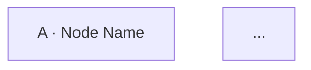

# Node Graph Diagram

Every encounter file gets a Mermaid flowchart of its node graph — this is not
an on-request extra, it's part of what "write the file" means. A DM skimming
the file cold benefits from seeing the whole shape of the scene in one
picture before reading node-by-node prose, and it renders inline on the
GitHub Pages site (in the DM view) as well as in GitHub's own file viewer.

Place it right after the short intro paragraph that opens `## Node Graph`,
before the first node's `###` subsection.

## The one rule that isn't optional: wrap it in ``

This repo's site is a Jekyll build, which runs **Liquid templating over every
page before Kramdown converts the markdown.** Liquid's own syntax for
outputting a value is `{{ ... }}` — the exact same double-curly-brace
sequence Mermaid uses for its hexagon node shape (`F{{"label"}}`). Left
unguarded, Liquid reads that as its own template tag, silently evaluates it,
and strips the braces and quotes out of the page before Mermaid ever sees the
text. The result isn't a Mermaid syntax error you'd catch by reading the
diagram — the diagram looks completely normal in the raw markdown file and in
a plain preview. It only breaks on the actual built site, where it shows up
as garbled node text or, in the browser, Mermaid's own parser choking on
what's left and rendering the bomb-icon "Syntax error in text."

The fix is mechanical and cheap: wrap the entire fenced block, fence markers
included, in Liquid's raw tags:

````markdown



````

Do this for every Mermaid block, every time, even if the specific diagram
doesn't happen to use hexagon nodes this time — it costs nothing when it's
not needed, and it's easy to forget to add later if a hexagon node gets
introduced in a revision. Treat `...` as part of the
fence, not an optional wrapper.

## Shape conventions

Use node shape to carry meaning the reader can absorb before reading a single
edge label. Keep it consistent across the whole diagram:

| Shape | Syntax | Use for |
|---|---|---|
| Rectangle | `A["A · Node Name"]` | An ordinary chase/skill-challenge node — checks and approaches, no combat live yet. |
| Hexagon | `F{{"F · Event Name"}}` | A hard, DM-scripted trigger that fires on a condition rather than a die roll (a scripted story beat, a clock running out). |
| Subroutine box | `G[["G · Node Name"]]` | A node where combat is a live option. |
| Stadium | `EndName(["Ending: Name"])` | A terminal ending. Give every distinct ending its own stadium node rather than routing everything back to one exit. |

Label every node with its letter/id and a short name (`"A · The Bay Door"`,
not just `"A"` or just `"The Bay Door"`) so the diagram is legible on its own,
without the surrounding prose.

## Edges

Label edges with the approach or outcome that causes the transition, in
quotes, matching the language used in the node's prose section — a reader
should be able to find the edge label as a phrase in the corresponding node
write-up:

```
A -->|"grab them at the door"| EndCaught
A -->|"chase continues"| B
```

Use a dotted edge (`-.->`) for a transition that's conditional on DM pacing
or judgment rather than a specific check — e.g. multiple possible nodes a
scripted trigger can fire from. A solid edge implies "this is how the scene
normally flows"; a dotted one signals "this happens at the DM's discretion."

## Keeping labels Mermaid-safe

- **No literal line breaks inside a quoted label.** Mermaid's parser rejects
  a raw newline inside `"..."` — if a label needs two lines, use `<br/>`
  instead: `F{{"Event Name<br/>(subtitle)"}}`.
- **Balance every bracket and quote.** A missing `"` or an unclosed `[[`/`]]`
  pair is the most common self-inflicted syntax error — read the diagram back
  once after writing it, shape by shape.
- **Keep node IDs short and stable** (`A`, `B`, `EndCaught`) — they're
  identifiers, not display text; the display text goes inside the quotes.

## Sanity-checking before you ship it

You can't render Mermaid directly, but you can catch most mistakes by eye:
re-read the finished block once, shape by shape, for balanced brackets and
quotes, and confirm the ``/`` wrapper is present. If a
terminal with `npx` is available, `npx -y @mermaid-js/mermaid-cli -i
diagram.mmd -o diagram.svg` on the extracted diagram text is a fast, free way
to confirm it actually parses — worth doing when the tooling is available,
not worth blocking the encounter on if it isn't.
