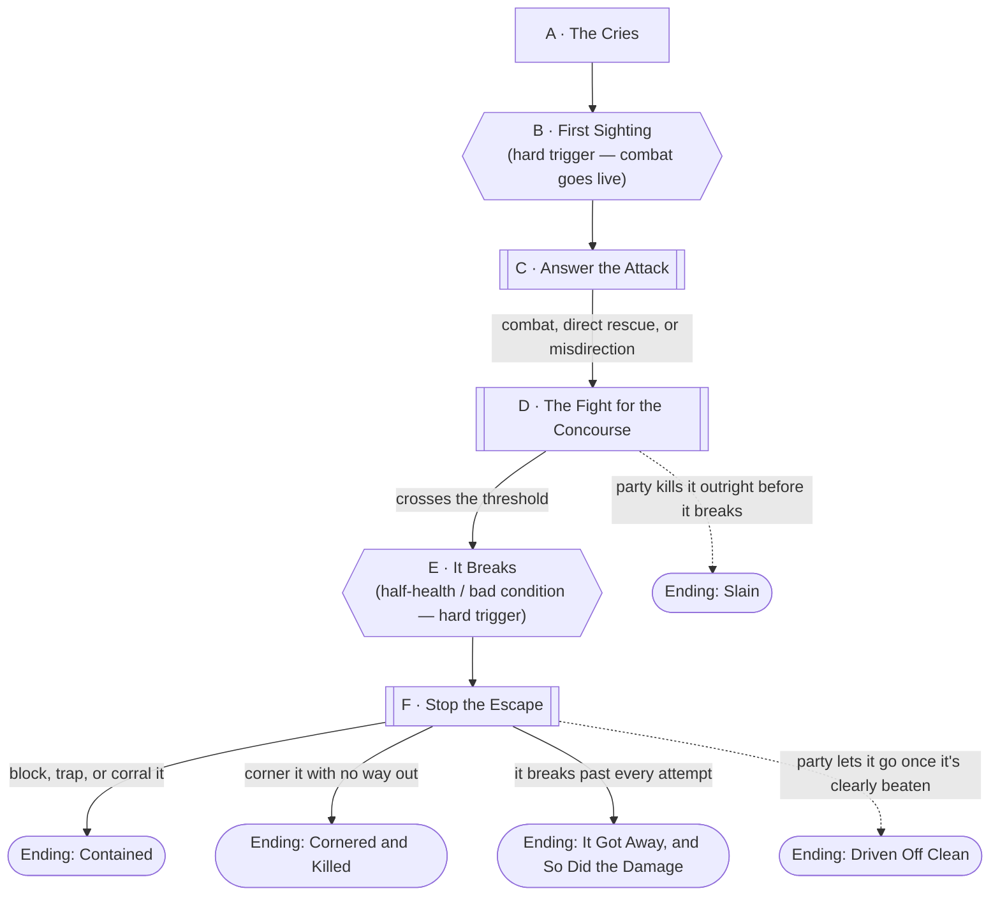

# Aether Breach at Briarwood

## The Hook

Some ordinary evening, weeks after the world changed everything else. A
scream that doesn't stop when the next one starts. Then glass.

## DM Only

## Premise

Post-merge [Briarwood Mall](../world/places/briarwood-mall.md), some ordinary evening
after Session 0. The party are their actual level 1 characters now, going about
whatever business brings them through the concourse. Something tore loose from the
Aether world's side of this cohort's transit — a contestant beast, in-flight between
whatever holding rig the Administration uses and wherever it was actually headed —
and it came down inside the mall's four hundred civilians instead. It is hurt,
disoriented, saturated with raw aether, and it is killing people.

This encounter has three honest beats, in order: the party **hears** it before they
see it (screaming, glass, something large moving fast, two wings over), they **see**
it (a cornered, overcharged predator mid-attack, not a monologuing villain), and then
they spend the rest of the scene trying to **stop it, kill it, or scare it off** while
Briarwood's four hundred shoppers are still in the blast radius of every choice they
make. How they handle that last part is the point of the scene, not a side effect of
it.

## Escalation Trigger(s)

**First Sighting is the hard trigger that makes combat live.** The moment the party
lays eyes on the creature (Node B), it is not ambiguous, not distant, and not
optional to react to — it is actively mauling someone in view. Combat becomes a live
option from that instant, though talking, luring, and rescuing remain legitimate
plays throughout; nothing forces the party to trade blows immediately, and nothing
stops them from choosing to.

**The second trigger is scripted, not rolled: once the creature is reduced to
roughly half its apparent HP, or is hit with any condition that would read as
"badly hurt" to the party (frightened, blinded, restrained, on fire, whatever the
scene produced), it breaks off and runs** (Node E). This fires the instant the
threshold is crossed, mid-round if needed — don't wait for a clean stopping point.
From here the ceiling flips: the creature is no longer trying to kill anyone, it is
trying to get out, and it is built to be very hard to stop (see Node F). Losing the
chase here is a normal, expected outcome, not a failure state for the table.

## Party

- **Tier/level:** Level 1, with classes — the party's actual characters.
- **Assumed size:** 3–4, per this campaign's default.
- This is a solo-monster encounter run at a genuinely high CR for the party's tier
  on purpose (see Combat Notes). It is not meant to be won by attrition in a stand-up
  fight; it's meant to be survived and redirected using the mall itself.

## Node Graph





Hexagons are the two beats that fire on the DM's call regardless of dice: the
creature *is* seen at Node B, and it *does* break for the exit once it's hurt
enough at Node E. Everything else — how the party gets there, what it costs, and
whether the creature dies, escapes, or gets boxed in — is theirs to decide.

### Node A — The Cries

**Situation:** Wherever the party is in the mall, it starts as sound: a scream that
doesn't stop when the next one starts, then a second, then glass. Whatever they were
doing gets interrupted by a wave of people moving *away* from something, fast,
without looking back. Nobody screaming knows what it is. Someone yells "GUN," someone
else yells "BEAR," and both are wrong.

*Flavor:* the crowd noise itself is the first real information — not panic in general,
but panic radiating outward from one specific point in the building, like a stone
dropped in water.

**Approaches:**
- *Read the crowd to find the source* — DC 5 (Perception or Insight). Success: you
  have a clean bearing on where it's coming from and arrive at Node B with your
  eyes open, not stumbling in blind. Failure: you still get there (this DC exists
  to reward attention, not to gate the scene), but you arrive a beat later and
  Node B opens mid-chaos instead of on your terms.
- *Grab a fleeing bystander for details* — DC 10 (Persuasion, or just catching
  someone who's willing to stop for a second). Success: something concrete and
  useful — "it's got wings, it came through the Sears bay doors," "it's the size of
  a car," "it grabbed someone by JCPenney" — that lets you approach Node B with a
  plan instead of a blank. Failure: you get nothing but noise; no cost beyond time.
- *Just move toward it* — no check, always available, gets you to Node B fastest
  but with no information at all.

**Complications available here:** pull from the bank below, or use "the crowd
carries you the wrong way for a second" — the panic flow is strong enough that a
PC who doesn't actively push against it gets swept twenty feet off course.

---

### Node B — First Sighting

**Situation:** This node fires the instant the party has line of sight, regardless
of what happened at Node A — it is not rolled. What they see: something large,
wrong-colored, and radiating heat-shimmer like a held-open oven door, mid-attack on
a bystander who is not going to survive more than a few more seconds of this without
help. Pick the location to match wherever Node A pointed them, or default to the
fountain court if the party had no lead — the two-story open well gives everyone a
clean sightline and the creature nowhere quiet to be.

*Flavor:* Read aloud or paraphrase —

> It isn't fighting so much as *thrashing* — off-balance, one wing dragging wrong,
> crackling along its crest with light that doesn't belong to any color you have a
> name for. It is enormous. It is bleeding something that smokes where it lands on
> the tile. And it has somebody's coat sleeve still gripped in one claw.

**This is the trigger.** Combat is live from this moment. Nothing requires the party
to start swinging — talking, distracting, or pure rescue are all still real plays —
but the option to fight exists now and didn't a scene ago.

**Approaches:**
- *Get the victim clear* — DC 10 (Athletics to physically pull them free, or
  Acrobatics/Sleight of Hand to slip in and out without drawing the creature's full
  attention). Success: the bystander survives, no combat forced yet → Node C.
  Failure: you free them, but the creature's attention is now on you specifically
  → straight into Node C already engaged.
- *Size it up before acting* — DC 10 (Nature, Arcana, or Investigation; a
  character with any Aether-world background gets this without a roll). Success:
  you clock the dragging wing and the smoking wounds as *already hurt* — this thing
  didn't arrive whole, it arrived from a fight or a fall, which is genuinely useful
  going into Node C (see Combat Notes). Failure: no information, no cost.
- *Just attack* — no check; a player can go straight in. Legitimate, not punished,
  and skips directly to Node C with combat already underway on the party's
  initiative.

**Complications available here:** the victim's family or friends are nearby and
will not leave without them, physically complicating any rescue; a second bystander,
frozen instead of fleeing, is standing directly in the creature's line of movement.

---

### Node C — Answer the Attack

**Situation:** Combat is live. The concourse around the fountain court is full of
people who haven't gotten clear yet — the encounter's real difficulty isn't the
creature's stat block, it's fighting *something this dangerous* in a room this full.
This node is where the party picks a posture: brawl it head-on, or start using the
building against it.

*Flavor:* Every round this runs long is a round Briarwood's stores lose window glass,
kiosks get flattened, and somebody who didn't get clear in time is in the wrong
square when the creature swings. If a monitor or speaker is in earshot, this is
a good spot for [Agent](../world/npcs/agent.md) to cut in unprompted, thrilled —
*"OH, that's a GOOD one—"* — narrating for the feed, not talking to the party,
and not remotely bothered that they can hear it.

**Approaches:**
- *Fight it directly* — standard combat resolution (see Combat Notes for sizing).
  Effective, honest, and expensive — this thing is a real threat to a level 1
  party toe-to-toe, and every round spent trading blows is a round it's still
  loose among bystanders.
- *Herd it away from the crowd* — DC 10 (Athletics, Intimidation, or a
  spellcaster's cantrip used as a scare tactic rather than damage). Success: it
  breaks toward a thinner part of the mall — the closed anchor wing, the service
  corridor — buying the crowd time to clear and setting up Node D on better terms.
  Failure: it goes where it wants, which might be *into* the crowd.
- *Use the fountain* — DC 10 (Athletics or just a good idea executed well) to get
  it into or drenched by the fountain court's water feature. This doesn't end the
  fight, but see Node D — it matters there.
- *Pull mall security's tools* — DC 15 (Investigation to find them fast, or
  automatic if a PC already knows the layout): the roll-down security grilles at
  the closed anchor stores, or the fire suppression system. Harder to arrange
  under pressure, but sets up a genuine trap rather than a straight fight.

**Complications available here:** pull from the bank, or use "a store window goes
first" — the first plate-glass storefront to go down is loud, dramatic, and a
visible marker of how much damage this fight is already doing, worth calling out to
the table as the collateral counter starts running.

---

### Node D — The Fight for the Concourse

**Situation:** The fight proper. This node absorbs however many rounds it actually
takes — it isn't meant to resolve in one exchange. What matters here is that the
creature can be worn down two ways: straight damage, or exploiting what Node B and C
told the party about it.

*Flavor:* It fights like something in pain that doesn't understand why the pain
won't stop — reckless, not tactical. That reads as terrifying up close and, to
anyone thinking clearly, as an opening.

**Approaches:**
- *Keep fighting* — normal combat resolution.
- *Exploit the water* — if the creature has been drenched (from Node C or a fresh
  attempt here, DC 10 Athletics to force it back into the fountain), its aether
  crackle visibly gutters and its regeneration (see Combat Notes) stops working
  until it dries out. Worth calling out mechanically the first time it happens —
  it's the table's best lead on how to actually beat this thing down.
- *Spring the trap* — if the party set up a grille or a chokepoint at Node C, DC
  10–15 (whatever's appropriate to the specific setup) to actually close it while
  the creature is in the right spot. Success meaningfully shortens the fight and
  reads as a real tactical win.
- *Protect bystanders instead of attacking* — always available, no roll required
  to attempt it, DC 10 (Athletics/Acrobatics) to actually pull someone clear
  mid-fight without opening yourself up. This is the node where "minimize the
  damage it causes" becomes a real, trackable choice rather than a mission
  statement — note who does this and how often; it's what Node E and the
  Administration Reward read off of later.

**Complications available here:** the collateral bank below, plus: a second wave
of bystanders who thought the coast was clear wanders back in at the worst moment.

*This node ends when the half-health/bad-condition threshold is crossed (→ Node E)
or, less commonly, when the party actually kills the creature outright before that
happens (→ **Ending: Slain**, below — legitimate, especially if the party leaned
hard into direct damage and got lucky, but note it denies the "hard to catch"
back half of the scene).*

---

### Node E — It Breaks

**Situation:** This node fires the instant the creature crosses roughly half its
apparent HP, or picks up any condition that reads as "badly hurt" — frightened,
blinded, restrained, on fire, whatever actually happened at the table. Not rolled,
not delayed for a clean stopping point.

*Flavor:* Read aloud or paraphrase —

> Something changes in it — not surrender, more like the pain finally wins the
> argument with whatever was driving it forward. It stops attacking mid-motion,
> full-body flinches away from you, and *runs* — not toward a door, toward the
> nearest opening big enough to fit through, glass or not.

From here the creature's only goal is escape. It will not re-engage unless
physically cornered with no way out (see Node F). This is the pivot the whole
encounter has been building to: the fight the party can win is over, and the harder
problem — can they stop it, or does it get away — starts now.

---

### Node F — Stop the Escape

**Situation:** The creature is running, and it is built to be genuinely hard to
stop (see Combat Notes) — this is deliberate, not a DM thumb on the scale. It will
take the shortest path out: a storefront window, the fountain court's mezzanine
rail, the Sears bay doors it may have come in through, whatever's closest to a way
outside. It is not fighting back unless the party leaves it no other option.

*Flavor:* It moves like something that has stopped caring what's in the way — it
doesn't dodge a kiosk, it goes through it.

**Approaches:**
- *Chase it down* — DC 15 (Athletics) to keep pace through the wreckage and
  obstacles it's leaving behind; the creature is faster than a level 1 party on
  foot, so this alone doesn't catch it, only keeps it in reach for something else.
- *Cut it off* — DC 15 (Athletics or Acrobatics, and it has to be plausible from
  the party's actual position) to beat it to whatever exit it's heading for.
  Success: you're between it and the way out, which forces a choice (see below).
- *Trap or block the exit* — DC 15–20 depending on what's actually available (a
  roll-down grille someone can drop in time, the Sears bay doors' chain hoist,
  anything the party set up earlier at Node C makes this easier — drop the DC to
  10 if it was already prepped). Success: the creature is genuinely boxed in.
- *Bring it down directly* — a called shot, a grapple, a spell meant to stop
  rather than damage it — DC 20 (whatever ability is most plausible for the
  specific attempt). This is the hardest single ask in the encounter on purpose;
  it should work rarely, and should cost something real (an expended resource, an
  opportunity attack eaten, a PC now between the creature and the exit) even when
  it does.

If the creature is boxed in with nowhere left to go, it turns and fights again —
cornered, not calculating — which can end in **Ending: Cornered and Killed** or, if
the party has a way to subdue rather than kill, **Ending: Contained**. If every
attempt fails, it gets out → **Ending: It Got Away, and So Did the Damage** (or
**Ending: Driven Off Clean**, if the party consciously stops trying once it's
clearly beaten and fleeing rather than burning resources chasing a lost cause).

**Complications available here:** the bank below, plus: the crowd, only now
regrouping, is directly between the creature and its chosen exit, forcing an
instant choice between blocking its path and clearing people out of it.

---

## Endings

- **Ending: Driven Off Clean.** The creature escapes, but the party made the call
  to let a clearly-beaten, fleeing animal go rather than risk more damage chasing
  it — and bystander harm across the scene was kept low. This is the best "read"
  a table can get without a kill: competent, controlled, and visibly more
  concerned with the four hundred people in the building than with finishing the
  monster. Feeds Agent's warmest framing in the Administration Reward scene below.
- **Ending: Slain.** The party kills it outright, either in Node D before it broke
  or by cornering it in Node F. Dramatic and final. How this reads (heroic vs.
  frightening) depends entirely on how the fight went — a clean kill with low
  collateral plays as competence; a kill that came with wrecked storefronts and
  bystander casualties plays as exactly the kind of thing [Agent](../world/npcs/agent.md)
  finds *very watchable* for less flattering reasons.
- **Ending: Contained.** The rare best-case: the party corners it and finds a way
  to stop it without killing it (a trap, a restraint, a surrender it can't refuse).
  Sets up a genuine hook — a live Aether creature in the party's hands is valuable,
  dangerous, and exactly the kind of asset Agent will want back for a rematch.
- **Ending: Cornered and Killed.** The party traps it at Node F with no de-escalation
  attempted or available, and finishes it there. Mechanically similar to Slain, but
  worth noting separately if the party's read at the table was aggressive — pure
  kill, no attempt at anything else — since it's the ending most likely to read as
  "dangerous" rather than "heroic" if collateral was also high.
- **Ending: It Got Away, and So Did the Damage.** The creature escapes despite a
  real effort to stop it, and the scene racked up meaningful collateral along the
  way — broken storefronts, hurt or dead bystanders, real property damage. Not a
  failure state; it's the honest outcome of a fight this far above the party's
  weight class run badly or unluckily. Sets up a rematch and a harder conversation
  with however Bellcross — or Agent — reacts to the damage.

## Reputation & Broadcast

Track loosely, not with hard points: how often did the party choose to protect a
bystander over pressing an advantage (Nodes C, D, F)? Did they let a beaten,
fleeing animal go, or fight it to the last regardless of who was still nearby? Did
they cause a storefront collapse or a stampede on their own initiative rather than
the creature's? [Agent](../world/npcs/agent.md) is watching all of it and broadcasting
everything, gleeful either way — a party that visibly prioritized the crowd reads
to a hundred thousand channels as **competent, controlled warriors**; a party
that plowed through bystanders to get their kill reads as **dangerous**, and
both readings follow them into future sessions. Neither is a wrong way to play
the scene — the encounter is built to make the difference visible, not to
punish one choice mechanically.

## Complication Bank

- **A store window goes down** — loud, dramatic, and a running marker of collateral
  damage the DM can call back to later.
- **A bystander freezes instead of fleeing** — directly in the creature's path,
  forcing an immediate choice between rescue and offense.
- **The crowd surges the wrong way** — a fresh wave of people, unaware the coast
  isn't clear, wanders back into the scene at the worst moment.
- **A family member won't leave without their person** — complicates any clean
  rescue attempt with a second body to manage.
- **Something from the Sears auto center** — tire irons, a chain hoist, jacks — is
  close at hand for anyone who thinks to grab an improvised weapon or tool.
- **The mall's own defenses** — roll-down anchor grilles, the fire suppression
  system, the loading dock's bay doors — are real, usable, and exactly the kind of
  thing a party thinking past "hit it" can turn against the creature (see
  [Briarwood Mall](../world/places/briarwood-mall.md)'s DM notes on the building's
  actual defenses being doors and lights).

## Combat Notes

- **Likely combatant — "the Cindercrest."** A single, high-CR-for-tier Aether
  predator (reskin a CR 4–5 apex-predator statblock — an *Allosaurus* or *Giant
  Crocodile* base scaled up works well — with these narrative traits layered on):
  a heavy multiattack (bite plus two claws), an aether-crackle discharge it can
  vent in a burst around itself (real risk to bystanders if used near a crowd,
  which is exactly the tension this encounter wants), and a regeneration that
  keeps it in the fight unless it's drenched or otherwise disrupted (the fountain
  is the party's best lead on this, see Node D). It arrives already hurt — a
  detail the party can learn at Node B — which is part of why a level 1 party has
  a real shot at driving it off despite the CR gap.
- **Party disadvantage factors:** this is a fresh, full-resource level 1 party, but
  the fight happens in a room full of civilians, which is a real tactical
  constraint no amount of HP fixes — area effects, reckless positioning, and
  collateral-blind tactics all cost something here that they wouldn't in an empty
  room. Treat the crowd as part of the difficulty budget, not set dressing.
- **What ends the fight without a kill:** the scripted break at Node E is the
  built-in off-ramp — the creature is never fighting to the death after that point
  unless physically cornered. The escape (Node F) should be genuinely hard to stop;
  resist letting a single good roll trivialize it. Losing the chase is a fine,
  expected outcome and should not be played as a DM fudge to "save" the encounter.

## Administration Reward

However the scene resolves, [Agent](../world/npcs/agent.md) decides within the hour
that this deserves a live moment — cutting in over every screen and speaker in
earshot before a production assistant, or Pedro himself if the table's night has
been good TV, physically shows up with a camera crew to make it official. The
party is handed a single item on camera, sourced directly from what the
Cindercrest left behind. See [Cindercrest Commendation Fang](../items/cindercrest-commendation-fang.md)
for the full write-up — its flavor text references this fight specifically, and the
tone Agent frames it with (rising stars vs. a liability worth watching) should
track whatever read the table earned in the Reputation & Broadcast section above.
The Administration's only visible role in the moment is the branded resin the
fang gets mounted on — standardized, serial-numbered, entirely uninterested.

---

[← Back to encounters index](README.md)
