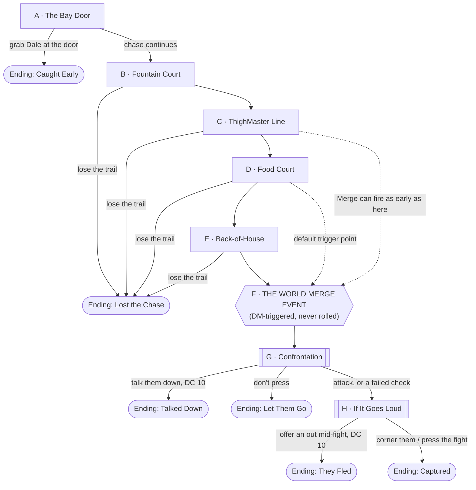

# Chase Through the Grand Opening

## Premise

Session 0, [Briarwood Mall](../world/places/briarwood-mall.md), the evening of the
"As Seen On TV" grand opening — November 5th, 1992. The party are still their
mundane, pre-merge Session 0 selves: shoppers, mall staff, whoever they were
introduced as before character sheets exist. [Dale Pruitt](../world/npcs/dale-pruitt.md),
fired from mall maintenance earlier that week (by one of the party, if a PC's
Session 0 background makes them his old manager — DM's call), bolts out of the
service bay of Sears with a stolen tool bag. His girlfriend
[Renee Castillo](../world/npcs/renee-castillo.md) is right behind him. A Sears
mechanic is behind *both* of them, yelling "Thief! They stole my tools!"

What starts as a foot chase through a packed mall is this campaign's on-ramp: it
gives the party something concrete to do with their pre-merge selves, and it's
built so the **World Merge Event** — the moment they become their actual level 1
characters — lands in the middle of the action instead of before or after it.
Nobody in this scene has fantasy powers until that moment. Dale and Renee are just
as mundane as the party until the merge changes all of them at once.

## Escalation Trigger

**The World Merge Event itself**, fired by the DM as a hard, scripted beat — not
something the party rolls for or can avert. It happens **after the 3rd chase node
resolves at the earliest, and no later than the 5th** (see the Node Graph below;
there are five pre-merge nodes, A through E, giving room to run it early for a
tighter session or late for a longer one). Default to firing it at the end of
**Node D (Food Court)** if you're not sure — it's the node built to hand off into
the Merge cleanly.

Before the trigger: no fantasy powers exist anywhere in the scene. Everyone —
party, Dale, Renee, the mechanic, four hundred shoppers — is exactly as mundane as
real 1992 Texas. Combat, if it happens at all before the merge, is a scuffle: shoves,
a thrown object, nothing lethal.

After the trigger: the party is playing their actual PCs for the first time, and
Dale and Renee have been transformed by the same event into a **"Wizard's Guard"**
and a **"Gunslinging Wizard"** respectively — see Node F. From here, armed combat
becomes the most likely outcome, but it is never the *only* one; Nodes G and H both
keep a real off-ramp open.

## Party

- **Tier/level:** Level 1, fixed by the premise — the merge event is what turns
  the party into level 1 characters partway through this scene. There's no "ask
  the DM" step here; the transformation *is* the answer.
- **Assumed size:** 3–4, per this campaign's default.
- Everything before Node F needs no combat stats at all — nobody in the pre-merge
  world can fight with more than their fists and what's on a store shelf. Combat
  sizing only applies to Nodes G/H and is written for a fresh, full-resource level
  1 party (see Combat Notes).

## Node Graph

The five pre-merge nodes (A–E) are chase beats, roughly linear but not rigid —
the party can lose the trail and pick it up two nodes later, or the DM can let a
strong success skip a node entirely. Read all five before running this so you can
compress or stretch to hit the Merge at the right pacing.

The shape of the whole scene, endings included:

Hexagon = the one beat that isn't a die roll. Double-bordered boxes = combat is
live. Rounded ends = where a table can actually stop. The dotted lines into Node
F are a reminder, not a rule: the Merge can land off of C, D, or E depending on
pacing — see the Escalation Trigger section above for the default.

### Node A — The Bay Door

**Situation:** The Sears auto center, tire bay, one roll-up door half open. Dale
comes through it first, tool bag over one shoulder clanking with every stride;
Renee's right behind him, already hissing "*go, go, go*" like this was supposed to
be quiet. The mechanic — call him Gary, forty-something, out of shape, furious —
is three steps behind Renee and losing ground fast. "THIEF! HE STOLE MY TOOLS!"

*Flavor:* The overhead fluorescents in the bay buzz. Somewhere behind them a
pneumatic wrench, still running, spins itself down to silence — nobody turned it
off, they just left.

**Clue:** Dale doesn't look toward the parking lot exit — he breaks straight for
the promenade doors into the mall proper. There's no getaway car waiting; whatever
his plan is, it runs through the crowd, not around it. A party that notices this
(it's visible without a check, just paying attention) knows chasing them toward
mall security or an exit won't cut them off — the crowd is where this is headed.

**Approaches:**
- *Grab Dale or block the door directly* — DC 10 (Athletics/Acrobatics). Success:
  you get a hand on the tool bag strap or force Dale to peel off alone, straight to
  an early version of Node G-lite (a scuffle, no merge yet — treat as **Ending:
  Caught Early**, see below). Failure: he shoulders past, tools spill and clatter
  but he keeps most of them → Node B, and the dropped tools are now visible
  evidence trailing his path (free clue into Node B).
- *Get the story from Gary in ten seconds flat* — DC 5 (Persuasion/Insight, or
  just asking). Success: Gary blurts what's actually missing — a cordless drill,
  a torque wrench, a tire iron — which matters later (see Node F: whichever tool
  is in Renee's hands versus Dale's hands decides who becomes what). Failure:
  Gary's too winded and mad to be coherent; you get "MY TOOLS" and nothing more.
- *Just run* — no check, straight to Node B. Always available; the mechanic falls
  further behind either way (he's not built for this).

**Complications available here:** pull from the bank below, or use "a bystander
gets underfoot" — a Sears customer wanders into the bay right as everyone's
sprinting through it.

---

### Node B — Into the Fountain Court

**Situation:** The promenade opens up around the two-story fountain court —
benches, pennies, the holiday water feature running three weeks early. It's
Thursday night and it's packed. Dale and Renee cut hard left through the thickest
part of the crowd; a KB Toys cart gets clipped and dumps a hundred bouncy balls
across the tile, and a Spencer Gifts window display topples with a crash that
turns forty heads at once.

*Flavor:* For about two seconds, half the fountain court is watching a Wolverine
poster and a rack of lava lamps go over, and nobody's looking at the two people who
actually did it.

**Clue:** The wreckage *is* the trail — bouncy balls still rolling, a display still
rocking on its stand — and it points unambiguously in the direction Dale and Renee
went. This is the easy read. The harder, better read is upstairs: the mezzanine
level rings the fountain court, and someone who clocks it can try to outflank
rather than follow.

**Approaches:**
- *Follow the obvious trail* — DC 5 (Perception/Investigation, or Survival if
  anyone wants to flex it). Success: you're right on them, no time lost → Node C.
  This DC is low on purpose; it should almost always work; the trail is not the
  hard part of this node.
- *Cut through the crowd directly, no finesse* — DC 10 (Athletics). Success: you
  gain ground → Node C fast, ahead of Gary and any other pursuers. Failure: you
  plow into someone's grandmother or a Cinnabon tray; no real harm, but you lose
  the lead and a mall employee is now annoyed and watching you specifically.
- *Take the mezzanine to outflank* — DC 15 (Athletics or a relevant background
  check — this is the hard, clever option). Only worth attempting if a PC actually
  thinks to look up; nothing prompts it besides the mezzanine being visibly there.
  Success: you get ahead of the chase entirely, arriving at Node C (or even D) from
  an unexpected angle — hand the players a genuine tactical win. Failure: you
  burn the time and arrive at Node C behind where you'd otherwise be.

**Complications available here:** the toppled display draws a Spencer Gifts
employee into the path; a kid starts crying over the spilled bouncy balls and a
parent is not thrilled about anyone running through it.

---

### Node C — The ThighMaster Line

**Situation:** The line for tonight's main event — Suzanne Somers, live, in front
of the "As Seen On TV" storefront — stretches from the folding chairs out past
Chess King, four hundred people deep behind the good retractable stanchions.
Dale and Renee don't go around it. They go *into* it.

*Flavor:* Renee grabs a promotional tote off a stack meant for the first two
hundred customers and holds it in front of the tool bag like that fixes anything.
For one shopper in a line of four hundred people all holding bags, coats, and
strollers, it almost does.

**Clue:** Almost everyone in this line is doing something with their hands — bags,
strollers, snacks. What marks Renee isn't the tote, it's that she's the only one
in the immediate area *moving against the line's flow*, angling sideways rather
than shuffling forward with everyone else. That's the tell, and it's specific
enough to reward someone who actually watches the crowd's motion rather than
scanning faces.

**Approaches:**
- *Scan the line for the motion tell* — DC 10 (Perception or Insight). Success:
  you spot her, and Dale a few feet further on, both threading against the grain
  → Node D. Failure: you lose them in the crowd for a beat; they resurface at Node
  D regardless, but you've lost the lead you might have had.
- *Ask the security stanchion guard* — DC 5. He's watching the line, not the
  crowd around it, so he's only useful if the party asks the right question
  ("did you see two people running" gets a shrug; "did anyone just cut sideways
  through here" gets a pointed finger). Success on the *right* question gives a
  free pointer to Node D with no roll needed.
- *Make a scene to flush them out* — no check required, but it's a real choice:
  shouting "thief" or grabbing someone in a crowd this size spooks the line and
  draws mall security's attention onto the party specifically (see Complication
  Bank — a security guard now treats the party as the problem for a scene or two).
  It does work, though — Dale and Renee bolt visibly toward Node D.

**Complications available here:** Suzanne Somers' handlers, working the front of
the line, get protective of her personal space if the chase comes anywhere near
the riser; a kid in line recognizes Dale from somewhere and says his name loudly.

---

### Node D — Food Court

**Situation:** Upper level. Sbarro, Orange Julius, Hot Dog on a Stick, Cinnabon,
Chick-fil-A, bolted-down tables. Dale and Renee are visibly flagging — this was
supposed to be a quick exit, not a marathon — and the tool bag is heavier than it
looked twenty minutes ago.

*Flavor:* A tray-return cart gets shoved into the aisle behind them, more obstacle
than weapon, and somewhere near the Cinnabon a fire door marked EMPLOYEES ONLY is
propped a few inches open with a folded napkin, exactly the way it's been propped
all week.

**Clue:** Two live options, both legible: a socket wrench, too heavy to keep
carrying at a dead sprint, has fallen out of the bag and is sitting in plain sight
near the escalator down — a ground-level trail anyone can read. The propped fire
door is subtler — it's the kind of thing you only notice if you're looking at the
walls instead of the crowd, but it's the route that actually gets ahead of them
rather than behind.

**Approaches:**
- *Follow the dropped wrench toward the escalator* — DC 5 (Perception). Success:
  straight shot to Node E, no ambiguity.
- *Notice and take the propped fire door* — DC 10 (Perception to notice it's
  propped at all, since it's meant to look shut; no further check to use it).
  Success: you arrive at Node E ahead of Dale and Renee instead of behind them —
  a real advantage worth telegraphing to the players as such.
- *Cut through Aladdin's Castle* — DC 10 (Athletics or Acrobatics — dark, loud,
  sticky carpet, a *Street Fighter II* cabinet with a permanent crowd around it).
  Only sensible if a PC already has a reason to know the arcade's layout (ask if
  anyone established that in their Session 0 intro). Success: same outcome as the
  fire door, arriving ahead rather than behind.

This is the recommended default node for the Merge to land at the end of — see
Node F.

**Complications available here:** a tray-return cart gets knocked fully into the
aisle, a genuine obstacle rather than set dressing; a food court employee grabs a
PC's arm insisting they "settle down."

---

### Node E — Back-of-House

**Situation:** The service corridor that rings the building — loading dock,
dumpster bay, the security office with its bank of black-and-white monitors, the
mechanical room, a janitor's closet every wing. Dale and Renee duck through a door
marked STAFF ONLY that nobody's supposed to have a key to (Dale made copies before 
being fired). If the party hasn't caught up by now, this is the last chance
before the world changes shape.

*Flavor:* It's quieter back here — cinderblock, a hum of building mechanicals, one
flickering tube light — and every door looks exactly like the last one.

**Clue:** One door down the corridor is still swinging, not yet settled — a fresher
trail than a shut, silent one. Following the motion is the direct read; the
mechanical room itself (loud, warm, full of places to hide or get cornered) is the
one place in this stretch where the DM should let a clever party predict Dale and
Renee are running out of corridor to give.

**Approaches:**
- *Follow the still-swinging door* — DC 10 (Perception, since a shut, motionless
  hallway of identical doors makes this a real read, not a gimme). Success: you
  catch up right as they reach a dead end near the mechanical room → straight into
  Node F.
- *Force a locked door* — DC 10 (Athletics) if they ducked one shut behind them, or
  DC 15 to pick it quietly with anything improvised. Either gets you through;
  failure costs time but not the chase — they haven't gotten anywhere to go yet.
- *Loop around via the loading dock* — DC 15 (a real gamble; requires guessing
  the building's back-of-house layout without having seen it). Success: you beat
  them to the mechanical room and the confrontation opens on the party's terms
  instead of Dale and Renee's.

**Complications available here:** a startled janitor, mop in hand, is exactly
where nobody expected anyone to be; a door the party is *sure* they didn't check
yet turns out to already be open (a small, deliberately strange beat if you want
to foreshadow that this building has more closets than it should — see
[Briarwood Mall](../world/places/briarwood-mall.md)'s DM notes, though that thread
is not this encounter's to resolve).

---

### Node F — The Merge

**Situation:** This node fires on the DM's call, not the dice — anywhere from the
end of Node C through the end of Node E, wherever the pacing calls for it (default:
end of Node D). When it fires, stop whatever check or conversation is in progress
and run this straight.

*Flavor:* Read aloud or paraphrase, adjusting the specific location to wherever the
chase currently is:

> The hum you've been hearing under everything all night — the fountain pump, the
> fluorescents, the mall's own machinery — stops being background noise and
> becomes a *pressure*, behind your eyes and under your skin. The lights don't go
> out. They go *wrong* — every color at once, then none. For one full second there
> is no floor, no gravity, no mall, just a sound like every radio in Bellcross
> tuning to the same station at the same instant. Then it's over, and you are not
> quite who you were a second ago.

Mechanically: every PC becomes their actual level 1 character, on the spot, full
HP and resources, mid-scene. Give each player a beat — even just one sentence — to
describe what it feels like for *their* character specifically to arrive in their
own body for the first time. This is the tutorial moment for their sheet; let it
breathe.

Dale and Renee are caught in the same event, holding the same stolen tools. The
tool actually in each one's hands at the moment of the merge decides what they
become — Gary's answer back in Node A, if the party got it, tells you which:

- Whoever is holding the **powered tool** (cordless drill, pneumatic wrench —
  whatever felt right from Node A, or DM's pick if that check was never made)
  becomes the **Gunslinging Wizard**: the tool is now a spellcasting focus that
  fires visible bolts when its trigger is pulled. This should be Renee, per the
  encounter's premise, but if the party's own choices had Dale holding it instead
  by this point, let the merge follow *that* — see the note at the top of this
  file about not forcing convergence.
- Whoever is holding the **hand tool** (tire iron, torque wrench) and is
  positioned physically between their partner and any threat becomes the
  **Wizard's Guard**: warded, sturdier, melee-focused, reading as protector
  because that's the role they were already in.

No combat happens in this node. It's the hinge, not the fight.

---

### Node G — Confrontation

**Situation:** Wherever the chase ends up (the mechanical room if triggered from
Node E, the food court if from Node D, etc.), the party is now face to face with
Dale and Renee, all of them freshly transformed and still figuring out what that
means. Renee's stolen tool now hums with a light that wasn't there a second ago,
and her hand is shaking around it. Dale's put himself slightly in front of her,
tire iron up, but he hasn't swung it at anything yet.

*Flavor:* Dale's voice cracks halfway through "stay back" — he sounds more
frightened of what just happened to his own hands than of the party. Renee isn't
looking at the party at all. She's looking at the light coming off the drill.

**Clue:** Their body language is the tell, and it's meant to be readable without a
check for anyone paying attention: Dale is *defensive*, not advancing — shielding,
not threatening. Renee's grip is unsteady, her breathing fast — someone in genuine
panic, not someone squaring up for a fight. This is the scene's clearest signal
that talking is a live option, not a trap; a party that reads it right shouldn't
need a high roll to act on it correctly. If the party caused a scene back in Node
C or drew mall security's attention, note that here too — Dale and Renee are more
keyed up and quicker to flinch toward violence if they think more people are
closing in.

**Approaches:**
- *Talk them down* — DC 10 (Persuasion or Insight-led roleplay — reward good
  in-character reasoning with advantage or a lower effective DC rather than
  requiring the number in isolation). Success: → **Ending: Talked Down**. Failure:
  Renee's hand tightens on the tool and it discharges — not necessarily at a
  person, could be a wild shot into a wall — which pushes straight into Node H
  whether anyone wanted it to or not.
- *Force a surrender* — DC 15 (Intimidation). This is the harder, riskier read:
  it can work, but a botched intimidation attempt reads to a already-panicking
  Renee as the threat finally arriving, and pushes to Node H immediately on a
  failure.
- *Attack first* — no check; a player can simply choose this. It's a legitimate
  choice, not a punished one, but it skips straight to Node H and the encounter
  should treat it as combat starting on the party's initiative, not as a
  "gotcha."
- *Let them go* — also no check; if the party doesn't press, Dale and Renee take
  the opening and run → **Ending: Let Them Go**.

---

### Node H — If It Goes Loud

**Situation:** Combat, if it happens, starts here — whether from a failed Node G
check, a discharged "shot," or a PC choosing to attack. See Combat Notes below for
sizing before running this.

*Flavor:* Renee's shots aren't aimed like someone who's ever held a weapon before
— wild, more dangerous to the ceiling tiles than to anyone in particular, at least
at first. Dale fights like a man protecting someone, not like a man trying to win.

**De-escalation stays live mid-fight:** if either Dale or Renee drops low on
apparent condition, or gets separated from the other, or a PC spends an action on
something other than attacking (calling a retreat, dropping a weapon, shouting
that they'll let them go), give it a real chance to end the fight rather than
running it to a mechanical knockout. These two would rather flee with what's left
of the tool bag than die over it.

**Approaches (mid-combat):**
- *Press the fight* — normal combat resolution.
- *Call for surrender / offer an out* — DC 10 (Persuasion, usable once real stakes
  are on the table — harder to pull off mid-swing than it was in Node G, but not
  impossible). Success: Dale and Renee break and run → **Ending: They Fled**.
- *Corner them* — if the party controls the room's exits, Dale and Renee will
  surrender rather than fight to the end → **Ending: Captured**.

---

## Endings

- **Ending: Caught Early.** The party physically stops Dale before Node B. No
  merge context yet — this resolves as a mundane Session 0 scene (mall security
  or the mechanic take it from here), and the World Merge Event still needs to
  happen on schedule via whatever the DM's separate plan for that is if the chase
  itself was the only vehicle for it. Good outcome for a table that wants a short,
  low-key Session 0 opener; note that it removes this encounter's built-in path
  to the merge, so have a backup trigger ready.
- **Ending: Lost the Chase.** Dale and Renee get away clean somewhere in Nodes
  A–E, pre-merge. Fine outcome — the Merge can still land on schedule (Node F
  doesn't require them to be present with the party, only to happen), and Dale
  and Renee reappear later, already transformed, as a hook rather than a scene.
- **Ending: Talked Down.** No violence. Dale and Renee either return the tools,
  flee anyway now that the immediate threat feels past, or strike some in-fiction
  deal with the party. Strongly recommended as at least a *possible* outcome to
  let land once in a while — it's proof to the table that this campaign listens
  to non-combat choices even in its opening scene.
- **Ending: Let Them Go.** The party chooses not to press. Cheap, clean setup for
  Dale and Renee as recurring rivals later.
- **Ending: They Fled.** Combat started, then broke off. Dale and Renee escape
  with some or all of the tools; the party has now met their first post-merge
  threat and lived. Best ending for setting up a rematch.
- **Ending: Captured.** Combat resolves in the party's favor and Dale/Renee
  surrender or go down non-lethally. Establishes early that this table's combats
  don't have to end in bodies.

## Complication Bank

- **A bystander gets underfoot** — a shopper, a kid, an elderly customer wanders
  directly into the chase at the worst moment; costs time or forces a choice
  between speed and safety.
- **Mall security mistakes the party for the problem** — especially likely if the
  party caused a scene at Node C; a rent-a-cop starts pursuing the *party*, adding
  a second complication thread independent of Dale and Renee.
- **A display or cart gets knocked into the path** — physical obstacle, usable at
  almost any node (the KB Toys cart, a tray-return, a rack of ThighMasters).
- **Someone recognizes Dale** — a former coworker, a regular customer, anyone who
  says his name out loud and changes the social temperature of a crowded node.
- **A dropped tool becomes a party resource** — the socket wrench from Node D, or
  anything else shaken loose earlier, is just sitting there for a PC to pick up;
  minor, mundane, but a nice bit of foreshadowing for tools-as-weapons once the
  merge hits.
- **Post-merge only: a flicker of somewhere else** — a half-second of static, a
  smell that doesn't belong in a Texas mall, a sound like distant surf or distant
  war drums. Not mechanically significant. Pure atmosphere, reminding the table
  that Briarwood isn't landing in this alone.

## Combat Notes

Applies to Nodes G and H only. The party here is freshly minted level 1 characters,
full HP and resources — unlike a mid-adventure ambush, there is no resource
attrition working against them. The actual disadvantage is **disorientation**, not
depletion: these are brand-new bodies and brand-new abilities the players have
never touched before. Lean into that rather than a mechanical penalty — a round
where a player has to find their attack bonus for the first time is already
friction enough; don't stack a mechanical debuff for it unless your table enjoys
that flavor of chaos.

- **Likely combatants:**
  - **Renee — "Gunslinging Wizard."** Reskin a low-CR spellcasting statblock
    (roughly CR 1/8–1/4 — an **Guard** or **Bandit** base with its attack swapped
    for *Fire Bolt* or *Ray of Frost*, flavored as "shots" from her tool). Ranged,
    the more fragile of the two, and the one whose actions should read as panic
    rather than tactics — wild shots, poor positioning.
  - **Dale — "Wizard's Guard."** Reskin the Monster Manual **Guard** (CR 1/8),
    melee with the tire iron, sturdier than Renee, and mechanically or narratively
    positioned to protect her rather than press an advantage — a single-use
    ward/shield-adjacent feature tied to standing near her is a nice touch if your
    table likes that kind of flourish, but isn't required.
- **Party disadvantage factors:** none from attrition (see above); the real
  variable is table pacing — a table new to their sheets will be slower this
  fight than a veteran table, and that's fine. Don't compensate by making Dale and
  Renee tougher; let the fight run a little long instead.
- **What ends the fight without a kill:** Dale and Renee are looters, not
  killers, and neither wants to die over a tool bag. Any of: dropping below
  roughly half apparent HP, getting separated from each other, or a PC spending
  an action to visibly offer an out, should be treated as a real chance for them
  to break and run (see Node H's de-escalation approaches). Don't require the
  fight to run to zero HP on either side for it to end.

---

[← Back to encounters index](README.md)
