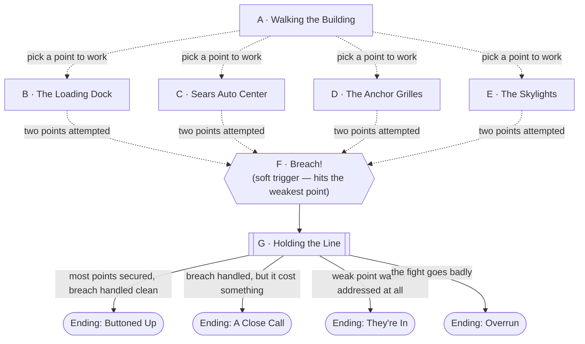

# Closing Time

## Premise

Some session after Session 0, [Briarwood Mall](../world/places/briarwood-mall.md)'s
survivors decide the building needs to actually be defensible, not just intact.
As that file's own DM notes point out, the mall's "real defenses are doors and
lights" — roll-up anchor grilles, the Sears auto center's bay doors, the loading
dock — and none of it was built to stop anything. This encounter is the party
spending real time turning "reads as a fortification" into "actually is one,"
across several weak points at once, while the building gets tested for the
first time by something that wants in.

This file is independent of whether
[Aether Breach at Briarwood](aether-breach-at-briarwood.md) or
[Mall Rats](mall-rats.md) have already happened at the table — nothing here
assumes either. It's built to run **either an Aether or a Faerun threat** at
the Breach node, DM's choice; see Combat Notes for both.

## Escalation Trigger(s)

**Node F (Breach!) is a soft, structural trigger, not a rolled one.** It fires
once the party has attempted fortification at two of the four points (Nodes
B–E) — win, lose, or partial — or whenever the DM's pacing calls for it. It
always hits whichever point the party has spent the *least* effort securing;
that's not a coincidence the players need to roll for, it's the point of the
whole scene. Before this, nothing here is remotely combat-live — after it,
combat is the live option at whatever entrance got tested, though talking,
holding a line, or falling back through the mall are all still legitimate
plays.

## Party

- **Tier/level:** Level 2.
- **Assumed size:** 3–4, per this campaign's default.
- This is a defense, not a dungeon crawl — the fight at Node G should feel
  winnable by a fresh, un-attritioned party, with the real difficulty coming
  from how much of the building is actually secured by the time it starts.

## Node Graph





Node A is a hub, not a gate — the party can hit B–E in any order, split up to
cover more ground, or skip straight to F if they'd rather wing it. The dotted
lines are the DM's discretion on exactly when "two points attempted" fires;
it's a feel call, not a counter the players see.

### Node A — Walking the Building

**Situation:** Before anyone starts nailing boards over anything, this is the
walkthrough — deciding what actually needs securing. [Briarwood Mall](../world/places/briarwood-mall.md)
has no ground-floor windows, which helps, but the loading dock, the auto
center's bay doors, and the anchors' security grilles are all real gaps, and
the skylights are the kind of thing nobody thinks about until something comes
through one.

**Approaches:**
- *Survey properly* — DC 10 (Investigation or Perception). Success: the party
  identifies all four weak points below, including the skylights, which are
  easy to miss without this check. Failure: the party only finds B, C, and D
  on their own — the skylights (Node E) get discovered the hard way, if at
  all.
- *Ask mall staff or security* — DC 5 (Persuasion), if anyone with building
  knowledge is still around and cooperative. Success: same information as
  above, no roll needed on the Investigation check.

**Complications available here:** pull from the bank below, or use "someone
already has opinions" — a survivor with strong (and not necessarily correct)
ideas about what matters most, complicating group consensus on where to
spend limited time and hands.

---

### Node B — The Loading Dock

**Situation:** Big vehicle-sized bay doors and a dumpster bay — the largest
single opening in the building, and the one that looks most like a door
because it is one.

**Approaches:**
- *Barricade it properly* — DC 10 (Athletics or Strength), using whatever's
  on hand: pallets, a delivery truck, shopping carts stacked and wedged.
  Success: this point is secured. Failure: partially blocked — still counts
  as "attempted" for Node F's purposes, but doesn't fully protect it.
- *Rig a warning instead of a full block* — DC 5 (Investigation), stringing
  cans, alarms, or anything noisy across the opening. Doesn't secure the
  point, but guarantees the party isn't surprised if this is where Node F
  lands.

**Complications available here:** the bank, plus: **a delivery truck is
still parked here** — a genuine asset (extra mass to block the door) or a
genuine problem (keys long gone, can't be moved once it's in the way).

---

### Node C — Sears Auto Center

**Situation:** Roll-up bay doors, out back — same category of gap as the
loading dock, but with an upside: tire irons, jacks, chain, and everything
else [Briarwood's DM notes](../world/places/briarwood-mall.md) flag as
scavengeable auto-shop loot is sitting right here.

**Approaches:**
- *Chain and jack the doors shut* — DC 10 (Athletics or a relevant
  proficiency — mechanic's tools, if anyone has them). Success: secured, and
  the party picks up a tire iron or similar improvised weapon apiece if they
  didn't already have one. Failure: partially secured, no gear bonus.

**Complications available here:** the bank, plus: **the doors don't all work
the same way** — one bay's manual override is broken, meaning this point
takes longer than the others or needs a second attempt to actually finish.

---

### Node D — The Anchor Grilles

**Situation:** Dillard's, JCPenney, and Montgomery Ward's roll-down security
grilles already exist — the task here is making sure all three are actually
down and locked, not fixing something broken.

**Approaches:**
- *Check and lock all three* — DC 10 (Investigation to find the manual
  crank on whichever grille's motor is dead, Strength to force a stuck one
  down). Success: all three secured. Partial success (DM's call on a mixed
  roll): two of three.

**Complications available here:** the bank, plus: **one anchor still has
people in it** — a straggler or two who didn't know the store was being
sealed, needing a quick resolution before the grille comes down for good.

---

### Node E — The Skylights

**Situation:** The two-story skylights over the fountain court and the
promenade — the one weak point that isn't a door, and the one nobody thinks
of as a way in until something proves them wrong. Only found without effort
if Node A's survey succeeded.

**Approaches:**
- *Board or net them from the inside* — DC 15 (Athletics to reach them
  safely, plus whatever the DM wants to charge for materials — plywood,
  fencing, anything scavenged). This is the hardest of the four fortification
  tasks, on purpose — it's the one the party is least likely to think of and
  the DM should reward the players who did.

**Complications available here:** the bank, plus: **there's no good ladder**
— finding one, or improvising a way up, is its own small obstacle before the
DC 15 check is even attempted.

---

### Node F — Breach!

**Situation:** This node fires once the party has spent real effort on two of
the four points above — not a die roll, a pacing call. Whatever entrance the
party spent the least time on is the one that gets tested. If they never
found the skylights, that's the breach. If they secured the loading dock and
the grilles but never touched the auto center, that's it instead.

**The DM picks the threat here — this is where "options" means something:**

- **Aether option:** a lesser, opportunistic Aether creature — smaller and
  meaner than [Aether Breach's Cindercrest](aether-breach-at-briarwood.md),
  a genuinely different animal — drawn by light, noise, and warmth bleeding
  out of a building that reads as nothing else does in this cosmos. It
  doesn't so much attack the mall as try to get *into* it, the way something
  feral goes for an open trash can.
- **Faerun option:** a small kobold raiding party, peeled off from the
  chaos around [Scornubel](../world/places/scornubel.md)'s muster and tent
  city, testing the rumor of an unguarded building full of impossible goods
  — see that file's DM notes on how the [Coster Council](../world/factions/coster-council.md)
  already reads Briarwood as "an unguarded warehouse of impossible
  merchandise." These aren't Council-sanctioned; they're opportunists who
  heard the same rumor everyone else did.

Both are built to the same tier — see Combat Notes — so this choice is pure
flavor and campaign continuity, not difficulty tuning. Nothing stops a DM
from running both across two separate sessions, reusing this file each time.

Give the party one beat to notice something's wrong (a grille rattling, a
skylight cracking, a sound at the dock) before Node G goes live.

---

### Node G — Holding the Line

**Situation:** Combat at whatever point breached. If that point was secured
(Node B–E succeeded there), the fight is fought *at* the barricade — the
enemy has to get through what the party built, which is a real mechanical
advantage, not just flavor. If it wasn't secured, the enemy is already
inside when the fight starts.

**Approaches:**
- *Fight at the choke point* — combat resolution, with advantage to the
  party if this point was successfully fortified (the enemy is stuck
  squeezing through, climbing over, or working at a lock while the party
  gets free hits).
- *Fall back and funnel them* — DC 10 (Investigation or tactical
  improvisation) to retreat toward a narrower part of the mall instead of
  fighting at the breach itself — works if the point wasn't secured and the
  party would rather not fight in the open.
- *Talk or scare it off* — plausible for the Aether option specifically (an
  opportunistic scavenger, not a soldier) at DC 15 (Intimidation, or denying
  it an easy meal by securing food/warmth sources visibly) — much less
  plausible for the kobold option, who are people making a choice, not an
  animal following instinct; DM's call on whether they'd ever bluff-retreat
  from a fight that's clearly going badly for them (their morale, not their
  species, decides this — see Combat Notes).

**Complications available here:** the bank, plus: **bystanders are still
around.** However many of Briarwood's four hundred are near this point when
it goes loud, they're a factor the same way they are in
[Aether Breach](aether-breach-at-briarwood.md)'s Node D — not a separate
mechanic, just a reason area effects and reckless positioning cost something
here.

---

## Endings

- **Ending: Buttoned Up.** Most or all of the four points got properly
  secured, and the breach — wherever it landed — got handled cleanly. The
  mall is, for the first time, an actual fortified position rather than a
  building that merely reads as one. Strong setup for treating Briarwood as
  a real home base going forward.
- **Ending: A Close Call.** The breach happened somewhere the party had
  worked on but not finished, or the fight ran long enough that it cost
  real resources or a scare. Everyone's fine, the point in question gets a
  second pass afterward, and the building is safer than it was — just not
  as clean a win as Buttoned Up.
- **Ending: They're In.** The breach hit a point the party never got to at
  all. Whatever got in is now loose somewhere in the mall past Node G — a
  fine hook for a short follow-up scene (a hunt through the promenade, a
  second, smaller fight) rather than something this file needs to resolve
  on the spot.
- **Ending: Overrun.** The fight at Node G goes badly — not a TPK state, but
  a real cost: civilians hurt, ground lost, or the party forced to retreat
  deeper into the mall. Play this as an honest consequence of how much
  fortification actually got done, not a DM fudge; it's a legitimate result
  of a party that spent Nodes A–E on the wrong priorities.

## Reputation & Broadcast

[Agent](../world/npcs/agent.md) has been watching Briarwood's four hundred
survivors since the merge, and "civilians build a fortress out of a shopping
mall" is exactly the kind of underdog-competence footage it loves. Track
loosely: how much the party actually secured before the breach, whether
bystanders saw them working versus scrambling, and how the fight at Node G
reads to people who live here and will remember it either way. A party that
visibly prepared reads as **capable defenders**; a party that improvised
under fire reads as **lucky** — both are fine outcomes, but they land
differently with Briarwood's survivors afterward, independent of anything
Agent decides to broadcast.

## Complication Bank

- **Someone's already living near a weak point.** A survivor claimed a
  storefront near whichever entrance the party is working — their
  cooperation (or refusal to move) affects how fast that node goes.
- **Tools are scarce.** Not everything the party wants for a given
  fortification task is actually on hand — a fair reason to fail a check
  without it feeling arbitrary, or a reason to send someone to Node C first
  for tire irons and chain before tackling B or D.
- **A grille or door was already compromised.** Pick one point (DM's
  choice) that turns out to have been tampered with or damaged before the
  party ever got to it — a loose thread that can connect to
  [The Circuit](../world/factions/the-circuit.md) or just be bad luck.
- **The crowd notices.** Word spreads fast in a building with four hundred
  people in it — expect volunteers, backseat drivers, and at least one
  person convinced the party is doing it wrong.

## Combat Notes

- **Aether option — Scavenger.** Reskin a **Giant Vulture** or **Giant
  Weasel** (CR 1/4–1/2): fast, opportunistic, more interested in getting
  past the party than fighting them head-on. Give it a narrative trait —
  **Drawn to Light** — it beelines for the brightest, warmest opening
  available, which is exactly why the skylights (Node E) are its favorite
  unsecured target. Not remotely on the Cindercrest's level; this is a
  nuisance-tier animal that got curious, not a wounded apex predator.
- **Faerun option — Kobold Raiders.** Reskin 3–4 **Kobolds** (CR 1/8) plus
  one **Kobold packleader** (reskin a **Goblin Boss**, CR 1) — the same
  tier structure as [Mall Rats](mall-rats.md)'s Skulkers and Ironquill, so
  a DM who's already run that encounter can lean on the same statblocks.
  They're testing a rumor, not executing orders — expect them to probe
  rather than commit fully.
- **Party disadvantage factors:** none, structurally — this is a fresh,
  full-resource level 2 party. The actual difficulty lever is how much of
  Nodes B–E got done, not anything about the party's own state.
- **What ends the fight without a kill:** the Aether Scavenger breaks off
  and flees the instant it's clearly not getting an easy way in — it was
  never trying to fight, just to get inside. The kobolds rout once their
  packleader falls or they're outnumbered at the choke point; they're
  scouts, not a suicidal vanguard, and living to report back is worth more
  to them than a dead-end raid.

---

[← Back to encounters index](README.md)
