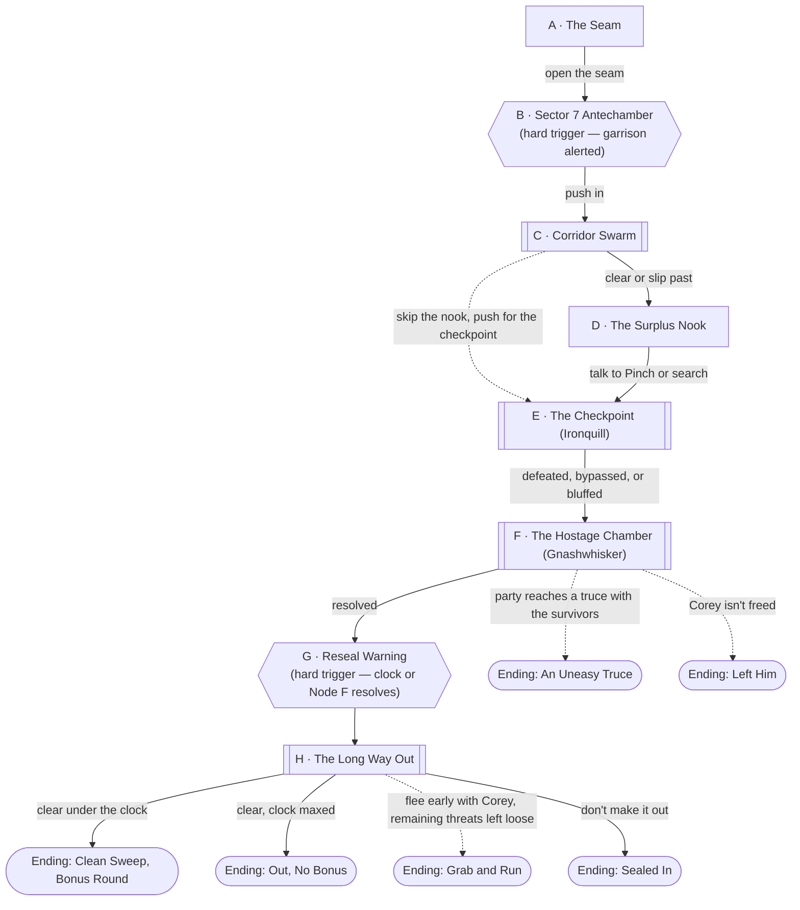

# Mall Rats

## The Hook

Somewhere in post-merge Briarwood, there's a door that doesn't work like a
door should.

## DM Only

## Premise

Somewhere in post-merge [Briarwood Mall](../world/places/briarwood-mall.md), a door
that shouldn't work like a door does. Default staging: the extra janitor's closet
that came through the merge with [Steven McDouglas](../items/mall-security-keyring.md)'s
keys still in its lock — see that item's file. Behind it isn't a closet anymore. It's
the seam into [Sector 7](../world/places/cohort-15-holding-sector.md), an
Administration storage sector for a ratkin population cancelled eight cohorts ago and
never actually disposed of.

This is a dungeon, not a chase — a string of rooms the party pushes through, mostly
against numbers rather than individual toughness, with two tougher named threats
guarding the back half and a hostage — [Corey Blevins](../world/npcs/corey-blevins.md),
the teenager from that same closet's original lock-in — waiting at the bottom of it.

**Alternate staging.** The closet is the default and has the strongest hooks already
in play, but the seam can open anywhere the DM wants a discovered change: a portal
in the [Orange Julius](../world/places/briarwood-mall.md) stockroom has extra bite if
[The Circuit](../world/factions/the-circuit.md) is active, since it puts Kessler's
crew and the party after the same door. Reskin Node A's flavor text to match; nothing
past Node A needs to change.

## Escalation Trigger(s)

**Node B is a hard, scripted trigger, not a rolled one.** The instant the party is a
few steps past the threshold, cold Administration signage and [Agent](../world/npcs/agent.md)'s
voice over the PA both wake up and flag them — the ratkin garrison is alerted from this point forward, and every node
from C onward can go loud without further warning. Talking, sneaking, and bargaining
remain legitimate plays throughout; the trigger only means the ratkin now know
someone's in the building and are watching for them.

**Node G (Reseal Warning) is the second hard trigger**, and it's a clock, not a
single moment — see **Administration Clock** below. It fires the instant Node F
resolves (however it resolves) *or* the Clock hits 5 ticks, whichever comes first.
From there the sector is coming down around the party's ears and Node H is a race,
not a normal fight.

## Party

- **Tier/level:** Level 2.
- **Assumed size:** 3–4, per this campaign's default (not specified by the request).
- This is a full dungeon crawl at the party's actual tier — unlike the level 1
  Cindercrest fight, nothing here is meant to outclass them. The difficulty is
  attrition and the clock, not any single fight being unwinnable.

## Node Graph





Hexagons are the two beats that fire on the DM's call: the garrison wakes up at B,
and the sector starts coming down at G. Everything else — how many fights the party
actually has, whether they find Pinch, whether Gnashwhisker talks or fights, how
close they cut the exit — is theirs.

### Node A — The Seam

**Situation:** The extra closet — see [Briarwood Mall](../world/places/briarwood-mall.md)'s
DM notes on the janitor's closets — has a door that looks wrong even shut: the
hardware doesn't match the mall's other closets, cold air leaks around the frame,
and there's a faint hum behind it that isn't the building's HVAC. It's locked.

**Approaches:**
- *Notice something's off before opening it* — DC 10 (Perception or Investigation).
  Success: the party knows this isn't an ordinary closet before they commit — no
  mechanical effect, but they enter Node B braced instead of surprised.
- *Open it with the [Mall Security Keyring](../items/mall-security-keyring.md)* —
  no roll, if the party holds it: the ring's owner locked this door, and it still
  answers to the ring.
- *Force it* — DC 15 (Strength/Athletics), matching the lock's own stated
  difficulty.
- *Pick it* — DC 15 (Dexterity/Sleight of Hand with thieves' tools).
- Failure on Force or Pick costs time only — no wandering threat out here to
  punish a retry.

**What's just inside:** not a closet interior. A short, unlit concrete threshold,
and on the floor, a skateboard wheel that's been there long enough to gather dust,
along with drag marks leading further in. Whoever was here recently didn't leave
under their own power.

**Complications available here:** pull from the bank below, or use "the door swings
both ways" — anything that gets past the party here (a fleeing ratkin, a released
scent, a sound) can just as easily go the other way, back into Briarwood.

---

### Node B — Sector 7 Antechamber

**Situation:** This node fires the instant the party is a few steps past the
threshold — not rolled. The space opens into a cramped concrete backstage: exposed
conduit, dead monitors, and one wall of Administration signage that flickers on as
they pass it. Cold, bureaucratic text scrolls past: **"COHORT 15 · VERMINFOLK ·
CONTESTANT STATUS REVOKED · RECLASSIFIED: AMBIENT HAZARD CONTENT."** That part's
the Administration — flat, soulless, exactly as interested in the ratkin as a
filing cabinet. Then a PA crackles to life mid-sentence, and this part has a
personality: *"—ooh, unidentified biologics in Sector 7! Residents, please
continue your assigned function, this is [Agent](../world/npcs/agent.md) speaking. Bonus round
eligibility confirmed for Cohort 23 wildcard contestants: clear to exit before
sector lockdown for commendation credit. Try to make this interesting, would
you? For me?"*

**This is the trigger.** The garrison is alerted from this instant. Nothing forces
combat immediately — the ratkin have to actually find the party — but every node
from here on can go loud without further warning, and the Administration Clock
(see below) starts now.

**Approaches:**
- *Move fast, worry about intel later* — no check, straight to Node C, but the
  party arrives with no information.
- *Read what else the signage says* — DC 10 (Investigation or History). Success:
  the party learns the shape of Cohort 15's story — a whole race axed mid-season
  and warehoused rather than sent home, kept as reusable hazard content for later
  cohorts — and picks up that something *else* is going on: a second alert is
  scrolling underneath about "unauthorized signal bleed, Sector 7, unresolved,"
  which is the Administration's real reason for the coming purge (see Node G).
  (DM's private read, no need to surface it: Agent almost certainly let that
  bleed run longer than it should have — bad TV doesn't hold Agent's interest,
  but a desperate, unscheduled broadcast stunt very much does.)
  Failure: no information, no cost — this is a DC 10 for a reason.
- *Listen for the drag marks' owner* — DC 10 (Perception). Success: a faint,
  distant sound — a skateboard wheel scraping concrete, or crying, hard to tell —
  from deep in the sector. This is [Corey](../world/npcs/corey-blevins.md), and it
  gives the party a bearing that pays off at Node F. Failure: nothing, no cost.

**Complications available here:** the bank below, plus: the PA repeats its
"reclassified" announcement every few minutes for the rest of the dungeon, at
increasingly petty length — good ambient color, and good cover noise for a
Stealth check if a player thinks to use it.

---

### Node C — Corridor Swarm

**Situation:** A narrow storage corridor lined with retired promotional nooks —
half-collapsed cardboard standees of past cohorts' "fan favorites," a dead
animatronic, vending nooks converted to bunks. Five or six **Ratkin Skulkers**
(see Combat Notes) are posted along it at intervals, alerted and spread out — not
clustered, because ratkin don't cluster.

**Approaches:**
- *Fight through* — combat resolution (see Combat Notes). This is the "many foes"
  fight the dungeon is built around; individually weak, numerous, and each one
  gets meaningfully stronger the more isolated it is.
- *Force a chokepoint* — DC 10 (Athletics or Investigation) to identify and hold a
  narrow point in the corridor. Success: fewer skulkers can reach the party per
  round — but see Combat Notes on why this can backfire against this particular
  enemy.
- *Slip past instead of clearing it* — DC 10 (Stealth or Acrobatics, harder if
  the party's making noise). Success: the party reaches Node D without a full
  fight, though 1–2 skulkers likely notice and trail behind, joining whatever
  happens next.

**Complications available here:** pull from the bank, or use "a standee comes down"
— a shoved-over cardboard cutout of some past cohort's contestant blocks part of the
corridor loudly, a hazard and a distraction both.

---

### Node D — The Surplus Nook

**Situation:** A side room off the main corridor, easy to miss, full of retired set
dressing — mascot heads, "ELIMINATED" placards, a busted camera rig. Hiding in the
back of it, alone, is a thinner, more ragged ratkin than the ones in the corridor:
**Pinch**, who didn't fight in Node C and isn't going to fight here either unless
cornered.

**Approaches:**
- *Approach without threatening* — DC 10 (Persuasion; no roll if the party's
  already shown mercy this scene). Success: Pinch talks. He's been sneaking food to
  "the furless pup" for weeks — he's been feeding Corey — but Gnashwhisker found
  out today and took him to the broadcast chamber to use as proof of "relevance"
  for [Agent](../world/npcs/agent.md) — the Administration already closed Cohort 15's
  file, but Agent is the one who decides what's worth airing, and Gnashwhisker
  still believes that's a door worth begging at. Pinch gives a real bearing on Node F and, DM's call,
  knowledge that shaves the checkpoint fight down (see Node E).
  Failure: Pinch bolts deeper into the nook and hides; no information, but he
  doesn't raise an alarm either — he's not brave enough to.
- *Threaten him* — DC 15 (Intimidation). Success: same information, but Pinch is
  now too frightened to help further and may bolt toward the checkpoint,
  potentially warning Ironquill (complication, DM's call).
- *Skip him and search the room instead* — DC 10 (Investigation) for whatever
  minor, non-magical Administration surplus the DM wants to plant here — useful
  gear, not loot in the magic-item sense.

**Complications available here:** pull from the bank, or use "Pinch isn't the only
one" — a second, younger ratkin is asleep in the nook and wakes up mid-conversation,
adding a wildcard reaction the party doesn't control.

*This node is entirely optional — the party can bypass it from Node C straight to
Node E. Skipping it just means they hit the checkpoint without Pinch's information.*

---

### Node E — The Checkpoint (Ironquill)

**Situation:** A barred junction gate, the sector's actual chokepoint, guarded by
**Ironquill** — a Ratkin Knight, the first named, tougher threat — plus two
Skulkers, alerted since Node B.

**Approaches:**
- *Fight* — combat resolution. Ironquill is a genuinely tougher single target; the
  Skulkers still fight per their usual pattern (see Combat Notes).
- *Use what Pinch gave you* — if the party got Node D's information, DC 10
  (whatever's plausible — a known blind spot, a distraction, a bit of Cohort 15
  history used to rattle him) instead of the normal fight setup, or skip straight
  past the Skulkers to Ironquill alone.
- *Bluff as Administration inspectors* — DC 15 (Deception), higher risk/reward:
  success buys passage or a surprise round; failure means Ironquill sees through
  it immediately and the fight starts with the ratkin already positioned.
- *Lock them out or in with the [Mall Security Keyring](../items/mall-security-keyring.md)*
  — no roll, if the party holds it and the gate is a lockable object: seals part
  of the encounter away, at the cost of a charge.

**What ends this without a kill:** Ironquill is proud, not suicidal — clearly
beaten, he'll withdraw toward Node F rather than die on the gate, which the DM can
use to seed a second appearance there instead of removing him from the dungeon
outright.

**Complications available here:** the bank, plus: the gate itself is rigged to an
Administration alarm strip — breaking through it carelessly adds a tick to the
Administration Clock even on a clean win.

---

### Node F — The Hostage Chamber (Gnashwhisker)

**Situation:** A repurposed backstage broadcast booth — a dead camera rig, cables,
one working monitor. **Gnashwhisker the Uncancelled**, the sector's ratkin mage, has
[Corey](../world/npcs/corey-blevins.md) rigged in front of it mid-plea, addressed
directly to [Agent](../world/npcs/agent.md) by name: proof, he insists, that Cohort
14 is still worth broadcasting. He does not initially register the party as a
threat so much as an interruption — and if Ironquill fled Node E, he may already
be here.

**Approaches:**
- *Fight* — combat resolution, with a real constraint: Corey is in the room.
  Gnashwhisker will use him as leverage ("back off or the broadcast gets
  complicated") at least once — DC 15 (Insight) to read whether that's a bluff he
  can't actually follow through on or a genuine threat, DM's call based on how the
  scene's gone.
- *Talk him down* — DC 15 (Persuasion), appealing to the plain fact that this
  stunt won't get Cohort 15 reinstated. Success: Gnashwhisker breaks — grief and
  rage, not surrender exactly, but he stops fighting for the broadcast and the
  scene can resolve toward **Ending: An Uneasy Truce** if the party follows up
  with any decency at all. Failure: it enrages him instead; treat the fight that
  follows as harder, not easier.
- *Free Corey directly* — DC 10 (Sleight of Hand or Athletics) while the rest of
  the party holds Gnashwhisker's attention, combat or not.

**Complications available here:** the bank, plus: the camera rig is still live —
whatever happens in this room is being broadcast, which the party may or may not
know yet (see Reputation & Broadcast, below).

*This node's outcome branches directly:*
- *Resolved (Corey freed, one way or another) →* **Node G**.
- *Truce reached and followed through →* **Ending: An Uneasy Truce**.
- *Corey isn't freed — killed as leverage, or the party retreats without him →*
  **Ending: Left Him**.

---

### Node G — Reseal Warning

**Situation:** This node fires the instant Node F resolves in any fashion, or the
instant the Administration Clock hits 5 ticks (see below) — not rolled, not
delayed. A cold, automated Administration tone cuts in first — *"Unauthorized
broadcast terminated. Sector 7 scheduled for immediate reseal."* — and then
[Agent](../world/npcs/agent.md) talks right over it, delighted rather than
alarmed: *"And THAT'S your reseal warning, folks — evacuate or don't, ratings
are ratings, this one's really coming together!"* Lights along the corridor
start failing in sequence, moving toward the party's position.

Nothing is decided by the players here — it's the pivot into Node H. Give them one
beat to react (grab Corey, grab Pinch if he's with them, move) before the finale
starts moving under them.

---

### Node H — The Long Way Out

**Situation:** The route back to Node A, except the sector is actively coming
apart — walls flickering, alarms, and whatever ratkin are still alive (fled
Skulkers, Ironquill if he survived E, reinforcements) converging on the same exit
the party needs.

**Approaches:**
- *Fight through* — combat resolution against whatever the DM has assembled from
  survivors and reinforcements (see Combat Notes — this should lean toward "get
  past" rather than "clear," given attrition by this point).
- *Sprint for the seam* — DC 15 (Athletics) per round to make ground; DC 10
  instead if nobody's encumbered, +5 if someone's carrying an injured Corey or
  Pinch.
- *Buy time with the environment* — DC 10–15, DM's call on the specific attempt
  (collapsing a standee behind them, locking a door with the keyring if it still
  has a charge) to slow pursuit rather than outrun it.

**Resolution:** clearing this node before the Clock effectively maxes out (or
before too many rounds pass mid-node, DM's feel for pacing) is **Ending: Clean
Sweep, Bonus Round**. Clearing it late is **Ending: Out, No Bonus**. Fleeing this
node early, before other threats are dealt with, is a legitimate choice from any
prior combat node and leads to **Ending: Grab and Run**. Failing to clear it at all
is **Ending: Sealed In** — not a TPK state, a cliffhanger.

**Complications available here:** the bank, plus: the exit seam itself is
narrowing — a last body has to physically be the one to hold it open a beat longer
for everyone else, which is a good moment to ask a player to spend a resource or
take a risk on someone else's behalf.

---

## Endings

> **What actually happened at this table:** the party's outcome ran past
> every ending below — Ironquill surrendered and swore personal fealty at
> Node E rather than fighting or withdrawing, and the offer extended to his
> entire garrison, not just himself. Corey was freed, Gnashwhisker was
> defeated, and twenty ratkin (not "a handful") left Sector 7 with the party
> and now live at Briarwood Mall. Treat this as **An Uneasy Truce, scaled
> up** rather than a new named ending — see
> [Session 1](../sessions/01-mall-rats-and-the-grasslands-city.md) and
> [Ironquill's NPC file](../world/npcs/ironquill.md) for the canonical
> result. The endings below remain useful as-written for any other table
> running this dungeon fresh.

- **Ending: Clean Sweep, Bonus Round.** Corey's out, the sector's sealed behind
  them, and they beat the clock doing it. [Agent](../world/npcs/agent.md) comes on
  gushing, genuinely thrilled and a little too loud — "Cohort 23 wildcards,
  that's PACING, folks!" — and cuts a bonus commendation their way on the spot.
  Treat this as a hook for a follow-up `magic-item-forge` reward rather than
  something this file stats out.
- **Ending: Out, No Bonus.** Same rescue, same escape, but the Clock maxed out —
  they make it through the seam as it's closing, no bonus, and Sector 7 is sealed
  and presumably purged behind them either way.
- **Ending: Grab and Run.** The party prioritized Corey over finishing every fight
  — perfectly good tactics — and left threats (Ironquill, surviving Skulkers,
  maybe Gnashwhisker) alive and loose in a sector about to reseal. Those threats
  are the Administration's problem now, not the party's, but note anything that
  escapes with them as a loose thread.
- **Ending: An Uneasy Truce.** Node F's talk-down succeeded and the party followed
  through with actual decency (freeing Pinch too, not leaving surviving ratkin to
  the purge if there's any way to bring them out). A handful of ratkin — Pinch for
  certain, Gnashwhisker if he's still breathing — come out through the seam with
  the party instead of staying to be resealed. This is a strong recurring hook: a
  small, homeless, cancelled-race refugee population now owing the party something,
  loose in Bellcross.
- **Ending: Sealed In.** The party doesn't clear Node H before the reseal. Not a
  death sentence — the sector is sealed with them still inside it, cut off from
  Briarwood's side of the seam. A real cliffhanger to end a session on, not a
  failure state to avoid at all costs.
- **Ending: Left Him.** Corey isn't freed — killed as leverage at Node F, or the
  party chose to retreat without him. Play this straight, not as a punishment: it's
  an honest cost of a fight gone wrong, and it closes [Steven McDouglas](../items/mall-security-keyring.md)'s
  dangling hook on a genuinely dark note instead of a tidy one.

## Administration Clock

The clock and the purge behind it are Administration infrastructure — silent
and mechanical. [Agent](../world/npcs/agent.md) doesn't run it, but it narrates over
it, because a silent countdown isn't good television. Track a simple clock
from 0. It ticks +1 whenever:
- The party fails an approach roll at any node from C onward.
- A fight runs long — more than a couple of extra rounds past the first exchange
  at any combat-live node.
- The party lingers at Node D past a single conversation/search.
- Anything explicitly flagged in a node's complications as clock-worthy (e.g.
  Node E's alarm strip).

At **5 ticks**, Node G fires immediately regardless of where the party is. Below 5
ticks, Node G still fires the moment Node F resolves — the Clock mostly determines
*how much runway* Node H gets, not whether the reseal happens at all.

## Complication Bank

- **The signage keeps talking.** The Administration's cold "reclassified" text
  repeats throughout, and [Agent](../world/npcs/agent.md) keeps talking over it,
  getting more editorial each time — usable as ambient color, cover noise for
  a Stealth attempt, or a way to needle a ratkin NPC's morale.
- **Set dressing everywhere.** Retired cohort props — mascot heads, standees,
  broken rigs — are improvised cover, improvised weapons, or a grim reminder (for
  a party paying attention) of what happens to a "discontinued" contestant race.
- **A lonely ratkin, off to the side.** Not just Pinch — the DM can drop a second,
  isolated ratkin into any node who isn't part of the garrison's coordinated
  response and might be talked past rather than fought.
- **Administration cameras.** Small, drifting recording drones are present in
  several nodes (explicitly live at Node F). Smashing one is possible but not free
  — it's still Administration property.
- **The keyring's second use.** If the party is carrying the
  [Mall Security Keyring](../items/mall-security-keyring.md), remind them it has a
  second charge — this dungeon is built to make that charge matter twice, once on
  the way in and once on the way out.
- **Corey doesn't know what's happening.** If freed mid-scene, he's disoriented,
  possibly injured, and functionally useless in a fight — a body to protect, not
  an ally who pulls his own weight.

## Combat Notes

- **Ratkin Skulker** (the corridor mooks, Node C and reinforcements at H): reskin
  a **Kobold** (CR 1/8). Racial trait — **Solitary Fighter:** at the start of its
  turn, if no other creature is within 5 feet of it, it has advantage on the first
  attack roll it makes that turn. Ratkin instinctively spread out rather than
  cluster, even to their own tactical detriment, which is exactly why Node C posts
  them at intervals instead of grouped.
- **Ratkin Knight — Ironquill** (Node E, possible return at F/H): reskin a
  **Goblin Boss** (CR 1). Racial trait — **Isolate the Prey:** advantage on attack
  rolls against a creature that has no allies within 5 feet of it. The named
  ratkin hunt the party's isolated members rather than benefiting from their own
  isolation — a sharper, more tactical version of the same trait.
- **Ratkin Mage — Gnashwhisker the Uncancelled** (Node F): reskin a low-CR
  spellcaster (an **Acolyte** or **Cult Fanatic** base works, CR 1/4–2, trimmed to
  a couple of offensive cantrips/1st-level spells — *Ray of Frost*, *Sleep*, or
  *Command* all fit the "desperate for relevance" flavor). Also has **Isolate the
  Prey**.
- **DM tactical note:** a party that forces ratkin into a tight cluster (Node C's
  chokepoint approach) denies Solitary Fighter — but the ratkin's own instinct is
  to spread out regardless, so a party that lets the fight sprawl across a wider
  room is handing every Skulker its bonus. Worth calling out at the table the
  first time it comes up.
- **Party disadvantage factors:** this is back-to-back combat across a full
  dungeon at the party's actual level — no free long rest between C, E, and F.
  Size H light on purpose; it should read as "get past what's left," not a fresh
  fourth stand-up fight.
- **What ends a fight without a kill:** Skulkers rout once outnumbered, their
  Knight falls, or the fight clearly turns — ratkin morale is thin, not suicidal,
  for a "cancelled" cause. Ironquill withdraws rather than dies at Node E. Both are
  legitimate off-ramps, not DM fudges.

## Reputation & Broadcast

Node F's camera rig is live, and Sector 7's own signage has been narrating the
party's arrival the entire time — this dungeon is being watched the same way
Briarwood's ordinary encounters are, just by a smaller, meaner audience.
Cross-reference with how the table handled [Aether Breach at Briarwood](aether-breach-at-briarwood.md)
if that's already happened: a party that shows Pinch or Gnashwhisker any mercy
plays as a genuinely different story than one that clears the sector like vermin
extermination, and [Agent](../world/npcs/agent.md)'s own dismissive framing of the
ratkin ("try to make this interesting") is there specifically so the party can
push back against it or lean into it — the ratkin are cattle to Agent, not
villains, and Agent has no idea that's the more damning read.

---

[← Back to encounters index](README.md)
