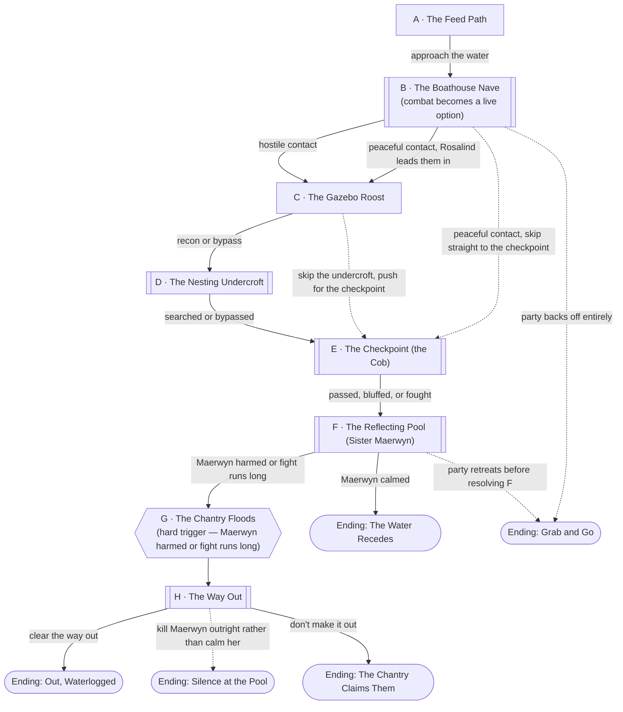

# Swan Song

## Premise

[The Drowned Chantry](../world/places/drowned-chantry.md), somewhere in the
unclaimed ground between [Scornubel](../world/places/scornubel.md) and
[Briarwood Mall](../world/places/briarwood-mall.md). The party has a reason to
be here — water, a rumor, a scavenging run, whatever the table's actual
situation is — and the [Swanfolk](../world/races/swanfolk.md) already know
they're coming before they see the boathouse.

This is a dungeon, not a chase — a string of half-submerged rooms the party
pushes through, mostly against a territorial population that would rather
not fight than fight, with one named guardian at the chokepoint and one
tragic, genuinely dangerous boss — [Sister Maerwyn](../world/npcs/sister-maerwyn.md)
— at the bottom of it. [Rosalind Voss](../world/npcs/rosalind-voss.md) is the
scene's off-ramp: whether the party ever meets her is the difference between
this playing as a fight and playing as a rescue.

**Note on party tier.** No level was specified for this encounter. It's built
for **level 2** by default — the same phase of the campaign as
[Mall Rats](mall-rats.md) — so the DM has a working file rather than a stub.
Rescale the Combat Notes if the table is actually somewhere else by the time
this gets played.

## Escalation Trigger(s)

**Node B (the Boathouse Nave) is where combat goes live, but it's a choice,
not a script.** If the party approaches carefully, Rosalind meets them there
and the whole dungeon can be walked through without initiative ever rolling.
If they arrive loud, armed, or hostile, the sentries at the Nave react in
kind and everything from there on is a live option. Nothing forces a fight —
the party can still talk, retreat, or bluff at nearly every node — but after
B, violence is squarely on the table in a way it wasn't at the shoreline.

**There is no clock.** Nothing in this dungeon counts down. Instead, see
**The Rising Water** (below the node graph) — an environmental state that
gets worse the louder and more violent the party is, and that closes off the
way they came in rather than measuring time. The pressure this dungeon puts
on the party is "don't make this place angrier," not "hurry up."

## Party

- **Tier/level:** Level 2 (default — see note above).
- **Assumed size:** 3–4, per this campaign's default.
- Nothing here is meant to outclass a level 2 party outright. The danger is
  the same as Mall Rats': attrition and a deteriorating environment, not any
  single fight being unwinnable — plus one genuinely tragic choice at the
  bottom of it.

## Node Graph





Subroutine boxes are the nodes where combat is a live option. The hexagon at
G is the only DM-scripted beat in the whole dungeon — everything else is the
party's choices and rolls. Whether they ever meet Rosalind, whether they
bother with the Gazebo or the Undercroft, and how they handle Maerwyn are
all theirs.

### Node A — The Feed Path

**Situation:** A muddy shoreline trail, the only dry approach, still bearing
a parks-department sign — **PLEASE DO NOT FEED THE SWANS** — half-swallowed
by duckweed. Pale shapes are visible at the tree line on the far bank,
standing very still, watching. Nothing is hostile yet.

**Approaches:**
- *Read the birds before advancing* — DC 10 (Perception or Survival — animal
  body language). Success: the party recognizes watching, not hunting — they
  arrive at Node B braced rather than surprised, and know not to draw
  weapons first if they want a peaceful contact.
- *Push straight for the boathouse* — no roll. Arrive at Node B with no read
  on the situation.
- *Use the irony of the sign* — DC 10 (Animal Handling), tossing food or
  otherwise trying to signal harmlessness. Success: a couple of the distant
  sentries visibly relax — advantage on the first approach roll at Node B.
  Failure: no effect, no cost; this is a low-risk node on purpose.

**Complications available here:** pull from the bank, or use "something's
moving in the shallows" — a loose paddle boat or drifting debris the party
can mistake for a threat, or use as one.

---

### Node B — The Boathouse Nave

**Situation:** Half dock, half chantry porch — this is the actual threshold.
If the party arrived braced (Node A success) or otherwise approaches without
threatening anyone, [Rosalind Voss](../world/npcs/rosalind-voss.md) steps
out first: recognizably a person under the feathers, hands empty, clearly
trying to signal something. If the party arrives loud or weapons-out,
several **Swanfolk Sentries** (see Combat Notes) hold the porch instead, and
they read the party as the threat.

**Approaches:**
- *Hold position and let Rosalind lead* — DC 10 (Insight) to recognize
  she's not attacking. Success: she gestures the party past the Sentries
  entirely, straight to Node C or, if the party skips recon, Node E — and
  warns them (in gesture, not words) to stay out of the deep water. No
  fight at this node.
- *Push past or draw first* — no roll; this is a choice, not a check.
  Combat becomes live: the Sentries (and Rosalind, if she was already
  present and gets threatened) react defensively.
- *Fight* — combat resolution, if it comes to that. See Combat Notes.
- *Back off entirely* — no roll. The party can simply leave the way they
  came; see **Ending: Grab and Go**.

**Complications available here:** the bank, plus: **Rosalind flinches at
raised weapons** — DC 15 (Insight) to notice, before anyone actually
swings, that provoking her here likely forecloses the peaceful route for
the rest of the dungeon.

---

### Node C — The Gazebo Roost

**Situation:** A half-collapsed park gazebo overlooking the pool, used as a
sentry perch — lightly held (one Sentry, or empty if Rosalind cleared the
way). Good sightlines over the Reflecting Pool and the Undercroft entrance.
Entirely optional — the party can go straight from B to D or E.

**Approaches:**
- *Climb up for a look* — DC 10 (Athletics). Success: a full view of Nodes
  E and F, including how many Swanfolk are actually posted at the
  checkpoint — advantage on the first approach roll at Node E.
- *Deal with the sentry quietly* — DC 10 (Stealth) to avoid it, or a short
  fight if it's noticed or the party chooses to engage.

**Complications available here:** the bank, plus: **the roost creaks** —
DC 5 to move carefully. Failure doesn't hurt anyone, but the noise counts
as a disruption for **The Rising Water**, below.

---

### Node D — The Nesting Undercroft

**Situation:** The flooded storage level under the chantry — cold-cellar on
one side, park maintenance shed on the other, already ankle-to-waist deep.
Nests, scavenged Earth and Faerun odds and ends, and — easy to miss — a
drainage culvert that isn't on either world's original blueprint, the
building's one other way out. A single Swanfolk may be nesting here,
isolated from the main flock's response.

**Approaches:**
- *Search carefully* — DC 10 (Investigation) for whatever the DM wants to
  seed as this dungeon's actual loot; see the open question in
  [the Drowned Chantry](../world/places/drowned-chantry.md)'s DM notes.
- *Avoid waking the nester* — DC 10 (Stealth). Failure: a short, harder
  fight than a normal Sentry — see Combat Notes on nesting Swanfolk.
- *Spot the drainage route* — DC 15 (Investigation). Success: the party
  knows about the Node H exit before they need it, which matters a great
  deal once Node G fires.

**Complications available here:** the bank, plus: **actual eggs.** If
anyone breaks or takes one, treat it as an immediate, serious disruption —
see The Rising Water. This is a genuine moral beat, not a trap the DM
springs unfairly; the party can see exactly what they'd be doing.

*This node is entirely optional — skippable from B or C straight to E.*

---

### Node E — The Checkpoint (the Cob)

**Situation:** A narrow spit of dry stone — a fallen chantry column doubling
as a bridge — is the only real approach to the pool. **The Cob**, a
larger, tougher Swanfolk (see Combat Notes), holds it with one or two
Sentries. He isn't capable of the kind of exchange Rosalind manages; he
reads intent, not words.

**Approaches:**
- *Fight* — combat resolution. The Cob is a genuinely tougher single
  target; Sentries fight per their usual pattern.
- *Use Gazebo recon, if the party has it* — advantage on this approach or
  the fight that follows, DM's call based on what was actually learned.
- *Back off without threatening him* — DC 15 (a physical calming
  approach — lowered weapons, slow movement; Persuasion doesn't really
  land on him the way it does on Rosalind). Success: he lets the party
  pass but trails them at a distance, and may reappear at Node F.

**What ends this without a kill:** the Cob is territorial, not suicidal —
clearly beaten, he withdraws toward the pool rather than dying on the
bridge, which the DM can use to seed his return at Node F instead of
removing him from the dungeon outright.

**Complications available here:** the bank, plus: **the water's already at
your knees here**, regardless of anything else that's happened — the
first concrete sign of what's coming, not yet a mechanical effect.

---

### Node F — The Reflecting Pool (Sister Maerwyn)

**Situation:** The chantry's actual heart. **Sister Maerwyn** stands (or
floats, half-shifted) at the center of the pool, mid-prayer, mid-cry —
[Reed-Song](../world/races/swanfolk.md) radiates from her, not from anyone
else in the dungeon; every other Swanfolk the party has met has just been
reinforcing hers.

**Approaches:**
- *Fight* — full combat resolution; see Combat Notes. This is the boss
  fight, and it's the approach most likely to fire Node G.
- *Calm her* — DC 15 (Persuasion, Performance, or an inspired non-verbal
  approach — singing back, holding up the "do not feed" sign, whatever a
  player actually thinks to try). Success: she stops. The cry ends, the
  rest of the flock goes still, and the dungeon resolves toward
  **Ending: The Water Recedes**.
- *Go for whatever's at the bottom of the pool* — DC 15 (Athletics to
  dive and hold position, Investigation to actually find anything) while
  risking her attention directly — DM's call on what's down there, per
  the open question in [the Drowned Chantry](../world/places/drowned-chantry.md).

**Complications available here:** the bank, plus: **the chorus answers** —
if this fight runs long, any Swanfolk still alive elsewhere in the dungeon
converge here. This is itself a trigger for The Rising Water, not a
separate clock.

*This node's outcome branches directly:*
- *Maerwyn calmed →* **Ending: The Water Recedes.**
- *Maerwyn harmed, or the fight runs more than a couple of rounds →*
  **Node G.**
- *Party retreats before resolving this node →* **Ending: Grab and Go.**

---

### Node G — The Chantry Floods

**Situation:** This node fires the instant Maerwyn is harmed in combat, or
the fight at F runs long, or the party has racked up enough disruptions
elsewhere (see The Rising Water). Nothing is rolled here. The water that's
been rising the whole dungeon reaches the entrance all at once — the route
back through the Nave floods over, the Gazebo's remaining supports give way,
and the only way out that isn't underwater is whatever the party found (or
didn't find) at the Undercroft.

Give the party one beat to react — grab what they're carrying, get their
bearings — before Node H starts moving under them.

---

### Node H — The Way Out

**Situation:** The drainage culvert under the Nesting Undercroft, now the
only route out, actively flooding. Whatever's left of the flock — surviving
Sentries, the Cob if he's alive — may be converging on the same exit.

**Approaches:**
- *Push through the culvert* — DC 10 (Athletics) if the party already
  found this route at Node D; DC 15 if they're finding it cold, under
  pressure, for the first time.
- *Fight through* — combat resolution against whatever's still standing;
  should read as "get past," not "clear," given attrition by this point.
- *Hold the way for the others* — a resource-spend beat: someone braces
  the culvert grate or a collapsing support a moment longer so the rest of
  the party gets through.

**Resolution:** clearing this node is **Ending: Out, Waterlogged**.
Clearing it after killing Maerwyn outright (rather than calming her) is the
darker **Ending: Silence at the Pool** — mechanically the same exit, a
different cost. Failing to clear it is **Ending: The Chantry Claims Them**
— not a TPK state, a cliffhanger.

**Complications available here:** the bank, plus: **the culvert is narrow**
— only one person fits through at a time, which is a good moment to ask who
goes last.

---

## Endings

- **Ending: The Water Recedes.** Maerwyn is calmed, not killed. The flock
  goes still, the water settles back to its ankle-deep baseline, and the
  party can leave the way they came, unharried. This is the only ending
  that keeps [Swanfolk](../world/races/swanfolk.md)'s "is any of this
  recoverable" hook fully open — a strong seed for a later session, not
  something this file resolves.
- **Ending: Out, Waterlogged.** The party fought their way to the bottom,
  the chantry flooded behind them, and they made it out through the
  culvert. Maerwyn's fate is whatever happened at Node F — hurt but alive,
  driven off, or genuinely defeated without being killed. The flock is
  wary of the party from here on, not necessarily hostile forever.
- **Ending: Grab and Go.** The party disengaged before resolving Node F —
  perfectly good tactics. Nothing here is finished: Maerwyn is still
  singing, the flock is still territorial, and the chantry is exactly as
  dangerous to the next person who wanders in. A clean way to leave this
  as a loose thread rather than a finished dungeon.
- **Ending: The Chantry Claims Them.** The party doesn't clear Node H
  before the flooding finishes. Not a death sentence — they're cut off in
  a flooded ruin, not drowned outright, and the DM can pick up from there
  next session. A real cliffhanger, not a failure state to avoid at all
  costs.
- **Ending: Silence at the Pool.** Maerwyn is killed rather than calmed.
  Reed-Song stops because its source is gone, the water recedes for the
  same reason it would have if she'd been talked down, and the party gets
  out — but the "person under the feathers" was killed, not saved, and
  whatever was recoverable about her dies with her. Play it as an honest
  cost of a fight gone the hard way, not a punishment.

## The Rising Water

This dungeon doesn't run on a countdown. It runs on how much noise and harm
the party actually does, and the consequence is spatial, not temporal: the
chantry floods further behind them, closing off the way they came rather
than ticking toward a deadline. **Never state a number or a countdown to the
players** — narrate the water itself ("it's past your knees now," "the dock
you crossed twenty minutes ago is gone") and let them draw their own
conclusions about how much runway is left.

Track a simple state, ankle-deep (baseline) rising through three tiers, DM's
eyes only:

1. **Knee-deep.** Low-lying nodes (D, and the Nave at B) become difficult
   terrain. Stealth attempts in the water are at disadvantage — the splash
   carries.
2. **Waist-deep.** The route back through the Nave to Node A starts to
   flood; retreating that way now costs a DC 10 Athletics check per person,
   and loose, unsecured gear can float off if dropped in it.
3. **Submerged — fires Node G immediately**, regardless of where the party
   is in the node graph.

The state rises one tier whenever:
- The party fails an approach roll at any node from D onward.
- A fight runs more than a couple of rounds past the first exchange, at any
  combat-live node.
- Something explicitly flagged as water-worthy happens (the Gazebo's creak
  at Node C, breaking eggs at Node D, drawing out the fight at Node E or F).

This mostly determines how much room the party has to maneuver and how bad
Node H gets, not whether Node G eventually happens — a long, loud dungeon
crawl reaches Submerged on its own even without Maerwyn ever being directly
harmed, the same way a long fight at F does. The pressure this creates is
forward pressure: the way behind the party is what disappears, not a clock
over their heads, and the drainage route from Node D quietly becomes the
safer bet the longer things drag on.

## Complication Bank

- **The Pen watches from the water.** Sentries visible at a distance,
  posted but not engaging — good ambient dread, and a fair warning shot the
  DM can use before any node actually goes hostile.
- **Gear floats.** Anything dropped or knocked loose in water above
  ankle-deep drifts — a complication for the party or a way to recover
  something they thought was lost, DM's call.
- **The "do not feed" sign.** A reusable prop for a Persuasion,
  Performance, or just a good bit at the table — funniest used sincerely.
- **A paddle boat.** Wedged, half-sunk, or still afloat depending on the
  node — improvised cover, an obstacle, or a way across deep water without
  swimming.
- **The chorus answers.** Any surviving, alerted Swanfolk elsewhere in the
  dungeon can converge on a loud node — reuse this anywhere combat runs
  long, not just at Node F.

## Combat Notes

- **Swanfolk Sentry** (Nodes B, C, E, and reinforcements at H): reskin a
  **Kobold** (CR 1/8). Racial traits — Water's Grace and Wingstorm, per
  [Swanfolk](../world/races/swanfolk.md). Per
  [Sister Maerwyn](../world/npcs/sister-maerwyn.md)'s notes, rank-and-file
  Sentries don't use Reed-Song independently in this dungeon — they
  reinforce hers rather than casting their own.
- **Nesting Swanfolk** (Node D, if provoked): as a Sentry, but fights at
  advantage on its first attack roll (defending eggs) — a sharper, more
  cornered version of the same statblock, not a new one.
- **The Cob** (Node E, possible return at F/H): reskin a **Goblin Boss**
  (CR 1). Racial traits as above. Territorial rather than tactical — he
  doesn't coordinate the other Sentries so much as out-toughen them.
- **Sister Maerwyn** (Node F): solo-boss tier. Full Racial Trait kit —
  Water's Grace, Reed-Song at will rather than once per short rest, and
  Wingstorm on a bloodied trigger — layered onto a tier-appropriate
  spellcaster base (an **Acolyte** or **Cult Fanatic**, CR 1/4–2, trimmed
  to a couple of nature-flavored options: *entangle*, *shape water*, a
  swan-dive charge attack). See her NPC file for the full brief.
- **Party disadvantage factors:** by Node F, the party has likely fought
  the Cob and possibly Sentries with no rest between — factor that into how
  hard Maerwyn hits. Node H should read as "get past what's left," not a
  fresh fourth stand-up fight.
- **What ends a fight without a kill:** Sentries scatter into open water
  and don't pursue onto dry ground once outnumbered or their nest is lost.
  The Cob withdraws rather than dies once clearly beaten. Maerwyn breaks
  off into grief rather than fighting to the death if the party ever gets
  a Persuasion attempt in mid-combat — DM's call on whether a mid-fight
  attempt is plausible, but it should always be possible.

---

[← Back to encounters index](README.md)
