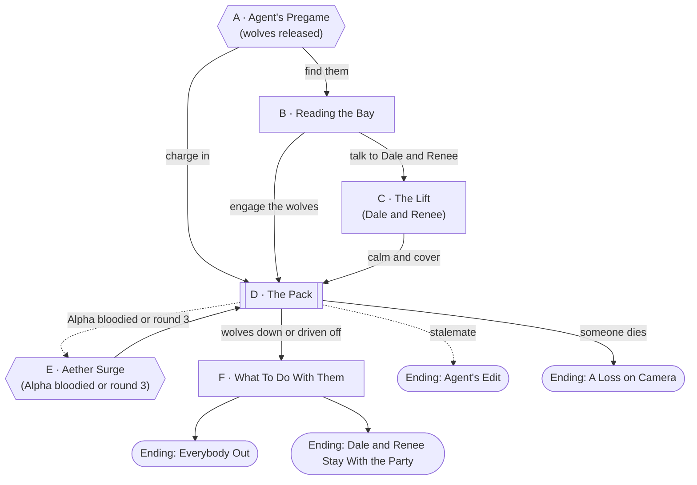
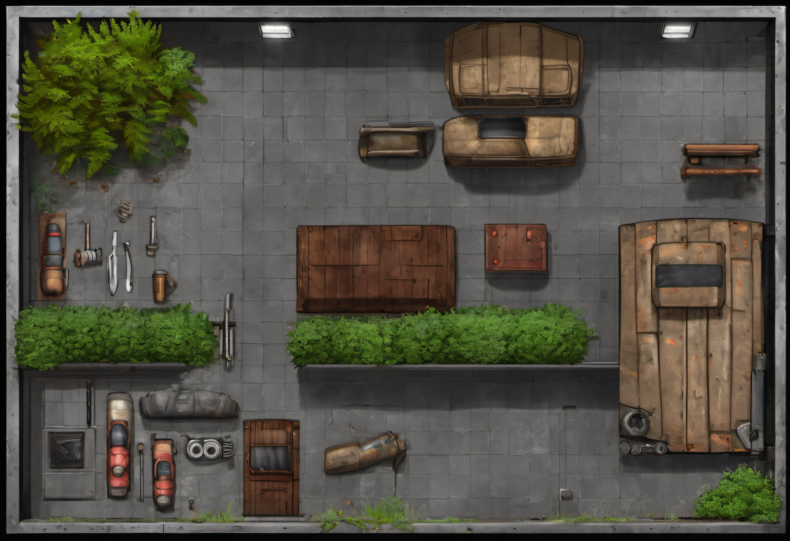

# Sweethearts of Sears

## Premise

Session 8 opens with a pregame segment. [Agent](../world/npcs/agent.md) freezes time at
Briarwood and pulls two people out of the mall: [Dale Pruitt](../world/npcs/dale-pruitt.md)
and [Renee Castillo](../world/npcs/renee-castillo.md), the couple the party let go in
Session 1. They had spent months living quietly in the back rooms of Sears, and Dale had
become friends with [Gary](../world/npcs/gary.md), the mechanic they stole from. Agent
doesn't mean them harm. It is *reintroducing* them: a recap reel, a catchphrase,
and a pack of **Aether wolves** (the same purple wolf-shaped predators as the one that
tore through JCPenney in Session 1) released into a staged replica of the Sears auto
center bay.

The party is dropped in alongside them to **deal with the wolves, and with Dale and
Renee**, in whatever order and by whatever means they choose. Then Agent sends everyone
straight on to the Hush Concord's camp in
[The Demerit Comes Due](the-demerit-comes-due.md).

## Escalation Trigger(s)

- **Hard trigger, Node A:** Agent's "GO!" It releases the wolves the moment it finishes
  the intro, whatever the party is doing. Until then nothing is hostile.
- **Combat goes live** at Node D, whenever the wolves close, or earlier if the party acts.
- **Second trigger, Node E:** the Alpha's Aether Surge, when it is first bloodied, or at
  the end of round 3.

## Party

- **Tier/level:** level 4.
- **Assumed size:** 4. Dale and Renee are NPCs and can be allies, bystanders or problems.
- **Pacing:** this is the first scene of the session and the second fight follows
  immediately. The fight is sized lighter than a fresh encounter on purpose (about
  1,200 XP, moderate for four level-4 PCs). If the table is deep in resources, let
  Agent grant a 10-minute "ad break" short rest before the gnomes.

## Node Graph





Legend: rectangle = ordinary node, subroutine box = combat live, hexagon = a hard
DM-triggered beat, stadium = an ending.

### Node A — Agent's Pregame

**Situation:** Time freezes. The party is standing in a bay that is *almost* the
Sears auto center: right fixtures, wrong light, a slightly too-clean floor. Banners hang
from the roll-up door. Over the PA, [Agent](../world/npcs/agent.md), thrilled:
*"Folks, tonight's pregame, brought to you by SEARS (not really): the Sweethearts!"* A
recap reel of Session 1's chase plays on a monitor. On a hydraulic lift, a Buick six feet
in the air, Dale and Renee are standing on the roof, backs together, with five purple
wolves circling the floor around them. Renee looks at the party with an expression of
pure, exhausted *oh, it's you.*

*"Wolves in three... two... GO!"*

**Approaches:**
- *Charge in* — no roll. Straight to Node D, with initiative called on Agent's GO.
- *Look before leaping* — go to Node B.
- *Talk to the camera* — DC 10 (Persuasion or Performance). Success: Agent grants
  the party one free round before the wolves close, because it likes the drama.

### Node B — Reading the Bay

**Situation:** One roll-up door (sealed), two car lifts (one holding the Buick), tire
racks, oil drums, a steel tool bench, and a rolling toolbox. Dale and Renee are on the
Buick. The wolves are circling the lift, not the party, since the lift is where the
smell is.

**Battlemap Prompt.**

```
Top-down tabletop battlemap, straight overhead angle, evenly lit with no
hard directional shadows obscuring terrain, clean enough to drop a grid
over without losing readability. No characters, miniatures, or tokens in
the scene — terrain and set dressing only. Mundane Earth terrain: an auto repair
shop garage floor seen from directly above, scuffed grey concrete with oil stains, two
hydraulic car lifts with a sedan raised on one, stacked tire racks, oil drums,
steel tool benches, a rolling toolbox, a roll-up door at one end.
```




**Approaches:**
- *Count the pack* — DC 5 (Perception). Four wolves and a larger one. No roll needed
  if the party stands in the open for a round.
- *Read the Alpha* — DC 10 (Nature or Survival). Success: it is the original's
  pack-mate; its coat is brightest when it is hurt; it will flare when bloodied (Node E).
- *Read Dale and Renee* — DC 10 (Insight). Success: they are scared of the
  *cameras* more than the wolves, and Renee is looking at Phil's hip, where the drill
  is, if he carries it.
- *Use the room* — DC 10 (Investigation). Success: the tire racks, oil drums and
  tool bench are cover; the second lift can be lowered or raised to cut the room in two.

### Node C — The Lift

**Situation:** Dale and Renee have been on the Buick for three minutes. They are
exhausted, and Dale's wrench arm shakes. They have a *Craftsman*-branded drill in
Renee's hand that she doesn't want. They would like to be left alone, very much.

**Approaches:**
- *Calm them* — DC 10 (Persuasion or Insight). Success: Dale stops swinging, and Renee
  takes a breath. They become cooperative allies (see Node D).
- *Give Renee her drill back* — no roll if [Phil](../world/people/phil-bernard.md)
  hands it over. She is stunned. Gives Renee +1 to Drill Bolt for the scene, and the
  gesture is not forgotten.
- *Promise Gary* — DC 5. Dale hears the name and relaxes. If the party has talked
  to Gary, even better.
- *Tell them to hold still* — DC 5. They obey.
- *Ignore them* — legitimate. Dale and Renee defend themselves but don't advance.

### Node D — The Pack

**Situation:** Combat is live in a garage-sized room, with the wolves between the party
and the lift.

**Combatants (about 1,200 XP):**
- **1 Alpha Aether Wolf** (~CR 3, 700 XP).
- **2 Aether Wolves** (CR 1, 200 XP each). The other two circling wolves are
  **pups**: Medium, CR 1/4 (50 XP each), staying close to the Alpha. Cut them
  if the party is hurting.
- **Dale and Renee** if allied; they add about 200 XP of help, so the fight is easier
  than the numbers suggest, and a loss of either one is a cost on camera.

**Complications available here:** use the bank, below.

**Approaches:**
- *Fight them* — straightforward initiative.
- *Pin them in the bay* — DC 10 (Athletics) to lower the second lift on a wolf or block a
  gap with a tire rack.
- *Distract the pack* — DC 10 (Animal Handling or a thrown meal). A thrown piece of
  food-court sandwich sends the pups after it for a round.
- *Use the Buick* — Dale and Renee are on a six-foot lift. A fall is 2d6.

### Node E — Aether Surge

**Hard trigger.** When the Alpha is first bloodied, or at the end of round 3, its coat
flares purple and it **discharges** (see its statblock): a 10-foot burst of raw aether
that knocks things around, flickers the lights, and arcs through the second lift.
Everyone nearby makes the save. Dale's torque wrench and Renee's drill both spark. A
conductive lift hits the Buick: the lift **drops** two feet with Dale and Renee on top.

**Approaches:**
- *Catch Renee* — DC 10 (Athletics or Acrobatics). Success: no damage.
- *Take the surge* — no roll. The party member nearest takes the burst.
- *Use the flare* — the Alpha is blinded for a round by its own light: advantage on
  attacks against it.

### Node F — What To Do With Them

**Situation:** The wolves are dead or gone. Agent is delighted. Dale and Renee are
standing in a room full of cameras, and every instinct they have is to disappear.
Agent says, brightly, that they are Briarwood's problem now. *Or* it keeps them.

**Approaches:**
- *Take them home* — they go back to the Sears bay. Gary is waiting. Quietly the best
  ending for them; Agent cuts to a heartwarming segment.
- *Recruit them* — DC 10 (Persuasion). They join the mall's militia, or the party's
  support. Dale is a decent bodyguard; Renee is a real ranged gun. Fits a level 4
  support role.
- *Let Agent keep them* — they become part of the broadcast cast, and Agent will use
  them again. Dale and Renee will *not* thank the party.
- *Leave them* — Agent drops them back where they came from, but they have been seen.
  They stay.

After this, Agent cuts to the demerit match: *"And NOW — Briarwood, your demerit!"* Go to
[The Demerit Comes Due](the-demerit-comes-due.md) Node A.

### Endings

- **Everybody Out.** Wolves down, Dale and Renee safe, and Agent moves on.
- **Dale and Renee Stay With the Party.** They join the mall's defense, or the party's, in
  the Hush Concord fight and beyond.
- **Agent's Edit.** The fight stalls and Agent ends it with an ad break and a convenient
  wolf retreat. No one is happy.
- **A Loss on Camera.** Dale, Renee, or a PC dies. Agent says nothing for a full
  second, then plays it back in slow motion. The next phase's quota is harder.

## Complication Bank

- **Dale and Renee argue** mid-fight about whose idea the tools were.
- **The monitor** replays the party's own Session 1 footage at the worst moment.
- **The tool bench** rolls into a wolf. Free cover, and a slamming sound.
- **A wolf breaks for the lift** and gets its front paws on the Buick.
- **Gary shows up** on a monitor, yelling from the mall, "That's MY wrench!"
- **Renee's drill jams** (Phil's version, if she was handed it) and sparks; roll a d6, on a 1
  it discharges at whoever is closest.
- **Agent pipes in** a laugh track at a deeply unfunny moment.

## Combat Notes

- **Aether Wolf (CR 1).** Large beast, **AC** 14, **HP** 37 (5d10+10), **Speed** 50 ft.
  STR 17 DEX 15 CON 15 INT 3 WIS 12 CHA 7. **Pack Tactics:** advantage on an attack
  if an ally is within 5 feet of the target. **Bite:** +5, reach 5 ft., 2d6+3 piercing;
  DC 13 Strength save or knocked prone. **Aether Glow:** its coat is a faint violet;
  it sheds dim light 10 ft.
- **Alpha Aether Wolf (~CR 3, 700 XP).** As the Aether Wolf, but **AC** 15, **HP** 76
  (9d10+27), **Bite** +6, 2d8+4. **Aether Surge (when first bloodied, or end of round 3):**
  10-foot burst centred on it, DC 13 Constitution save, 2d6 force damage and pushed
  10 feet, half damage and not pushed on a success. Lights flicker. It is **blinded**
  until the end of its next turn.
- **Pup (CR 1/4).** Medium, **AC** 13, **HP** 18, **Bite** +4, 1d8+2.
- **Dale and Renee** use the updated blocks in
  [Dale's file](../world/npcs/dale-pruitt.md) and [Renee's](../world/npcs/renee-castillo.md).
- **What ends the fight without a kill:** the wolves flee when the Alpha drops below
  a quarter of its hit points; Agent can cut in at any time.
- **Rewards:** nothing mechanical. The prize is Dale and Renee.

---

[← Back to encounters index](README.md)
