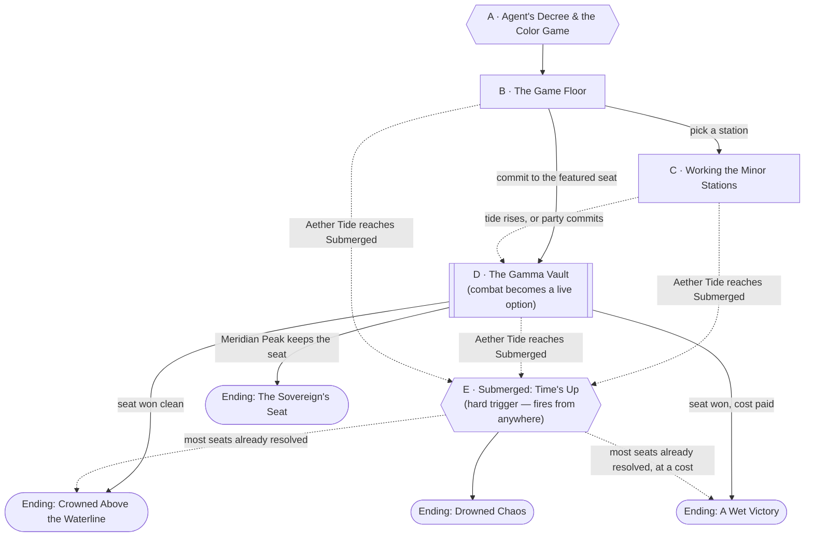

# The Color Game

**Note on party tier.** Not confirmed by the table — inferred from actual
play. Session 1's recap logs two explicit level-ups (after Gnashwhisker,
then again after the Fearus Dungeon); Session 2's recap logs none. Built for
**level 3, party of 4** on that basis. Rescale Combat Notes if the table is
actually somewhere else by tonight.

**Confirmed in play (Session 3).** This was run, and several things landed
differently from the design below — see
[Session 3](../sessions/03-the-flooded-crown.md) for the full recap. Left
here for the next DM who reads this file cold:

- **The venue wasn't Briarwood at all — Agent built a separate arena and
  teleported everyone into it.** See
  [The Flood Stage](../world/places/the-flood-stage.md) for the confirmed
  map: a purpose-built set, not a real district, sorted into four height
  tiers (Shortest/Short/Medium/Tall) that determine flood order exactly —
  Shortest first, Tall never before the event ends. Contestants were
  pulled directly out of [Briarwood Mall](../world/places/briarwood-mall.md),
  the same "time freezes" teleportation Agent's used since Session 0. The
  Aether Tide section below and Node D have both been rewritten to match
  this map exactly rather than the original generic depth-tier design —
  read them fresh rather than assuming the old version still applies.
- **Tokens found:** Microwave (a garage door opener) at the Wells Fargo;
  Infrared (an RC car, not the designed fever thermometer) at the
  Toys "R" Us; Ultraviolet (a bug zapper, as designed) after the party
  fell back to the dance studio. All three found almost on sight using
  [Jack's Spectrometer](../items/jacks-spectrometer.md), a new item built
  as a long-term project — expect it to trivialize the Deduce checks in
  Node C going forward whenever Jack has it on him.
- **The Corrupted Puma was killed, not healed** — the earlier note here
  was wrong, corrected after the DM clarified. It was infested with
  parasitic worms rather than generically "corrupted"; the worms lashed
  out and hit a party member as the puma went down, dealing real damage
  that was healed afterward. Reflavor the Wandering Threats entry below to
  match: **Wormburst**, not a generic energy release.
- **The Visible station played out as a real regicide attempt, not a
  false alarm.** Rather than a laser pointer mistaken for a sniper, an
  actual sniper fired on Phil from the medical supply factory right after
  the puma went down — resolved, DM-side only, as
  [Nadia Grier](../world/npcs/nadia-grier.md), Meridian Peak's forward
  scout, already posted there guarding the Gamma Vault. Her identity stays
  unresolved in the fiction until the party identifies her.
- **The Shrine Row Pilgrims were played as "the Bahamut hippies"** —
  devotees of Bahamut specifically, which is a good, usable specificity to
  keep. They ended up stranded on the Toys "R" Us roof as the flood rose;
  as of Session 3's end, still unrescued.
- **Miriel Ashgrove's crowning and the token-immunity rule both landed
  exactly as designed.** She was pressed into standing as "Queen of
  Scornubel" and made her unhappiness known; the party's first real
  contact with her went well. Confirmed: holding any token grants immunity
  to automatic punishment, and the Gamma holder can still override that
  immunity regardless — run it that way from here on, it isn't a house
  rule under discussion anymore.
- **Sesug's ultraviolet sight is now canon**, not a one-off ruling — see
  his file. Geese can (in this world) see into the ultraviolet, and so can
  he.
- **Meridian Peak wasn't physically present** — Agent named them on air,
  specifically to needle the two fragments into resenting each other, but
  no Meridian Peak delegate actually showed up at the Flood Stage. Don't
  write them into this session's aftermath as if they were there; the
  rivalry is real, the appearance isn't.

## Premise

Mid-morning, mid-[Blood Bowl](../world/lore/the-blood-bowl.md) countdown,
time freezes and [Agent](../world/npcs/agent.md) opens with something
closer to a complaint than an announcement: disappointing how many people
are still surviving, more disappointing that almost none of the
*interesting* ones — the higher-profile, higher-level ones — are getting
sick along with everyone else. Agent doesn't know why, and neither does
anyone else present — see
[The Aether Hunger](../world/lore/the-aether-hunger.md) for the real,
campaign-secret mechanism. Play the line as genuine, confused irritation
from a host whose format isn't behaving the way twenty-two prior cohorts
trained it to expect, not as a threat with teeth. Then, brighter: every
fragment should have royalty by now, and the fastest way to a crown is
regicide.

Real prize talk follows. **The Color Game** — seven tokens, one for each
band of the electromagnetic spectrum reskinned as "colors" for the cameras
— radio, microwave, infrared, visible, ultraviolet, x-ray, gamma. Agent
explains the rules before anyone moves: whichever fragment is physically
holding a color's token when the game ends gets that seat. Two stakes are
attached, and Agent makes sure everyone hears both — see **Stakes &
Punishments**, below the node graph, for the full mechanic and the explicit
default if the party sits this out.

Then the seeding, and it's deliberately unkind. Agent names
**[Meridian Peak](../world/factions/meridian-peak.md)** — a private
Colorado wellness-and-survival compound merged in as its own Earth
fragment, led by a woman already calling herself **Sovereign
[Helena Marsh](../world/npcs/helena-marsh.md)** — as the **first seed**.
**The Gander** (Agent's own broadcast branding for Phil Bernard's people,
lifted from the mall's homegrown religion rather than the mall's own name)
is the **second seed**. Nobody else gets named — not Scornubel, not
[Miriel Ashgrove](../world/npcs/miriel-ashgrove.md), representing the
Coster Council on an hour's notice and visibly unhappy about it, not
anyone. Agent simply doesn't bother, on air, in front of everyone.

**Five minutes.** That's the window Agent gives before the game starts —
long enough for one beat of preparation, not long enough for a plan. Then
time freezes again, harder: only the crowned and whoever's standing close
enough to count as their entourage get pulled through, not full
delegations. They land already ankle-to-knee deep in fast-rising water —
the Aether Tide (see below) didn't wait for the game to start politely, and
nobody announced that part.

## Escalation Trigger(s)

Three, doing different jobs:

1. **Ambient — Regicide Attempts & Wandering Threats.** Rolled every time
   the Aether Tide rises a tier (see below). Not mandatory combat, but a
   live possibility from the moment Agent's announcement ends, at whatever
   node the party happens to be in.
2. **Hard, local — The Gamma Vault (Node D).** Meridian Peak's security is
   already staged to hold the isotope capsule. Approaching it puts combat
   within one bad roll's reach — talking, trickery, and stealth all remain
   live options throughout, and their guards would rather retreat than die
   for one token (see Combat Notes).
3. **Hard, global — Submerged (Node E).** The instant the Aether Tide hits
   its final tier, the competition ends, full stop, regardless of what node
   the party is in. Not rolled. See The Aether Tide.

## Party

- **Tier/level:** Level 3 (inferred — see note above).
- **Assumed size:** 4, matching this table's actual roster across Sessions
  0-2 rather than the campaign's usual 3-4 default.
- Nothing at this tier is meant to be a fair fight against a Tide-Titan —
  see below. The Meridian Peak confrontation and the wandering-threats table
  are the fights actually sized for this party.

## Node Graph





Node B is a hub, not a gate — the party can work minor stations, commit to
the Gamma Vault, or bounce between both in any order. The dotted edges into
E are the Aether Tide's hard deadline; it can fire from anywhere, at any
point in the party's own plan, and doesn't wait for them to be ready.

### Node A — Agent's Decree & the Color Game

**Situation:** Time freezes. Agent runs through the whole announcement in
one breath — the "disappointing survival numbers" complaint, the
royalty-and-regicide line, then the Color Game's rules and stakes (see
Stakes & Punishments, below) — before naming the seeds: **Meridian Peak
first, the Gander second, no one else.** Miriel Ashgrove is visible behind
Scornubel's delegation and doesn't get a mention.

Agent gives everyone **five minutes** before the game starts — play it out
in real time if the table wants it, or narrate it as one beat if they'd
rather skip to the drop. Then time freezes again, harder: only the crowned
and whoever's standing close enough to count as their entourage get pulled
through. (If the party isn't physically near Phil when the five minutes are
up, decide whether that costs them — being late to your own team's
teleport is a fair, ordinary consequence, not a punishment the game itself
hands out.)

They land already ankle-to-knee deep in fast-rising water. No roll for any
of this — it's Agent's scripted opening, start to finish. Give the party
one beat to get their bearings before Node B starts moving.

---

### Node B — The Game Floor

**Situation:** The fountain court and promenade, restyled overnight into
seven stations spread across both levels, water already moving across the
lower level's tile. This isn't the whole mall's crowd — just royal
entourages and whoever else Agent decided was worth pulling in. Meridian
Peak's security detail works the floor like a unit: armed, disciplined,
unnervingly calm, physically moving weaker searching contestants out of
their way without acknowledging them as people. Scornubel's guards keep
close to Miriel, who looks like she'd rather be anywhere else.

Scattered around the edges: smaller, visibly overwhelmed groups nobody
bothered to seed or name — see **Lesser Factions**, under Wandering
Threats, for two the party might actually talk to. They're not playing to
win. They're just trying not to drown.

**Approaches:**
- *Read the floor before committing* — DC 10 (Investigation or
  Perception). Success: the party clocks which stations are genuinely
  contested versus which nobody's bothered with yet, plus a first glimpse
  of something Meridian Peak is keeping out of sight near their staging
  area — a seed for Node D's manifest.
- *Talk to another delegation* — DC 5 (Persuasion or Insight, target
  varies). Success against Miriel: she admits, quietly, she didn't ask for
  this and would rather it be over than won — and that nobody expected her
  to actually win anything. Success against a Meridian Peak guard (DC 10
  Insight instead): the party catches the specific, professional unease of
  being sized up like livestock, not like a threat.
- *Just start working a station* — no roll. Heads straight to Node C or,
  if the party wants to commit early, Node D.

**Complications available here:** pull from the bank, or use "someone
else is also reading the floor" — a generic rival contestant running the
same recon, an opening for cooperation or petty sabotage.

---

### Node C — Working the Minor Stations

**Situation:** Six of the seven stations — everything but Gamma — share the
same shape: figure out what the object has to do with its color, then hold
onto it against whoever else wants it. This node represents that loop and
can be revisited for any of the six, in any order, as many times as the
party has runway for before the tide or their own choices end the scene.

| Color | Token | Deduce | Hold | Flavor note |
|---|---|---|---|---|
| Radio | A CB radio handset | DC 10 | DC 10 | Low stakes, mostly texture. |
| Microwave | A garage door opener | DC 5 | DC 10 | The obvious one; everyone gets this fast. |
| Infrared | A forehead/fever IR thermometer | DC 10 | DC 10 | DC 15 (Medicine) extra: it's reading *something* about whoever's holding it — a quiet echo of Agent's "getting sick" line, not an explained one. |
| Visible | A laser pointer | DC 10 | DC 15 | Reads as a sniper's sight from across the floor — drawing it near a royal can trigger a false Regicide Attempt roll (DM's call). |
| Ultraviolet | A bug zapper's UV tube | DC 10 | DC 10 | Glass and a little mercury — broken roughly, treat as a minor hazard (1 point of damage, no lasting effect) rather than a real danger. |
| X-ray | Vintage "X-ray Specs" novelty glasses | DC 5 | DC 5 | Pure comedy, no danger. The DM should let this one be funny. |

**Approaches (apply to whichever token the party is working):**
- *Deduce it* — DC per table above (Investigation).
- *Hold it against a rival claimant* — DC per table above (contested, if
  someone else is also going for it; otherwise treat as the listed DC
  straight).
- *Cause chaos to cover a grab* — DC 15 (Deception or Sleight of Hand).
  Success: token secured cleanly. Failure or success either way: triggers
  one complication elsewhere on the floor (a Regicide Attempt roll, a
  Wandering Threat, or an Aether Tide tier — DM's pick, see below).
- *Gift a secured token to a lesser faction* — no roll. See **Gifting
  Tokens**, under Stakes & Punishments, below.

**Complications available here:** the bank, plus the per-token flavor notes
above.

---

### Node D — The Gamma Vault

**Situation:** Confirmed location, per the DM's map of
[The Flood Stage](../world/places/the-flood-stage.md): the
**Medical Supplies Factory**, a Medium-tier building — safe for now, but it
floods before the event ends. Meridian Peak's security rings Gamma's
token: a smoke detector's americium-241 capsule, in a lead-lined display
case. They already treat this seat as theirs — winning it is what lets its
holder force an extra punishment on any fragment (see Stakes &
Punishments), and Marsh has no intention of leaving that power on the
table. Half-hidden nearby, if anyone looks: a clipboard manifest and a
fenced-off holding area where a handful of arrivals Meridian Peak judged
"non-viable" have been cut loose from care — the hard evidence of what
their medicine is actually for.

**The clock inside the clock.** The Factory's Medium tier means Meridian
Peak has to abandon it and relocate to a Tall building — Wells Fargo
Regional Office or Neon Lights Apartment, the arena's only two guaranteed
safe points — before it floods, or drown holding Gamma uncontested. Per
the DM's own read on them, they hold out and make the call late rather
than early. A party that reaches the Factory before that relocation finds
them still dug in; a party that waits or gets delayed may instead have to
run down their evacuation, or beat them to whichever Tall building they're
making for.

**Approaches:**
- *Talk or bluff past the guards* — DC 15 (Persuasion or Deception). They're
  disciplined, not stupid, but success gets the party close without a
  fight.
- *Stealth in* — DC 15 (Stealth). The vault is watched, not omniscient.
- *Search the staging area for the manifest* — DC 10 (Investigation),
  independent of the token grab itself. This is how the party gets hard,
  portable evidence of the culling, whether or not they walk out with the
  token.
- *Force it* — combat resolution. A guard drawing a weapon without yet
  attacking is its own beat — DC 10 to talk it back down before anyone
  swings. If it goes all the way to a real fight, this is where
  [The Long Climb](the-long-climb.md) picks up — Meridian Peak brought far
  more people than this node alone suggests, and the confrontation
  escalates into a running battle up through Neon Lights Apartment's
  stairwell as the Factory floods out from under both sides.
- *Let them run, then intercept* — no roll to set up, just positioning.
  Beating Meridian Peak to Wells Fargo or Neon Lights Apartment, or
  catching them mid-relocation between buildings (in the open water, where
  the Tide-Titans also roam), is a legitimate alternate approach to this
  whole node — treat it as its own encounter, not a shortcut.

**What ends this without a kill:** Sovereign Marsh calls a retreat the
instant the optics turn against her on camera — she's performing for the
same broadcast Agent is running. Her guards fall back rather than die for
one token; see Combat Notes.

**Complications available here:** the bank, plus the capsule itself — bare
handling of the americium capsule risks exposure (DC 13 Constitution save
per round held ungloved/uncontained; failure: 1d4 necrotic damage,
cumulative). A container or improvised shielding (lead apron, thick glass)
negates this entirely — a smart party solves it rather than eating the
damage.

---

### Node E — Submerged: Time's Up

**Situation:** Fires the instant the Aether Tide reaches its final tier —
see below — regardless of where the party is or what they were mid-doing.
Nothing is rolled here. Agent calls the game the second the floor goes
under; whatever's held at that moment is final. Give the party one beat to
grab what they're carrying and get to real high ground before resolving
into an ending.

---

## Endings

- **Ending: Crowned Above the Waterline.** The party (or Briarwood, via the
  party's work) holds the Gamma seat plus a real haul of minor tokens, no
  royal was lost, and the evacuation was clean. Briarwood gets genuine
  leadership standing going into the Blood Bowl, the manifest (if found)
  exposes Meridian Peak publicly, and holding Gamma means Briarwood — not
  Marsh — gets to nominate the extra punishment, if the table wants to use
  it on Meridian Peak rather than let the power go unused. The strongest
  outcome, and it should feel earned rather than default.
- **Ending: A Wet Victory.** The party wins the Gamma seat or most of the
  minor tokens, but it cost something — a regicide attempt landed, a Titan
  redirect backfired, or the evacuation was chaotic rather than clean. Still
  a win Briarwood can use, just an expensive one.
- **Ending: The Sovereign's Seat.** Meridian Peak secures Gamma uncontested
  and nominates Briarwood for the Blood Bowl's worst punishment — exactly
  the default outcome Agent set up from Node A. The party got out, but
  ceded real ground, and Meridian Peak is now a returning antagonist with
  actual standing and a grudge already paid forward.
- **Ending: Drowned Chaos.** The Aether Tide reaches Submerged before much
  of anything got resolved. Agent calls the game early — great television,
  bad for everyone's actual standing. Tokens end up scattered or unclaimed,
  a regicide attempt may have landed unnoticed in the confusion, and someone
  might still be unaccounted for below the waterline. A genuine cliffhanger,
  not a failure state — pick up the loose ends next session.

Any of the above can also carry a quieter thread: which lesser factions got
a gifted token and avoided automatic punishment, and which didn't. Track it
loosely — it's a strong seed for who owes the party a favor, or resents
them for not sparing one, next session.

## Stakes & Punishments

Two rules, explained by Agent before the game starts (see Node A), that
make this more than a scavenger hunt:

1. **Zero tokens at the end = automatic punishment.** Any fragment holding
   none of the seven tokens when Node E fires gets punished in the Blood
   Bowl itself — no nomination needed, it just happens.
2. **Gamma's holder gets to nominate one more.** Whoever is holding the
   Gamma token when the game ends, and is still alive, gets to force one
   *additional* punishment on any fragment of their choosing — including
   one that already has tokens.

**The default, if the party does nothing.** Meridian Peak wins Gamma
uncontested and nominates Briarwood. This isn't a possible outcome the DM
rolls for — it's what happens on its own, offscreen, if the party never
engages with Node D. Make sure the table understands the stakes are live
from Node A, not something that only matters if they go looking for
trouble.

**What a punishment actually is.** Pick or roll when it matters — these are
starting points, not an exhaustive list:
- The punished fragment is assigned the worst matchup or hazard the Blood
  Bowl has queued (see [The Blood Bowl](../world/lore/the-blood-bowl.md)).
- A resource the fragment can't easily replace is stripped or spent against
  them (a defensible position lost, a stockpile seized, a favorable rule
  voided).
- A public broadcast segment airs framing them as the Bowl's designated
  underdog or villain — reputational, but Agent-amplified reputational
  damage is a real cost in this world.
- Something narrower and crueler, tied to whatever the punished fragment
  actually cares about — decide per-group rather than reusing the same
  effect twice.

**Gifting Tokens.** A fragment that secures more than the one token it
needs can hand a spare to a group that would otherwise end with zero — see
**Lesser Factions**, under Wandering Threats. This costs the giving
fragment nothing mechanically beyond the time spent finding and delivering
it — a token isn't consumed by holding it, only claimed at the end by
whoever's hand it's in — and it's the single best way for the party to
build goodwill with groups too overwhelmed to compete for themselves. Play
the receiving faction's gratitude as real and specific, not generic; this
is how a Wandering Threat becomes a future ally.

## The Aether Tide

Not a countdown stated to the players — narrate it the way Swan Song
narrates its own rising water ("the water's over the Toy Store's windows
now," "the Factory won't stay dry much longer"), and let the party draw
their own conclusions about how much runway remains. This is also the
clock the whole encounter runs on: it decides which buildings are
reachable, when Tide-Titans are a direct risk, and when the game ends
outright.

**Confirmed, per the DM's own map of
[The Flood Stage](../world/places/the-flood-stage.md) — use this instead
of a generic depth-tier guess.** Every building is sorted into one of four
height tiers, and flood order follows height exactly:

1. **Shortest floods first.** Fallen Tower, Caravan of Junkyard Vans,
   McDonald's. No mechanical effect on the party yet beyond losing those
   buildings as options — baseline from Node A's teleport onward.
2. **Short floods second.** Toy Store, Strip Mall, Industrial Chicken
   Coop. **First Tide-Titan sighting**, at a distance — see below; the
   avoid-or-redirect subsystem goes live from here on.
3. **Medium floods third.** Multi-story Dance Studio, Medical Supplies
   Factory (Node D — see that node for what this means for Meridian
   Peak specifically), Younkers. Titans are now close enough to be a
   direct risk if noticed, not just a distant shape.
4. **Tall never floods before the event ends.** Wells Fargo Regional
   Office and Neon Lights Apartment (27 Dance Studios Stacked too, though
   it's not otherwise in play) are the arena's two guaranteed safe points
   — the destination once Medium starts going under, for the party and
   for Meridian Peak alike.

**The tier rises whenever:** the party fails an approach roll at Node C or
D; a fight at Node D runs more than a couple of rounds; the party is
noticed by a Tide-Titan and doesn't successfully evade or redirect it; or
the DM's pacing calls for it after a quiet stretch. **Roll one Regicide
Attempt and consider one Wandering Threat every time the tier rises** —
this is the encounter's actual pacing engine, replacing a hard
scene-by-scene script with "the water decides when something happens
next." Node E fires the instant Tier 3 (Medium) goes under — the event
ends before Tall ever floods, so don't push past that point looking for a
fourth flood tier that isn't coming.

### Tide-Titans

Two confirmed, per the DM's map: one prowling the western channel (between
27 Dance Studios/Strip Mall and the rest of the arena), one in the central
channel (between the Multi-story Dance Studio/Fallen Tower cluster and the
McDonald's/Medical Supplies Factory cluster) — see
[The Flood Stage](../world/places/the-flood-stage.md) for the map. Dragged
in with the tide itself rather than arriving on their own, the same
"leviathans in the ocean" register the primer establishes for the Aether
world, just close enough now to be a table problem. Dumb,
food-and-noise-and-panic driven, not tactical. **Not a fair fight at this
tier — CR 8+, explicitly meant to be avoided, not fought.** See Combat
Notes for what happens if the party forces the issue anyway.

**Approaches, once a Titan is nearby (Tier 2+):**
- *Stay unnoticed* — DC 15 (Stealth).
- *Redirect it onto someone else* — DC 15 (Deception or Sleight of Hand),
  using noise, blood, or a marked target — a rival delegation's own
  commotion, a thrown noisemaker, anything that reads as prey or threat
  louder than the party does. Success: the Titan commits to the new target
  instead. Failure: it notices the party instead, and the Tide advances a
  tier immediately regardless of the normal triggers.
- *Just run for high ground* — DC 10 (Athletics). Always available, no
  special downside beyond losing time — which is itself what feeds the
  Tide.

Redirecting a Titan onto Meridian Peak's people specifically is a legitimate
play the scene supports — a quieter, uglier way to hurt them than a direct
fight, and one the party may reach for on their own once they've seen the
manifest.

## Wandering Threats

Pacing content for when a Wandering Threat consideration comes up (see The
Aether Tide) — some are fights, some are people the party can actually
help. Both are separate from the Tide-Titans and from the Meridian Peak
confrontation.

### Actually-Fightable Threats

- **Faerun option — Kobold Raiders.** Reuse [Closing Time](closing-time.md)'s
  3-4 **Kobolds** (CR 1/8) plus one **Kobold packleader** (reskin **Goblin
  Boss**, CR 1) — flushed toward high ground by the same tide, opportunistic
  rather than organized.
- **Aether option — Aether Scavenger.** Reuse [Closing Time](closing-time.md)'s
  reskinned **Giant Vulture/Weasel** (CR 1/4-1/2), Drawn to Light — now
  drawn to the game floor's noise and lights instead.
- **Earth option — Corrupted Puma.** A Bellcross-area cougar that wandered
  too close to one of the mall's merge seams, its corruption visible as
  something crawling under its skin. Reskin a **Panther** (CR 1/4) with one
  added trait — **Wormburst**: the first time it's bloodied in a fight,
  parasitic worms erupt from its hide and lash out in a 5-foot radius; each
  creature in range must succeed on a DC 13 Constitution save or take 1d4
  piercing damage. Otherwise fights exactly like a base Panther. Confirmed
  in play (Session 3): killed, not tamed or cured — treat that as the
  default outcome unless a table specifically plays for a rescue.

### Lesser Factions

Smaller Earth and Faerun groups scattered across the game floor, present
but never seeded or named by Agent — nobody thinks they can win, including
them. Not hostile by nature; their danger is panic and desperation, not
malice, and they're the intended targets for **Gifting Tokens** (see Stakes
& Punishments). None of them read as put-together the way Briarwood or
Meridian Peak do — play every one of them as overwhelmed, improvising, and
one bad moment from a real accident.

- **The Route 12 Survivors** (Earth). A Greyhound bus's worth of strangers
  — passengers and driver — swallowed whole off a stretch of Missouri
  interstate, pulled in by Agent purely as background color. No plan, no
  weapons beyond what a bus first-aid kit and a tire iron can offer, mostly
  organized around whichever passenger has stopped panicking longest. As a
  Wandering Threat: not an attack, a stampede — DC 10 (Athletics or
  Acrobatics) to avoid getting swept up if they bolt for high ground near
  the party. As a gifting target: profoundly, permanently grateful for a
  spare token or a guided route to safety — a good seed for new Briarwood
  residents down the line.
- **The Shrine Row Pilgrims** (Faerun). Devotees from
  [Scornubel](../world/places/scornubel.md)'s Shrine Row, mid-pilgrimage to
  a shrine that doesn't exist anymore, still carrying devotional relics and
  praying through the rising water rather than acting on it. As a Wandering
  Threat: not hostile, but their prayer circle blocks a corridor or
  stairwell right when the party needs it — DC 10 (Persuasion) to move
  them, or DC 15 if the party tries to do it by force without hurting
  anyone's feelings. As a gifting target: a token handed to them reads as
  an omen, not a prize — a strong hook into Faerun's fractured religious
  landscape if the table wants to pull on it later.

Both groups can also simply be **helped** rather than encountered as a
threat at all — leading them to high ground, or handing over a spare token,
costs the party a beat of time and nothing else, and is the cleanest way
into the Gifting Tokens mechanic above.

## Regicide Attempts

Rolled per the Aether Tide's pacing (once per tier-up, plus DM discretion).
Reusable all event long — roll again each time. Targets: **Phil Bernard**,
**Miriel Ashgrove**, or **Sovereign Marsh**, whichever reads as most exposed
at the moment (DM's call, or roll a d3).

1. A grieving Sector 7 survivor, convinced Phil let people die during Mall
   Rats, rushes him with a scavenged blade.
2. A bystander radicalized by Agent's morning announcement takes a swing at
   whichever royal is standing in the open.
3. A Circuit-affiliated opportunist tries to stage Phil's death as an
   accident — a "loose" grille, a "stray" crossbow bolt — a quiet nod to
   [Wade Kessler](../world/npcs/wade-kessler.md)'s simmering Act 1 threat,
   not a confirmed hit.
4. One of Meridian Peak's own security detail tests whether Marsh's crown is
   actually defended, gauging the party's response as much as hers. This is
   what actually happened in Session 3 —
   [Nadia Grier](../world/npcs/nadia-grier.md) took the shot at Phil
   unprompted; reuse her stat block (see her file) for this entry going
   forward.
5. A panicked contestant grabs a station prop as an improvised weapon rather
   than attacking anyone directly — chaos, not malice.
6. Someone shouts "regicide" as a joke and three other people take it
   seriously at once — a scrum, not an assassin.
7. A Scornubel guard, overprotective of Miriel and spooked by the crowd,
   nearly attacks an innocent bystander who got too close to her.
8. The Aether Tide itself does the work — a Titan sighting (see above)
   panics a knot of people directly toward whichever royal is nearest,
   and nobody can tell if it's an attack or a stampede until it's on top
   of them.

**Miriel Ashgrove has no PC levels and won't fight back** — per her own
file, a serious attempt against her resolves in one round unless the party
physically intervenes. Play any attempt on her as a rescue the party has to
choose to make, not a fight she survives on her own.

## Complication Bank

- **A token's in the water.** Something dropped or knocked loose during a
  scramble is now floating, retrievable but exposed.
- **A rival delegate asks for help.** A generic contestant, overwhelmed,
  asks the party for aid at a station — cooperation or a wasted turn,
  their call.
- **Somebody recognizes Meridian Peak.** A Briarwood resident who watched
  too much cable news pre-merge places the compound's name from a real,
  damning pre-merge exposé — a rumor the party can use, not proof by
  itself.
- **A station prop floats away mid-search**, forcing a choice between
  finishing the search and chasing the prop before it's lost for good.

## Combat Notes

- **Meridian Peak security** (Node D): 2 **elite guards** — reskin
  **Veteran** (CR 3) — plus 2-3 **rank-and-file** — reskin **Guard**
  (CR 1/8). Disciplined, not fanatical; see "what ends this without a kill"
  above.
- **Sovereign Marsh** — no PC levels, command presence only. Reskin a
  **Noble** or **Spy** (CR 1) with a command-flavored feature. She directs
  the fight and retreats early; she never melees.
- **Tide-Titans** — explicitly not sized for this fight. If the party
  forces an engagement anyway, treat as CR 8-10 brutes: a single slam or
  bite attack that deals lethal damage to a level 3 character on a hit.
  This number exists so the DM has something to adjudicate if a table
  ignores "avoid," not as an invitation to run a real fight here.
- **Wandering Threats (fightable)** — see above; all sized to be winnable,
  unlike the Titans.
- **Lesser Factions** — not a combat statblock. If violence somehow breaks
  out against the Route 12 Survivors or the Shrine Row Pilgrims, treat any
  individual as a **Commoner** (AC 10, a handful of HP) who flees rather
  than fights. They are not meant to be a fight, under any circumstances.
- **Party disadvantage factors:** by the time the party reaches Node D, they
  may already have spent resources on a Regicide Attempt, a Titan evasion,
  or a Wandering Threat. Size Node D's fight as attrition, not a fresh
  encounter.
- **What ends a fight without a kill:** Marsh's guards fall back once
  clearly losing or once she calls the retreat; the Titans were never
  fightable to begin with and simply move on once their attention shifts;
  wandering threats per their own listed behavior (kobolds rout, the
  Scavenger flees, the Puma disengages once bloodied and released its
  Aether Bleed).

---

[← Back to encounters index](README.md)
