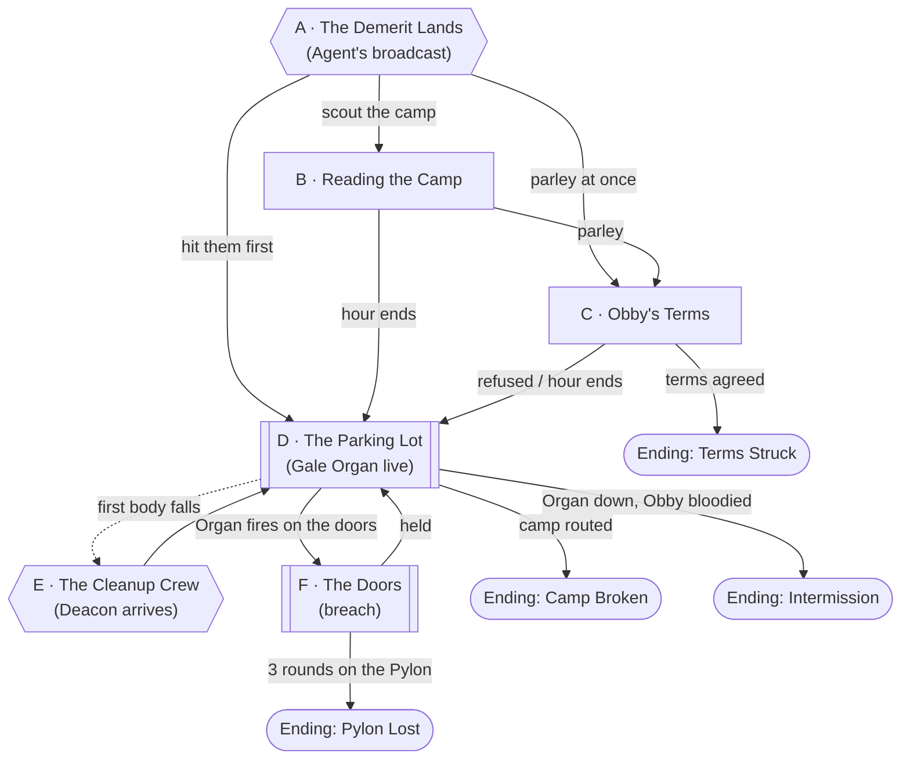
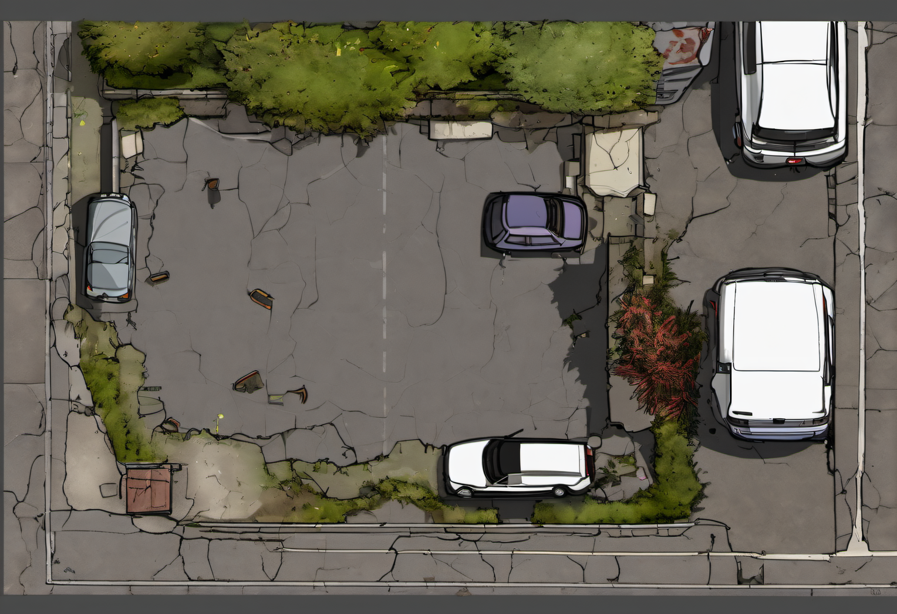

# The Demerit Comes Due

## Premise

The Blood Bowl opens, and [Meridian Peak](../world/factions/meridian-peak.md)'s
demerit from [Session 6](../sessions/06-the-fixed-game.md) lands. Agent makes
Briarwood **Phase One's designated underdog**, flags the mall's Pylon "exposed",
and drops the [Hush Concord](../world/factions/the-hush-concord.md) (gnomes from an
alternate Faerûn ruled by the Prince of Evil Air, and crowd favorites from a
previous cohort) at the far end of the broken-down parking lot with a built camp,
a siege machine, and an hour of broadcast lead-in. The party has that hour to
learn what they are facing, get the mall ready, and decide whether to bargain,
fight or both. If the gnomes reach the fountain court and hold the Pylon for three
rounds, Briarwood loses its home territory and is under quota for the phase.

Four level 4 PCs, plus whatever the mall's militia and engineering can add.

**Runs second.** The session's opening scene is the pregame,
[Sweethearts of Sears](sweethearts-of-sears.md), where Agent pulls Dale and Renee out of
the mall and the party fights a pack of Aether wolves to get them back. When that ends,
Agent cuts straight to the demerit: Node A below. Whatever the party did with Dale and
Renee carries over (they can fight with the militia, or watch from the mall doors).

## Escalation Trigger(s)

- **Hard trigger, Node A:** Agent's broadcast starts the clock. Nothing is
  hostile until the hour is up *or* someone acts first.
- **Combat goes live** at Node D when the hour ends, when the party or the
  gnomes attack early, or when Obby's terms (Node C) are refused. After that the
  Gale Organ is firing and everything else is a response to it.
- **Second escalation, Node E:** the first body that hits the asphalt calls the
  Sextonback. From then on, the longer the fight runs, the more of it is eaten.

## Party

- **Tier/level:** level 4 (per [Session 6](../sessions/06-the-fixed-game.md): "Party is
  now level 4").
- **Assumed size:** 4 ([Phil](../world/people/phil-bernard.md),
  [Jack](../world/people/jack-mercer.md), [Mitch](../world/people/mitch-saddlerash.md),
  [Geezus](../world/people/sesug-tsirch.md)).
- Balanced for the party *with* a few militia in support. Without any militia,
  drop two skirmishers.

## Node Graph

The whole scene is a defense with a clock on it. Nodes B and C can be
skipped in either order, and D is where it resolves.





Legend: rectangle = ordinary node, subroutine box = combat live, hexagon = hard
DM-triggered beat, stadium = an ending.

### Node A — The Demerit Lands

**Situation:** Sunrise. The mall's lights flicker as the PA that is not the mall's
PA starts, and [Agent](../world/npcs/agent.md) announces Phase One of the Blood
Bowl's second act (see [The Blood Bowl](../world/lore/the-blood-bowl.md)). Every
faction needs enough territories to survive the phase, and
Briarwood, "our friends who are carrying a little demerit," get a special matchup:
fan favorites from Cohort 12, the **Hush Concord**. A camp that was not there
last night stands at the far end of the lot, and nothing about it moves in the
wind, because there isn't any. The party has **one hour** of real time at the
table's discretion (or about 10 minutes in a fast session) before Agent calls
"kickoff."

**Approaches:**
- *Scout the camp* — go to Node B.
- *Call for a parley* — Node C. The gnomes accept at once; they were told to.
- *Prepare the mall first* — no roll; spend the hour. See Node B's "Dig In" list.
- *Hit them before kickoff* — legal and unsportsmanlike. Straight to Node D,
  but Agent docks the party's broadcast standing, and the gnomes are *very*
  hurt about it.

### Node B — Reading the Camp

**Situation:** A ring of canvas tents, dead-still windsocks and pinwheels, brass
pipework, and in the middle a thing like a pipe organ on a wagon: the Gale Organ.
Gnomes in leather and brass walk the perimeter, all wearing the same lung-packs.
They are quiet. Everyone is quiet.

**Approaches:**
- *Count and read the camp* — DC 10 (Perception or Investigation). Success: roughly
  8 gnomes, one old gnome in robes who floats, one gnome tinkering with the Organ.
  Failure: the number but not the roles.
- *Work out the Organ* — DC 10 (Investigation or Arcana). Success: it builds
  pressure and fires a line along the lot in rounds; the Pressure gauge is
  visible. DC 15 as a gnome engineer would explain it: the valve is on the
  left side.
- *Read the gnomes' manner* — DC 10 (Insight). Success: they are performing, and
  they will not like to be seen losing badly.
- *Ask Agent* — no roll; Agent tells you gleefully, with spoilers, in exchange for nothing.

**Dig In (hour options, one per PC action):** brace the mall doors and roll-up
grilles (Phil or Jack; DC 10, doors gain +10 hit points of barricade); park
cars in a line to break the Organ's lane (DC 10 Athletics, Jack's trailer
tools help); rally the militia (Phil, DC 10 Persuasion or Intimidation;
success adds 4 militia); stage a miracle or a speech (Geezus or Mitch, DC 10
Religion or Performance; success gives each PC inspiration at the first round);
shut off the mall's lights and rattle the gnomes with a surprise (DC 15 Stealth/Tinker, Jack:
the Organ's crew has disadvantage on the first round's initiative).

### Node C — Obby's Terms

**Situation:** [Prelate Obby Windlestraw](../world/npcs/obby-windlestraw.md)
floats out under a white flag made of a pillowcase, flanked by two skirmishers
and a camera drone Agent is quite pleased with. He is courteous. He offers
**terms**: hand over the Pylon, or fight at the top of the hour; the mall will be
"respected, as a guest, and its people kept warm." He cannot quite say "kept
breathing" without smiling.

**Approaches:**
- *Refuse* — no roll. Node D when the hour ends.
- *Negotiate a different outcome* — DC 15 (Persuasion). Success: Obby will accept
  a **staged intermission** (e.g., a fair "first to the fountain" contest that
  puts the camera on a skill challenge and both sides keep their dignity). The
  fight is not removed, just delayed; the next fight happens on Briarwood's terms.
- *Perform at him* — DC 10 (Performance), advantage for [Mitch](../world/people/mitch-saddlerash.md).
  Success: the camera drone swings to the party, and Obby is visibly aware of how
  that looks. Gives +1 to the next Persuasion roll, or lets the party keep him
  talking while Jack goes around the back of the camp.
- *Offer the Pylon's twin* — DC 20 (Persuasion). They stay quiet, accept a
  joint claim, and the Concord becomes an ally in the phase. Trying this when
  the party is visibly stronger helps; trying it when they are not is a risk.
- *Insult him on air* — DC 5 (no check). Obby is wounded, and Agent loves it.

### Node D — The Parking Lot

**Situation:** The broken lot between the camp and the doors: cracked asphalt,
weeds in every seam, a few abandoned 1992 sedans and a shopping-cart corral, a
fallen light pole, and an open lane right down the middle for the Organ's line.
Distance from camp to the mall doors is about 110 feet. The Organ gains
**1 Pressure** each round and fires at **Pressure 3**.

**Battlemap Prompt.**

```
Top-down tabletop battlemap, straight overhead angle, evenly lit with no
hard directional shadows obscuring terrain, clean enough to drop a grid
over without losing readability. No characters, miniatures, or tokens in
the scene — terrain and set dressing only. Mundane Earth terrain: a ruined
shopping-mall parking lot seen from directly above, cracked grey asphalt with
weeds growing through the cracks, faded white parking-space lines, many rusted
abandoned cars parked at angles, a toppled light pole, overturned shopping carts.
At the top edge, a small camp of round canvas tents, a wagon with a brass
organ-like machine, and poles with windsocks. At the bottom edge, the concrete
front of a mall with glass doors.
```




**Approaches:**
- *Break the lane* — DC 10 (Athletics) to drag or flip a car into the Organ's
  line: the discharge hits it instead, and it is wrecked. One or two cars
  total are movable before they run out.
- *Disable the Organ* — DC 10 (Investigation) to find the valve, then
  DC 15 (Tinker's Tools or Sleight of Hand) at the Organ to jam it: Pressure falls
  by 2 and it can't build for 2 rounds. Destroying it works too (statblock below).
- *Go for Obby* — Obby fights from range and from the air; breaking his
  concentration on Pocket Calm drops the dome. Hit him to 13 hit points and
  Node "Intermission" opens.
- *Hold the line with the militia* — a militia of 4 absorbs one skirmisher's
  attention per round.
- *Stolen Breath, countered* — Geezus's miracles (or any effect that creates
  breath, wind or sound) can undo an effect with a DC 10 check.

**The Gale Organ.** Large object. **AC** 15 · **HP** 45 · immune to poison and psychic.
Crewed by Flue or a skirmisher. At the end of each round it gains 1 Pressure; at
Pressure 3 it **discharges** in a 60-foot line, 10 feet wide: DC 13 Dexterity
save, 3d8 force damage (half on success) and a failed save is pushed 15 feet and
knocked prone. Pressure resets to 0. While Pressure is 2 or more, sound within
30 feet of the Organ is dampened. If the Organ is destroyed at Pressure 2+, it vents in a
10-foot burst (DC 13 Dex, 2d8 force).

**Combatants (about 1,600 XP, a moderate-to-hard fight for 4 level-4 PCs):**
- **Obby** — see [his file](../world/npcs/obby-windlestraw.md). ~CR 4.
- **[Flue](../world/npcs/tamberlock-flue.md)** — crews the Organ. ~CR 2.
- **4 Hushbound Skirmishers** — Small humanoid, **AC** 14, **HP** 22 (5d6+5),
  **Speed** 25 ft. *Bellows-Lance:* +4, range 30/90 ft., 1d8+2 bludgeoning,
  pushed 5 ft. *Breathless Puff (Recharge 5-6):* 15-foot cone, DC 12 Con save,
  7 (2d6) bludgeoning and no speech or verbal spells until the end of its next turn
  (half damage, no silence on a success). Gnome Cunning. ~CR 1/2 (100 XP) each.

**Complications available here:** pick from the bank below.

### Node E — The Cleanup Crew

**Hard trigger.** The moment the **first body** (a gnome, a militia member, anyone)
lands on the asphalt, or the end of round 4, whichever comes first: a dull, cracked
bone-chime tolls from the edge of the lot. [Deacon](../world/npcs/deacon.md)
ambles in, followed (if you like) by [Verger](../world/npcs/verger.md). It is the
size of a delivery truck, makes no threat, and *eats bodies*. Everyone
sees it, and the gnomes sigh with relief, because Agent put it here. Bodies vanish
in 1-4 rounds. The fight now has a time limit for reviving anyone, and a huge
piece of moving cover.

**Approaches:**
- *Drag a body out of reach* — DC 10 (Athletics) per Medium body, one round.
- *Distract or steer it* — DC 15 (Animal Handling), or bait with the
  mall's food-court meat, to move it away from the fight.
- *Take cover behind it* — no roll; it is a Huge, slow, tolerant wall. Careful
  about the gnomes' Organ lane through it: the Organ's discharge hits Deacon
  instead, which makes it a *very* sore subject.
- *Harm it* — don't. Agent docks the party's broadcast standing, and Deacon will
  fight back hard.
- *Use it on the gnomes* — dragging a downed gnome to it is cold and legal, and
  Obby will have strong feelings.

### Node F — The Doors

**Situation:** The Organ has started firing at the mall's entrance, and every
discharge shatters a bit more of the barricade. The doors have **40 hit points**
(+10 if the party braced them in Node B). When they fall, gnomes can pour into
the atrium and the fountain court's Pylon is 40 feet inside.

**Approaches:**
- *Plug the breach* — DC 10 (Athletics) to hold a gap, with whoever is nearest.
- *Fighting retreat to the fountain court* — gives up the lot but the gnomes
  have to come through a chokepoint, away from the Organ's line.
- *Hold the Pylon* — whoever stands within 10 feet of the Pylon and no enemy is
  within 30 feet at the end of each round keeps the claim. Three
  rounds of an uncontested enemy hold on the Pylon ends the scene in a loss.

### Endings

- **Camp Broken.** Skirmishers down or fled, Organ wrecked, Obby carried off by his
  own people. The Concord is out of Phase One. Agent is delighted and says so; the
  Concord becomes a recurring rival, or, if the party showed mercy on camera, a
  future ally.
- **Terms Struck.** The party talks the fight into a contest, a joint claim, or an
  alliance. The best ending for the long game and the one Agent likes least; it
  pays for the party's next fight with a worse matchup.
- **Intermission.** Obby asks for a pause with the Organ jammed or broken and himself
  at a quarter of his hit points. The fight resumes next phase in a worse spot for
  both. The party should take the offer: the gnomes are weaker and may be willing
  to bargain.
- **Pylon Lost.** The Concord holds the Pylon for three rounds. Briarwood is
  now under quota; every other faction starts closing in. The party gets one
  phase to claim a territory elsewhere or the mall is revoked.

## Complication Bank

- **A car alarm.** The gnomes' sound-dampening can't stop a 1992 Chevy's alarm; it
  goes off as soon as any car is hit. Everyone hears it. (DC 10 Strength to rip
  the wire.)
- **The militia breaks.** One or more militia panic when the first gnome falls to
  the Organ. Phil gets one chance (DC 10 Persuasion) to rally them.
- **A lift of air.** Obby draws a cone of the Prince's air in front of the
  facade and the mall's glass doors bow inward. A glass storefront shatters; DC 12
  Dex save or 2d6 slashing in the atrium.
- **Carol arrives.** [Carol](../world/npcs/carol.md) steps out in the doorway to
  see what the noise is. A golden goose on camera is the best thing anyone in
  Agent's control room has seen all week, and the gnomes recognise her.
- **A gnome wants out.** A skirmisher drops its lance and asks, in a whisper, if
  there is still room in the mall for gnomes. Agent hates this.
- **Verger bolts** across the lot after a body and runs through both sides.
- **The wind changes.** For one round the Organ vents sideways at its own camp.
  Flue is not happy.
- **The cameras cut.** Agent cuts to an ad break mid-fight. For one round the
  gnomes stop dead and bow to nothing. Phil may use that or not.

## Combat Notes

- **Likely combatants:** Obby (leader, caster at range), Flue (the Organ's crew),
  4 skirmishers, and a Pressure clock. Deacon is a hazard, not an enemy.
- **Party disadvantage factors:** the Organ's 60-foot line punishes a clumped
  party; Stolen Breath silences casters; being in the open on the lot. Size it
  lighter if the party skipped the hour of prep.
- **What ends the fight without a kill:** Obby's intermission (13 hp or fewer),
  a disabled Organ plus a camera on him, or a successful Node C bargain. The
  gnomes break before they die, and they bow when they do.
- **Rewards:** the Concord's lungs (see [Hushbound Gnomes](../world/races/hushbound-gnomes.md)),
  whatever the party salvages from the Organ, and the unanswered question of
  what happens when a faction gets a mall full of engineers.

---

[← Back to encounters index](README.md)
