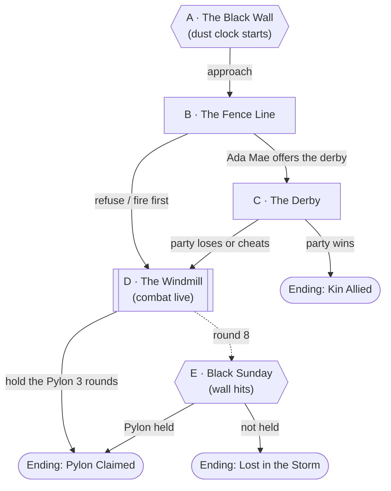

# The Dust Flats

## Premise

The first territory on offer in Act Two of
[the Blood Bowl](../world/lore/the-blood-bowl.md): [Cimarron Flats](../world/places/cimarron-flats.md),
a dust-bowl plain held by the [Black Sunday Kin](../world/factions/black-sunday-kin.md),
jackalope-folk survivors of an earlier cohort. The Pylon is at the foot of a ruined
windmill. A black dust wall (the "black blizzard") rolls in from the north on a
clock. To claim the Pylon the party has to win it from the Kin (a **derby**,
or a fight) and then **hold it for three rounds** before the storm arrives.

## Escalation Trigger(s)

- **Hard trigger, Node A:** the dust wall is visible on the horizon the moment the
  party arrives. It reaches the windmill at the end of **round 8** of the
  contest.
- **Combat goes live** at Node B or C when the party refuses the derby, cheats
  during it, or someone fires first. The Kin are not eager.
- **Hard trigger, Node E:** the dust wall hits.

## Party

- **Tier/level:** level 4; they level to 5 when they hold the Pylon.
- **Assumed size:** 4.

## Node Graph





### Node A — The Black Wall

**Situation:** Cracked, red-brown hardpan; sage and tumbleweed piled against
leaning posts; a windmill skeleton a quarter-mile off; and in the north a
rolling wall of black dust a mile high. Agent, over a static-filled radio the
party finds, announces: "Territory One: the Flats! Eight rounds to the storm."

**Approaches:**
- *Read the wall* — DC 10 (Survival). Success: eight rounds is right, and the wind
  will turn the dust toward the windmill. Failure: you think you have longer.
- *Cover faces and gear* — DC 5. Success: no penalties at the storm. Otherwise
  disadvantage on Perception and on ranged attacks inside the wall.
- *Walk in openly* — no roll; the Kin see you coming and are polite.

### Node B — The Fence Line

**Situation:** A collapsed barbed-wire fence across the plain. Behind it,
[Ada Mae Quill](../world/npcs/ada-mae-quill.md) with six Kin and a lot of rifles,
all pointed politely at the dirt. "Y'all'll be wanting the windmill. Well, ma'am,
we'll want to talk about that."

**Battlemap Prompt.**

```
Top-down tabletop battlemap, straight overhead angle, evenly lit with no
hard directional shadows obscuring terrain, clean enough to drop a grid
over without losing readability. No characters, miniatures, or tokens in
the scene — terrain and set dressing only. Mundane Earth terrain: a dried-up
dust-bowl plain seen from directly above, cracked pale red-brown dirt with
drifts of dust, dry grass, scattered sagebrush and tumbleweeds, long lines of
broken-down barbed-wire fence with leaning and fallen posts, a dry creek bed,
a collapsed wooden windmill and a rusted wagon wheel near the middle.
```

**Approaches:**
- *Parley* — DC 10 (Persuasion). Success: Ada Mae offers the derby (Node C).
  The Kin respect plain talk and manners (advantage with Geezus's calm).
- *Show proof of good faith* — DC 5. Offer water from the mall: automatic
  success on the parley. The Kin have been rationing for a hundred years.
- *Threaten them* — DC 15 (Intimidation). Success: they stand down and
  Agent boos. Failure: Node D.
- *Fire first* — no roll; Node D, and the audience notices.

### Node C — The Derby

**Situation:** The Kin's way of settling things: three events on the plain, run
before the wall arrives. The party needs to win **two of three**, each event
costing one round of the storm clock.
- **The Jackrabbit Drive:** drive a stampede of dust-stunned hares into a pen.
  DC 10 (Animal Handling or Athletics).
- **The Fence Run:** race to the windmill over wire and wreckage. DC 10 (Acrobatics
  or Athletics), with a Kin runner who gets +3.
- **The Water Hand:** pump the windmill's dry well. DC 15 (Survival or Tinker's
  Tools); a success can bring up water for everyone, which the Kin never forget.

Winning grants the Pylon with Ada Mae's blessing and her people as friendly
neighbours (Ending: Kin Allied). Losing hands the Kin the claim. Cheating (caught
on DC 15 Insight) starts a fight.

### Node D — The Windmill

**Situation:** The Pylon, a humming block, at the foot of the windmill, with the
dry creek on one side and the fence on the other.

**Approaches:**
- *Claim it* — touch the Pylon (DC 10 Arcana or Tinker's Tools, a handshake with
  Agent's tech), then **hold it for 3 consecutive rounds** with no Kin within 30
  feet. Each round, the Kin contest it.
- *Use the dry creek* — half cover along the cut bank; one fighter can flank.
- *Use the fence* — barbed wire is difficult terrain and 1d4 piercing for anyone
  dragged through it.

**Combatants (about 1,200 XP, moderate for 4 level-4 PCs):** Ada Mae
(Veteran, ~CR 3) and 4 Kin riflemen (**Scouts**, CR 1/2, with Jackalope Dash).
They run, regroup, and shoot from range; they hate melee. Break their line
and they ask for terms. They never kill a downed PC if they can avoid it.

### Node E — Black Sunday

**Hard trigger, end of round 8.** The wall hits: the area becomes heavily
obscured, ranged attacks have disadvantage, and everyone takes **1d4 slashing
dust** at the start of each of their turns without cover or a wrapped face.
Anyone *not* within 10 feet of the Pylon (the dust shields in a bubble there)
is also pushed 10 feet downwind each round. [Deacon](../world/npcs/deacon.md)
ambles through the storm, grazing on the bones, perfectly happy.

### Endings

- **Pylon Claimed.** The party holds it; Agent announces Territory One. The party
  gains a level (5). The Kin are impressed or outplayed.
- **Kin Allied.** The party wins the derby, shares the water, and the Kin help
  hold the Pylon. Fewer enemies, one good neighbour.
- **Lost in the Storm.** The wall hits and the party doesn't hold; everyone is
  pushed off the Flats. The Kin keep the Pylon, and the party is a territory behind.

## Complication Bank

- **The jackrabbit drive goes wrong.** A thousand hares turn on a PC.
- **A hidden well.** Ada Mae knows a way down to old water, and sees whether
  the party is the sort to share it.
- **Tumbleweed rolls into the fight** and sets off something unhelpful.
- **Deacon wanders in** and starts eating. Everyone stops and stares.
- **The radio crackles** with Agent's voice, taking bets.
- **A scrap of the 1935 world:** a sheriff's star, a diary, a still-ticking pocket
  watch that points toward the Pylon.

## Combat Notes

- **Likely combatants:** Ada Mae and 4 riflemen; fast and ranged, with a
  strong preference not to melee.
- **What ends the fight without a kill:** Kin morale (two down and they ask for
  terms), the storm, or a derby proposal at any point.

---

[← Back to encounters index](README.md)
