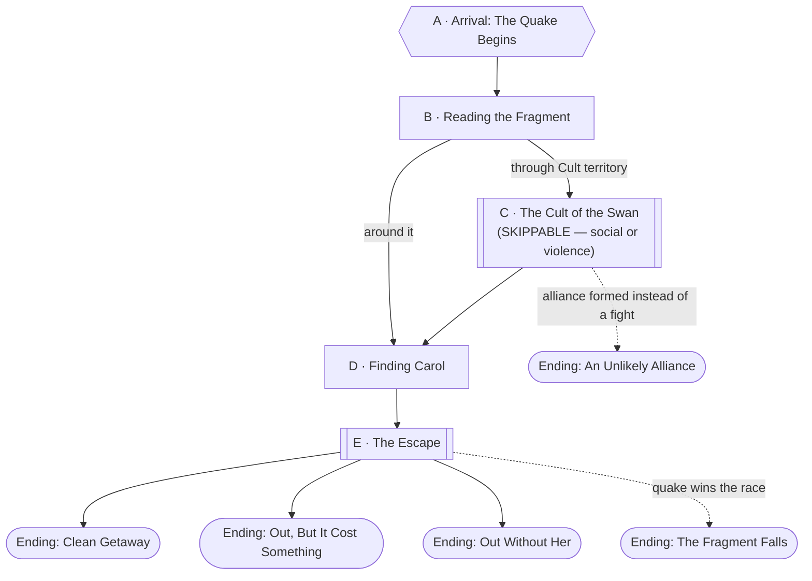

# The Golden Goose Chase

**Note on scope.** Built to fit inside a single session. Only two things in
this file are load-bearing — reaching [Carol](../world/npcs/carol.md) (Node
D) and the Escape (Node E). Everything else, including the entire Cult of
the Swan confrontation and every Leprechaun raid, is explicitly disposable:
skip freely, compress to a line of narration, or cut mid-scene the moment
the table's run out of runway. Every optional beat below is marked
**SKIPPABLE**.

## Premise

Word reaches the Mall Rats the way rumors do — a goose somewhere out past
the merge seams lays solid gold eggs, and whoever gets there first walks
away rich. Before anyone can even finish planning the trip, worse news
follows: the fragment that goose is on, the [Preening
Grounds](../world/places/the-preening-grounds.md), is under assault. A
raiding Luck of Aether creatures the party's already hearing called
"Leprechauns" — [Gildrot](../world/npcs/gildrot.md)'s band, small, green,
too many teeth, obsessed with gold and worse with people who are guarding
any — has moved in on territory claimed by an orc tribe calling itself the
**[Cult of the Swan](../world/factions/cult-of-the-swan.md)**, who want the
same goose for entirely different, much stranger reasons (see that
faction's file — they think she's the most beautiful bird they've ever
heard of, and have no idea what she actually is).

And then the ground starts cracking. Something — nobody knows what, and
this file doesn't decide it either — has put a fault line through the
fragment itself, and it's getting worse by the hour. The party isn't just
racing two other claimants to a goose. They're racing a fragment that's
coming apart.

## Escalation Trigger(s)

Two, doing different jobs:

1. **Hard, at the top — Arrival & the Quake Begins (Node A).** No roll. The
   party lands already mid-tremor; the quake clock (see below) starts the
   moment they set foot on the Preening Grounds and doesn't stop for
   anyone.
2. **Ambient — Leprechaun Raids.** Rolled at the DM's discretion whenever
   the quake clock ticks up a tier (see below), 0-2 times over the whole
   session. **SKIPPABLE entirely** — see Leprechaun Raids, below, for how
   to cut this to zero without losing anything the plot needs.

## Party

- **Tier/level:** Level 4, party of 4 (confirmed as of Session 6).
- Nothing here is meant to be a fair fight against the fragment itself —
  the quake is the real threat by the end, not any single monster.

## Node Graph





Node B is a hub: the party can go straight around the Cult toward Carol, or
through their territory (Node C) if they want the social angle, the intel,
or think a fight's worth it. Node C is a genuine detour, not a gate —
nothing at Node D or E requires having gone through it. Leprechaun Raids can
land on top of any node and aren't shown on this graph; see below.

### Node A — Arrival & the Quake Begins

**Situation:** The party arrives — however the table frames the trip in —
to reed marsh and black water already trembling underfoot. No roll for any
of this; narrate the first tremor as it happens; give the party one beat to
get their bearings before Node B starts moving. This is the encounter's only
hard trigger and it fires on arrival, full stop.

---

### Node B — Reading the Fragment

**Situation:** Marsh in every direction, orc chanting audible somewhere off
to one side, and at least one distant shriek that doesn't sound like either
an orc or a bird. The party has to pick a direction before anything else
happens.

**Approaches:**
- *Read the terrain before moving* — DC 10 (Investigation or Survival).
  Success: a rough sense of where the Cult's main camp is (loud, organized,
  avoidable) versus where the goose most likely is (quiet, marshy, probably
  where nobody else wants to go).
- *Listen for the goose specifically* — DC 15 (Perception or Survival).
  Success: a real bearing on Carol's location, enough to skip straight to
  Node D without going anywhere near the Cult at all.
- *Just pick a direction* — no roll. Heads toward Node C if they walk into
  Cult territory, or straight to Node D if they don't.

**Complications available here:** pull from the bank, below.

---

### Node C — The Cult of the Swan *(SKIPPABLE)*

**Situation:** [Chief Vainhusk](../world/npcs/vainhusk.md)'s people, mid
hunt, feathers on everyone worth the name, none of them able to tell a
swan from anything else with wings. They don't yet have Carol and don't
know what she really is — just that something spectacular is out there and
they want it before the Leprechauns or the quake take it first. Per that
faction's file, this is explicitly **social or violence**, the table's
choice, and can also simply be **skipped**: the party can route around this
node's entire territory at Node B and never trigger it.

**Approaches:**
- *Talk to them* — DC 10 (Persuasion). Success: Vainhusk hears the party
  out — an offer of feathers, prestige, or a shared enemy in the
  Leprechauns can buy safe passage or even temporary help (see Node C's
  Alliance ending, and Vainhusk's own file for what he'd actually accept).
- *Bluff or impress them* — DC 15 (Deception, Performance, or Intimidation).
  Success as above; failure risks tipping straight to violence.
- *Fight them* — combat resolution; see Combat Notes. They fight for pride,
  not tactics, and mockery or humiliation breaks their morale faster than
  damage does.
- *Avoid them entirely* — DC 10 (Stealth), or simply route around at Node B
  and skip this node outright. Either is a fully legitimate way to never
  interact with the Cult at all.

**What ends this without a kill:** a face-saving offer, or Vainhusk simply
deciding the goose isn't worth dying over once it's clearly costing him
fighters — see his file.

**Complications available here:** the bank, plus "a Cult scout spots the
party first and reports back," which can seed either a later ambush or an
opening for the party to approach Vainhusk on their own terms.

---

### Node D — Finding Carol

**Situation:** The core beat of the whole mission. Somewhere quiet and wet,
away from both the Cult's noise and the worst of the Leprechauns' raiding,
is [Carol](../world/npcs/carol.md) — furious, exhausted, and completely
unimpressed by yet another group of armed strangers showing up. This node
is not optional; the mission doesn't resolve without at least reaching her,
even if the party ultimately leaves without her (see Endings).

**Approaches:**
- *Track her down* — DC 10 (Survival), or automatic if the party already
  succeeded on Node B's Perception/Survival check.
- *Talk her into trusting the party* — DC 10 (Persuasion or Insight).
  Success: she explains the Gilder/Glider situation herself, sharp and
  sarcastic (see her file), and agrees to try to leave with them.
  Failure: she's willing to be led toward safety but doesn't trust anyone
  yet — treat as an escort NPC who argues with every decision along the
  way, not a hostile one.
- *Just grab her and go* — no roll, but expect her opinion of the party to
  reflect it. She isn't a fighter and won't meaningfully resist, but she'll
  make the whole escape more difficult to enjoy.

**What the party actually finds here** is the mission's real payoff, not
another fight — treat this node as a conversation and a decision, not a
combat encounter.

---

### Node E — The Escape

**Situation:** Wherever the quake clock stands by the time the party has
Carol (or has decided to leave without her), getting off the Preening
Grounds now means moving fast through collapsing terrain, and possibly
through whoever else is still around — an angered Cult, a still-raiding
Luck of Leprechauns, or both. This node is not optional. Resolve it as a
single tense scene rather than a fresh combat encounter from scratch —
lean on whatever's already in motion from earlier nodes.

**Approaches:**
- *Outrun it* — DC 15 (Athletics or Acrobatics), harder if carrying or
  escorting Carol. Success: clean terrain the rest of the way.
- *Navigate around a collapsing section* — DC 10 (Survival or
  Investigation) to spot the safe path before committing to one that isn't.
- *Deal with pursuit, if any* — combat resolution or a social/skill
  approach per whichever faction is chasing (Cult per Node C's rules,
  Leprechauns per Combat Notes below — a thrown handful of coin is always
  a legitimate way to end a Leprechaun pursuit without a fight).
- *Carry Carol out directly* — no roll, but she can't outrun a serious
  hazard alone; someone needs to be responsible for her if things get bad.

---

## Endings

- **Ending: Clean Getaway.** The party gets Carol off the fragment before
  the quake takes it, without a costly fight along the way. The strongest
  outcome — Carol owes the party a real debt, and her golden eggs become an
  ongoing, friendly resource rather than a one-time score.
- **Ending: Out, But It Cost Something.** The party escapes with Carol, but
  paid for it — a fight went badly, someone got hurt, or they had to
  abandon something to move fast enough. Still a win; Carol's grateful, but
  the mission wasn't free.
- **Ending: Out Without Her.** The party makes it off the Preening Grounds,
  but Carol doesn't come with them — she chose to stay, got separated, or
  the party decided she wasn't worth the risk. Not a failure state; it's a
  real, usable hook (does the Cult get her instead? does she turn up again
  later, having survived on her own?), just not the mission's best outcome.
- **Ending: An Unlikely Alliance.** Node C resolved into a genuine deal with
  Vainhusk's people rather than a fight, and that alliance carries into the
  escape — the Cult actively helps get Carol clear, at least as far as their
  own territory extends, in exchange for whatever the party offered. A
  strong seed for the Cult recurring as a strange, sincere ally rather than
  a one-off threat.
- **Ending: The Fragment Falls.** The quake wins the race. Whether this
  means the party barely escapes without Carol, or the fragment tears apart
  with people still on it, is the DM's call in the moment — play it as a
  genuine cliffhanger, not a punishment, and pick up the loose ends next
  session.

## The Quake Clock

Same device as the Aether Tide/rising-water pattern used elsewhere in this
campaign (see `the-color-game.md` and `the-long-climb.md`) — don't run this
as a single roll or a strict turn count, narrate it as escalating tremors
that make the terrain worse each time and let the table feel time
tightening without a hard number attached.

1. **First tremor (on arrival, Node A).** Cracked mud, startled birds,
   nothing dangerous yet.
2. **Second tremor.** Standing water starts draining into new cracks; a
   structure or two the party might have used for cover comes down.
   Trigger this once the party has resolved roughly half the session's
   content (Node B plus either Node C or meaningful progress toward Node
   D) — a pacing cue, not a fixed clock.
3. **Third tremor.** Open fissures, sections of marsh actively dropping —
   this is the tremor that should be landing right around when the party
   reaches Node D, to put real pressure on the Escape.
4. **The fragment goes.** Reserve this for Node E itself, and only if the
   table is genuinely out of time or the DM wants The Fragment Falls as the
   ending — this isn't meant to fire mid-scene and cut a fight short
   arbitrarily.

**Tie Leprechaun Raids (below) to tremor stages** if used at all — a raid
lands well right after the second tremor, less well stacked on top of a
node the party's already struggling through.

## Leprechaun Raids *(ambient, SKIPPABLE — 0-2 uses)*

Not a fixed node. At the DM's discretion, once per tremor tier at most (so
at most twice across the whole session), a handful of Gildrot's Luck can
show up wherever the party currently is. **The single easiest thing in this
whole file to cut for time — running zero of these costs the mission
nothing**, since the party's already going to see Leprechauns menace the
fragment in the fiction even if none of it becomes a rolled fight.

**A raid, if run:** 2-3 rank-and-file Leprechauns (see Combat Notes),
occasionally with Gildrot himself if the DM wants a named face on it.
Remember Gold Hunger — a thrown handful of coin, a dropped pouch, or any
unclaimed gold in the scene pulls them off the party immediately and ends
the encounter without anyone needing to fight it out.

## Complication Bank

- **The ground gives way underfoot** mid-scene, no warning — DC 10
  (Acrobatics or Athletics) to avoid a fall into shin-deep muck, more
  annoying than dangerous.
- **A Leprechaun and a Cult scout are already fighting each other** when
  the party arrives at a location — an opening to slip past both, or to
  pick a side.
- **Carol's egg comes due at the worst possible moment** — a solid gold
  egg, mid-escape, immediately interesting to anyone watching who hasn't
  already been dealt with.
- **A landmark the party was using to navigate collapses**, forcing a fresh
  Survival check to reorient.

## Combat Notes

- **Rank-and-file Leprechauns:** reskin **Goblin** (CR 1/4) with
  [Aether Leprechauns](../world/races/aether-leprechauns.md)' Gold Hunger
  and Ravenous Bite traits. 2-3 per raid, per Leprechaun Raids above.
- **Gildrot**, if used by name: see his own file for the full statblock
  (reskinned **Goblin Boss** plus the Doombow attack). Not required to
  appear in person for this mission to work — the rank-and-file alone carry
  the threat just fine.
- **Cult of the Swan rank-and-file** (Node C, if it goes to violence):
  reskin **Orc** (CR 1/2), 3-4 of them. Fight for pride, not tactics; break
  and retreat once clearly losing or once humiliated rather than merely
  hurt.
- **Vainhusk**, if the fight escalates to him directly: see his file
  (reskin **Orc War Chief**/Half-Ogre tier, CR 2-3, no unusual traits).
- **Carol:** no PC levels, not built as a combatant — see her file. Treat
  her purely as an escort objective throughout Node D and Node E.
- **What ends a fight without a kill:** Leprechauns break for gold, always;
  the Cult breaks once humiliated or once Vainhusk calls it; nothing in
  this file is meant to require a fight to the death to resolve.

---

[← Back to encounters index](README.md)
