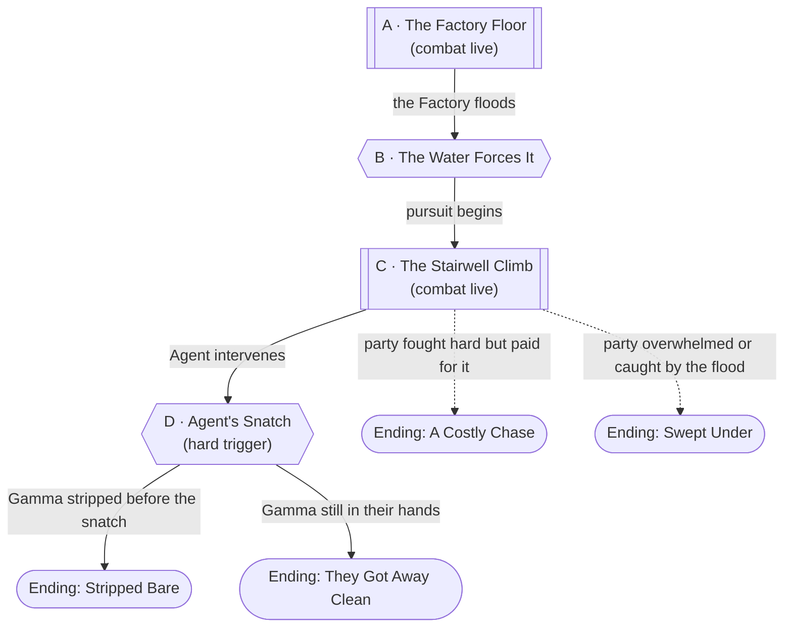

# The Long Climb

## Premise

The escalation of [the Color Game](the-color-game.md)'s Node D once the
party pushes it into a real fight rather than talk, trickery, or stealth.
Sovereign Marsh never intended to defend the Medical Supplies Factory to
the end — she brought **far more people than any other fragment**, and
her Warden, [Silas Renner](../world/npcs/silas-renner.md), is the reason
why. What starts as a fight over the Gamma token becomes a running battle
up through [Neon Lights Apartment](../world/places/the-flood-stage.md)'s
stairwell as both sides race the Aether Tide — the party trying to stop
Meridian Peak's leadership before they get clear, Meridian Peak trying to
reach the roof with whatever they're holding.

**The ending is fixed; the cost isn't.** Marsh and Renner escape — that's
authored, not rolled. What's genuinely contested is whether they escape
*with* the Gamma token, how many guards and duplicates the party has to
go through to make them work for it, and what it costs the party to get
that close.

## Escalation Trigger(s)

Three, in sequence:

1. **Already live.** This file only gets used if Node D's "Force it"
   approach was taken — combat is live from the first line.
2. **Hard, environmental — the Factory floods.** The Medical Supplies
   Factory is Medium tier; its flood timer runs out mid-fight (DM's
   pacing, or automatically per [the Color Game](the-color-game.md)'s
   Aether Tide reaching Tier 3), forcing both sides to move. This is Node
   B below.
3. **Hard, scripted — Agent's Snatch.** Named precisely: fires either
   after 3-4 rounds of the stairwell chase (Node C), or immediately if the
   party is about to land a blow that would kill or capture Marsh or
   Renner outright — whichever comes first. Agent will not let its two
   favorite new heels die off-camera. See Node D.

## Party

- **Tier/level:** Level 3.
- **Assumed size:** 4.
- This is built as the Color Game's actual boss-tier set piece — expect it
  to be genuinely dangerous, not a warm-up fight. The narrow stairwell
  terrain in Node C is what keeps Meridian Peak's numbers from simply
  overwhelming the party on action economy alone; see that node's
  Approaches.

## Node Graph





Subroutine boxes are where combat is live throughout. The hexagons are
both DM-scripted beats — the flood timer and Agent's intervention — rather
than rolled outcomes.

### Node A — The Factory Floor

**Situation:** The fight the party chose. [Silas Renner](../world/npcs/silas-renner.md)
personally engages, backed by 3 **Meridian Peak Guards** (see Combat
Notes) — Marsh stays back, already angling toward the Factory's rear
exit rather than the fight itself. A DC 10 (Perception or Insight) check
notices her positioning early: she's not planning to be here much longer,
with or without a reason to leave.

**Approaches:**
- *Fight* — combat resolution. See Combat Notes.
- *Go straight for Marsh* — a bold, legitimate play. Renner and the
  guards intervene to screen her; treat this as fighting toward a
  objective through the existing combatants, not a separate check.
- *Grab the manifest or the capsule mid-fight* — DC 10 (Investigation),
  usable once per combatant, action cost same as any other combat action.

**Complications available here:** the bank, plus the capsule's exposure
risk (see [the Color Game](the-color-game.md)'s Node D) — now a genuine
hot potato if it changes hands mid-fight.

---

### Node B — The Water Forces It

**Situation:** No roll. The Factory's flood timer runs out — water comes
in fast, not a trickle — and both sides have to move immediately. Marsh
and roughly half of whatever guards remain break for
[Neon Lights Apartment](../world/places/the-flood-stage.md), the nearer of
the arena's two Tall buildings. Renner and the rest hang back just long
enough to make pursuit expensive. Give the party one beat to decide:
chase immediately, grab anything not yet secured, or both at a cost.

---

### Node C — The Stairwell Climb

**Situation:** A tight, multi-flight stairwell inside Neon Lights
Apartment, water visible and rising through a stairwell window below.
Both sides climbing at once. The stairwell is narrow enough that only two
combatants can meaningfully engage at a landing at a time — this is the
node's real balancing lever against Meridian Peak's numbers, not a
throwaway detail. Renner fights a rearguard action at each landing,
spawning **Duplicate Guards** (see Combat Notes) to slow pursuit while
Marsh keeps climbing ahead, unengaged.

**Approaches:**
- *Push through a chokepoint* — combat resolution, one landing at a time.
  Whoever holds the higher ground on a landing has advantage on melee
  attacks against anyone still climbing toward them.
- *Move fast and reckless* — DC 10 (Acrobatics) to close distance on
  Marsh without stopping to fully clear a landing. Failure: knocked prone
  on slick stairs, losing the ground gained.
- *Use the environment* — DC 15 (Athletics) to vault a railing, use debris
  as an improvised chokepoint blocker, or collapse a section behind the
  party to slow whatever's still climbing after them (works both
  directions — Renner may try this too).
- *Peel off after Marsh specifically* — DC 15 (Athletics or Acrobatics) to
  break away from the landing fight and close on her directly. Renner will
  spend a Duplicate or his own action to stop whoever tries this.

**Complications available here:** the bank, plus **the lights are failing**
— treat any landing as dim light after the first couple of rounds, and
flag one specific landing (DM's choice) as difficult terrain from a
collapsed section of railing.

---

### Node D — Agent's Snatch

**Situation:** Fires per the Escalation Trigger above — not rolled. Time
freezes. [Agent](../world/npcs/agent.md)'s voice cuts in, delighted,
declaring the chase a ratings triumph, and pulls Marsh, Renner, and
whatever's left of their people out entirely — the same "time freezes"
teleportation used since Session 0. Whatever they're physically holding at
that exact moment leaves with them; whatever the party already secured
stays. Give the party one beat to grab anything still loose before
resolving into an ending.

---

## Endings

- **Ending: Stripped Bare.** The party got the Gamma token (and/or the
  manifest) out of Marsh's or Renner's hands before the snatch — a called
  shot, a disarm, simply besting them badly enough something got dropped.
  Meridian Peak escapes humiliated and empty-handed. The strongest
  outcome, and it should feel earned, not default.
- **Ending: They Got Away Clean.** Gamma leaves with Marsh. Feeds directly
  into [the Color Game](the-color-game.md)'s **Ending: The Sovereign's
  Seat** — Meridian Peak nominates Briarwood for the Blood Bowl's worst
  punishment, and now has a face-to-face grudge to go with it.
- **Ending: A Costly Chase.** The party fought hard and it cost them —
  someone got Dominated, the party is bloodied, or they lost a round to a
  Duplicate swarm — but they're still standing and still in the game
  either way. Track this loosely into whichever Node D outcome actually
  landed.
- **Ending: Swept Under.** The fight went badly enough, or ran long
  enough, that the Tide catches the party as well as Meridian Peak — not a
  TPK state, a forced retreat down and out before the stairwell floods
  behind them. Meridian Peak gets away by default; the party gets a
  genuine cliffhanger and a score to settle instead.

## Complication Bank

- **A duplicate doesn't know it's fake.** Treat one Duplicate Guard per
  fight as briefly, tragically self-aware before it dissolves — a strong,
  ugly beat about what Meridian Peak actually does to people, usable once
  for real weight rather than played for laughs every time.
- **A Bahamut pilgrim is still on this floor**, trying to reach high
  ground the hard way, caught between both sides — a reason area attacks
  and reckless positioning cost something here too.
- **The manifest is dropped, not secured** — floating, retrievable, but
  exposed to the same rising water as everything else if nobody grabs it.
- **A guard breaks and runs** rather than fights — Renner doesn't chase
  them down for it; not every Meridian Peak combatant is committed the way
  he is.

## Combat Notes

### Silas Renner

*Medium humanoid (human), lawful evil*

- **Armor Class** 16 (reinforced tactical vest)
- **Hit Points** 65 (10d8 + 20)
- **Speed** 30 ft.
- **STR** 14 (+2) **DEX** 16 (+3) **CON** 14 (+2) **INT** 13 (+1) **WIS** 15 (+2) **CHA** 16 (+3)
- **Saving Throws** Wis +4, Cha +5
- **Skills** Insight +4, Intimidation +5, Perception +4
- **Senses** passive Perception 14
- **Languages** Common
- **Challenge** 4 (1,100 XP)

**Composed Under Fire.** Renner has advantage on saving throws against
being frightened.

**Compliance Rig (Dominate, Recharge 5-6).** Renner targets one creature he
can see within 30 feet. The target must succeed on a DC 13 Wisdom saving
throw or be charmed by him for 1 minute. While charmed, the target is
under Renner's control — the DM decides its actions, or the player
narrates within tight DM-set constraints — and it repeats the saving
throw whenever it takes damage, ending the effect on itself on a success.
The effect also ends if Renner is incapacitated, dies, or the target ends
its turn more than 60 feet from him.

**Replication Unit (Duplicate, Recharge 5-6).** As a bonus action, Renner
touches a Meridian Peak Guard within 5 feet of him. An unstable duplicate
of that guard appears in an unoccupied space within 5 feet of the
original, using the same statistics except it has half the normal hit
point maximum (5 HP) and dissolves into gray ash 1 minute after it
appears, or immediately if reduced to 0 hit points. A duplicate cannot
itself be duplicated.

**Multiattack.** Renner makes two Shock Baton attacks.

**Shock Baton.** *Melee Weapon Attack:* +5 to hit, reach 5 ft., one
target. *Hit:* 7 (1d8 + 3) bludgeoning damage plus 7 (2d6) lightning
damage, and the target must succeed on a DC 13 Constitution saving throw
or have disadvantage on its next attack roll.

---

### Meridian Peak Guard

*Medium humanoid (human), lawful evil*

- **Armor Class** 14 (tactical vest and shield)
- **Hit Points** 11 (2d8 + 2)
- **Speed** 30 ft.
- **STR** 13 (+1) **DEX** 12 (+1) **CON** 12 (+1) **INT** 10 (+0) **WIS** 11 (+0) **CHA** 10 (+0)
- **Skills** Perception +2
- **Senses** passive Perception 12
- **Languages** Common
- **Challenge** 1/8 (25 XP)

**Baton.** *Melee Weapon Attack:* +3 to hit, reach 5 ft., one target.
*Hit:* 4 (1d6 + 1) bludgeoning damage.

**Sidearm.** *Ranged Weapon Attack:* +3 to hit, range 30/90 ft., one
target. *Hit:* 4 (1d6 + 1) piercing damage.

**Duplicate Guard variant:** identical statistics except 5 hit points
(half the normal maximum) and dissolves into gray ash 1 minute after it
appears, or immediately at 0 hit points.

---

- **Meridian Peak elites** (2, held in reserve unless the party pushes
  hard early): reskin **Veteran** (CR 3) from the core rules, unchanged —
  see [the Color Game](the-color-game.md)'s original Combat Notes.
- **Sovereign Marsh:** does not fight in this encounter, per her
  established characterization — see her file. She climbs, she directs,
  she doesn't swing.
- **Party disadvantage factors:** this fight comes directly out of Node
  D's Factory confrontation with no rest between — factor that into pacing
  Node C rather than running it fresh.
- **What ends the fight without a kill (for the party, not just Meridian
  Peak):** if Node C goes badly, falling back down the stairwell and out
  of the building is always available — the Tide-Titans in the open water
  outside are a worse problem than a guard who lets you retreat.
- **What ends the fight without a kill (Meridian Peak's side):** ordinary
  guards rout once Renner falls, retreats, or is clearly losing; Renner
  himself does not rout — he fights until Node D fires, per his own
  DM Only notes.

---

[← Back to encounters index](README.md)
