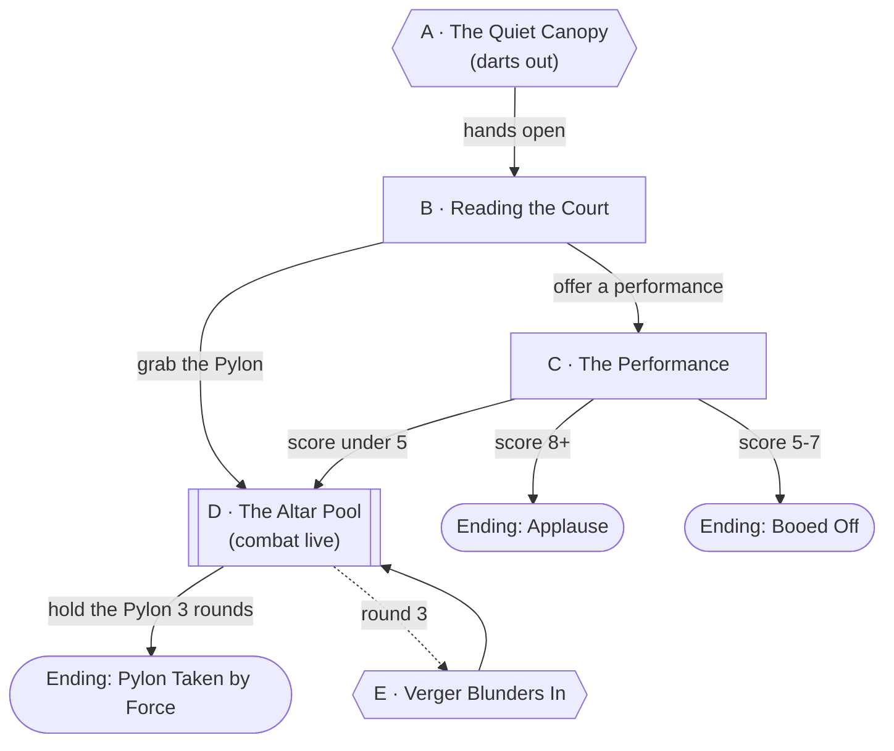

# The Verdigris Clearing

## Premise

The second territory of Act Two: a small clearing in a fantasy rainforest, held by the
[Dartwood Court](../world/factions/dartwood-court.md), poison-frog folk and crowd
favorites from an earlier cohort. The Pylon stands on a half-drowned altar in the
middle of a pool. The Court will let a party it enjoys take the Pylon, and
shoot a party that bores it. The decider is a **performance** for
[Queen Ximena Goldleg](../world/npcs/queen-ximena-goldleg.md), who scores out loud.

## Escalation Trigger(s)

- **Hard trigger, Node A:** on arrival, the canopy goes quiet and a hundred
  blowguns are suddenly pointed at the party. Hands stay at sides; no one is hit.
- **Combat goes live** if the Queen scores the party **under 5**, if someone grabs
  the Pylon unannounced, or if the party harms [Verger](../world/npcs/verger.md).
- **Second trigger, Node D:** a lost Verger blunders into the clearing.

## Party

- **Tier/level:** level 5 (balanced for after Cimarron Flats). If it is the first
  territory, drop one tier of numbers.
- **Assumed size:** 4.

## Node Graph





### Node A — The Quiet Canopy

**Situation:** The party steps from the dark of the forest into the clearing
and the whole jungle goes silent. Brilliant frogs, thumb-sized, line every
branch and root, blowguns up. A voice far too big for its source: "A SPECTACLE,
PLEASE. THE COURT IS *BORED.*"

**Approaches:**
- *Hands open, stay calm* — DC 10 (Insight or Persuasion). Success: Node B.
- *Look for the shooters* — DC 15 (Perception). Success: you count about 20, and
  know where the Queen is.
- *Do anything sudden* — darts for everyone; DC 12 Con save or poisoned (1 minute).

### Node B — Reading the Court

**Situation:** The Queen is on a lily-pad throne under the ceiba. Her
attendants hold up cards with numbers on them. The clearing is a stage.

**Battlemap Prompt.**

```
Top-down tabletop battlemap, straight overhead angle, evenly lit with no
hard directional shadows obscuring terrain, clean enough to drop a grid
over without losing readability. No characters, miniatures, or tokens in
the scene — terrain and set dressing only. Fantasy rainforest terrain: a
small round clearing in dense jungle seen from directly above. A shallow
pool in the middle with a mossy stone altar and lily pads, black mud and
moss around it, a huge fallen mossy tree trunk with ferns and orchids lying
across one side, root walls, giant leaves, and bright flowers. The map's
edges are solid dense jungle canopy.
```

**Approaches:**
- *Ask the rules* — DC 5. The Queen scores all 10-point performances. 8+ wins
  the Pylon, 5-7 is a polite no, under 5 is war.
- *Study the Queen* — DC 10 (Insight). Success: she loves a story with a twist,
  hates a recital, and respects an audience that is actually moved.
- *Grab the Pylon* — DC 15 (Stealth) to reach it unseen; failure starts the fight.

### Node C — The Performance

**Situation:** A party member (or the whole party) performs. [Mitch](../world/people/mitch-saddlerash.md)
has advantage; [Geezus](../world/people/sesug-tsirch.md)'s miracles or
honks may count; the mall's own goods are props.

**Scoring.** Each performer rolls once: DC 10 (Performance, Persuasion or Deception
as fits). The Queen scores from **1-10**: use 2 + (roll-10)/2 + number of
supporting performers, capped at 10. Props, an original idea and a twist each
add +1.

- **8+:** Applause. The Pylon is the party's with the Court's blessing.
- **5-7:** A polite no. "Again, in an hour."
- **Under 5:** "BORING." Node D.

### Node D — The Altar Pool

**Situation:** The fight, in a round clearing of mud, moss and pool, with a
fallen trunk and buttress roots for cover. The Pylon is in the water.

**Approaches:**
- *Claim it* — wade to the altar (difficult terrain), touch the Pylon (DC 10
  Arcana or Tinker's Tools), and **hold it for 3 consecutive rounds** with no
  Court attacker within 30 feet.
- *Use the ceiba log* — a walkway above the mud and good cover.
- *Climb to the canopy* — DC 10 Athletics; lets you fight the blowguns from above.

**Combatants (about 2,000 XP, moderate-hard for 4 level-5 PCs):**
- **Queen Ximena Goldleg** — fast skirmisher with contact poison, ~CR 2.
- **8 Court Blowgunners** — Tiny humanoids, **AC** 14, **HP** 9. Blowgun: +4, range
  25/100, 1d4 piercing plus DC 12 Con save or poisoned for 1 minute; they
  dive for cover as a reaction.
- **2 Barge-Wardens** — Medium-sized trained giant toads, ~CR 1 (**AC** 11,
  **HP** 39, bite +4 1d10+2, swallow a Small or smaller creature).

### Node E — Verger Blunders In

**Hard trigger, end of round 3.** The calf [Verger](../world/npcs/verger.md) has
lost [Deacon](../world/npcs/deacon.md), and in a panic it plows into the clearing,
trampling the buttress roots. Everyone has a round to react. It does not
attack unless hit; hits bring Deacon.

**Approaches:**
- *Calm it* — DC 10 (Animal Handling). It follows the person who feeds it.
- *Use it* — it lands on a Blowgunner cluster if steered (DC 15 Animal Handling).
- *Hurt it* — don't. Agent docks the party's standing, and Deacon arrives next round.

### Endings

- **Applause.** The Court cheers, the Queen gives a score of 9 on air, the party
  claims the Pylon and levels to 6. The Court becomes a friendly stage.
- **Pylon Taken by Force.** The party wins by blood and holds the Pylon. They level, and
  the Court is a dangerous enemy with a long memory.
- **Booed Off.** A polite no; the party can try again at the next phase, but a
  competing faction may arrive first.

## Complication Bank

- **A toad in the mud** swallows a party member's pack.
- **The Queen demands an encore** in the middle of the fight.
- **The pool glows.** Spores bloom when the Pylon is touched, adding poison.
- **A vine lifts a party member** high into the canopy.
- **A challenger arrives:** a rival faction's scout is also here for the Pylon.
- **Agent pipes in** a laugh track.

## Combat Notes

- **Likely combatants:** the Queen, 8 blowgunners, 2 toads; the danger is
  poison stacking and being outflanked from above.
- **What ends the fight without a kill:** a performance that scores 8+ at any
  point, the Queen's pride, or losing 5 blowgunners.

---

[← Back to encounters index](README.md)
